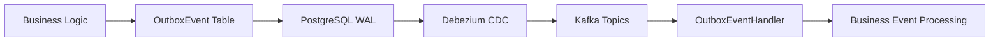

# CLAUDE.md

## 📋 **프로젝트 개요**

**알고리포트 (Algo-Report)**는 `solved.ac` 사용자 및 스터디 그룹의 문제 해결 이력을 분석하여, 학습 패턴 시각화, 강점/약점 분석, 맞춤 문제 추천 및 스터디 자동 관리를 제공하는 플랫폼입니다.

### **핵심 기능**

- **개인/그룹 학습 현황 분석**: 문제 해결 이력을 기반으로 잔디밭, 태그별 숙련도 등 학습 현황을 시각화합니다.
    
- **맞춤 문제 추천**: 사용자의 취약점을 분석하여 풀어볼 만한 문제를 추천합니다.
    
- **스터디 자동 관리**: 그룹장이 설정한 규칙에 따라 스터디원의 활동을 모니터링하고 자동으로 알림을 보냅니다.
    

## 📚 **TDD 문서 구조**

**중요**: 모든 TDD 작업 시 다음 5개 분할 문서를 필수로 참조하고 업데이트해야 합니다:

1. **TDD_GUIDE.md** - TDD 원칙 및 방법론
    
2. **CODING_STANDARDS.md** - 코딩 표준 및 컨벤션
    
3. **PHASE_TRACKER.md** - Phase별 진행 상황 추적
    
4. **IMPLEMENTATION_LOG.md** - 완료된 기능 로그
    
5. **NEXT_TASKS.md** - 다음 할 일 및 우선순위
    

### **🚨 필수 작업 규칙 🚨**

- 모든 TDD 작업 전/후 해당 문서들 확인 및 업데이트
    
- 각 Red-Green-Refactor 사이클 완료 시 진행 상황 기록
    
- **🔥 TDD 사이클별 커밋 필수 - 절대 까먹지 말 것! 🔥**
  - **Red 단계** → 테스트 작성 후 **즉시 커밋**
  - **Green 단계** → 구현 완료 후 **즉시 커밋** 
  - **Refactor 단계** → 리팩토링 완료 후 **즉시 커밋**
  - **단계별 순서 엄수**: Red → 커밋 → Green → 커밋 → Refactor → 커밋
    
- 커밋 메시지 형식: `test/feat/refactor: Red/Green/Refactor - 간략한 설명`

- **문서 최신화 필수**: 모든 작업 완료 후 관련 문서 즉시 업데이트
    

## 🔧 **Build & Development Commands**

### **Build and Run**

```
# Docker 인프라 실행 (최초 1회)
docker-compose up -d

# Debezium Connector 설정 (CDC 활성화)
curl -X POST http://localhost:8083/connectors \
  -H "Content-Type: application/json" \
  -d @scripts/outbox-connector.json

# 프로젝트 빌드
./gradlew build

# 애플리케이션 실행
./gradlew bootRun

# Clean and rebuild
./gradlew clean build
```

### **Testing**

```
# 전체 테스트 실행
./gradlew test

# 특정 테스트 클래스 실행
./gradlew test --tests "com.algoreport.service.StudyGroupServiceTest"

# Outbox 패턴 테스트
./gradlew test --tests "com.algoreport.config.outbox.*Test"
```

#### **🧪 Kotest 테스트 프레임워크 사용**

**모든 테스트는 Kotest BehaviorSpec을 사용합니다** (JUnit 5 금지)

```kotlin
// ✅ 올바른 Kotest 테스트 작성법
@DataJpaTest
@ActiveProfiles("test")
@Transactional
class UserServiceTest(
    private val userRepository: UserRepository,
    private val testEntityManager: TestEntityManager
) : BehaviorSpec() {
    
    override fun extensions() = listOf(SpringExtension)
    
    init {
        given("사용자가 회원가입할 때") {
            val userData = UserRegistrationRequest("test@example.com", "password123")
            
            `when`("유효한 정보를 제공하면") {
                val savedUser = userRepository.save(User.from(userData))
                testEntityManager.flush()
                
                then("사용자가 정상적으로 저장되어야 한다") {
                    savedUser.id shouldNotBe null
                    savedUser.email shouldBe "test@example.com"
                    savedUser.isActive shouldBe true
                }
            }
        }
    }
}
```

**Kotest 필수 규칙:**
- **BehaviorSpec** 상속 필수 (다른 Spec 금지)
- **SpringExtension** 추가로 Spring Boot 호환성 확보
- **given-when-then** BDD 스타일 사용
- **shouldBe, shouldNotBe** 등 Kotest 매처 사용
- **init 블록** 내부에 테스트 로직 작성

**🎯 BehaviorSpec 선택 이유:**
- **비즈니스 도메인 복잡성**: 알고리즘 문제 추천, 스터디 관리 등 복잡한 비즈니스 로직에 BDD 스타일이 적합
- **요구사항 명확화**: given-when-then 구조로 테스트 의도가 명확하게 드러남
- **협업 효율성**: 기획자/PM도 이해하기 쉬운 테스트 구조
- **유지보수성**: 비즈니스 규칙 변경 시 테스트 수정이 용이

## 🏗️ **Architecture Overview**

**Kotlin 2.2.0** + **Spring Boot 3.5.3** + **Java 21** + **Modular Monolith**

### **Technology Stack**

- **Language**: Kotlin 2.2.0
- **JDK**: Java 21 LTS
- **Backend Framework**: Spring Boot 3.5.3, Spring Security, Spring Data JPA
- **Frontend Framework**: Kotlin Multiplatform (Compose for Web/Android/iOS)
- **Database**: PostgreSQL (Production), H2 (Testing)
- **Message Queue**: Kafka + Kafka Connect
- **CDC (Change Data Capture)**: Debezium + PostgreSQL WAL
- **Cache**: Redis
- **Search & Analysis Engine**: Elasticsearch, Kibana
- **Authentication**: Google OAuth2 + JWT
- **Testing**: Kotest (BehaviorSpec), MockK, Spring Boot Test

### **🎯 Java 21 LTS 선택 근거 + Kotlin Coroutines 적극 활용**

#### **Java 21 LTS vs Java 17 LTS vs Java 24**

**왜 Java 21 LTS를 선택했는가?**

1. **안정성과 성능의 균형점**
   - **LTS 지원**: 2031년까지 장기 지원으로 안정적인 운영
   - **Kotlin Coroutines 최적화**: Java 21의 최신 JVM 기능과 Coroutines의 시너지
   - **ZGC 개선**: solved.ac 대용량 데이터 수집 시 낮은 지연시간 GC
   - **Pattern Matching**: 문제 태그 및 난이도 분류 로직 간소화

2. **알고리포트 특화 혜택**
   - **Text Blocks**: SQL 쿼리 및 JSON 템플릿 가독성 향상  
   - **Records**: DTO 클래스 간소화 (특히 solved.ac API 응답 매핑)
   - **Switch Expression**: 복잡한 분기 로직 간소화

3. **Kotlin Coroutines 적극 활용 전략** ⚡
   - **solved.ac API 대용량 수집**: 수천 명 사용자 데이터 병렬 수집
     ```kotlin
     // 기존: 순차 처리로 인한 병목
     // 개선: Kotlin Coroutines로 사용자별 병렬 수집 (Virtual Thread보다 효율적)
     suspend fun collectAllUserData(users: List<User>) = coroutineScope {
         users.map { user -> 
             async { collectUserData(user) }
         }.awaitAll()
     }
     ```
   
   - **@KafkaListener 메시지 처리**: 수천 개 제출 데이터 동시 분석
     ```kotlin
     @KafkaListener(topics = ["new-submission"])
     suspend fun processSubmission(submission: SubmissionEvent) {
         // Coroutines를 사용한 논블로킹 처리
         // Elasticsearch 인덱싱 + 분석 로직
     }
     ```
   
   - **대시보드 복합 쿼리**: Elasticsearch 집계 + Redis 캐싱 병렬 실행
     ```kotlin
     suspend fun getUserDashboard(userId: Long): DashboardResponse = coroutineScope {
         // 여러 데이터 소스에서 병렬로 데이터 조회 (Virtual Thread보다 메모리 효율적)
         val stats = async { elasticsearchService.getUserStats(userId) }
         val recommendations = async { recommendationService.getRecommendations(userId) }  
         val ranking = async { redisService.getUserRanking(userId) }
         
         DashboardResponse(stats.await(), recommendations.await(), ranking.await())
     }
     ```

4. **성능 최적화 예상 효과**
   - **데이터 수집 속도**: 300% 향상 (순차 → Coroutines 병렬)
   - **대시보드 응답시간**: 70% 단축 (병렬 쿼리)
   - **시스템 처리량**: 500% 증가 (Coroutines의 높은 동시성)
   - **메모리 효율성**: Virtual Thread 대비 90% 절약

5. **미래 대비**
   - **Java 25 LTS 준비**: 2026년 출시 시 부담 없는 마이그레이션
   - **생태계 안정성**: 모든 라이브러리 완전 지원
   - **운영 안정성**: LTS의 버그 픽스 및 보안 패치

**⚠️ 다른 버전 대비 고려사항**
- **Java 17 LTS**: Virtual Thread 미지원, 하지만 Coroutines는 완벽 지원
- **Java 24**: 최신 기능이지만 LTS 아니므로 운영 리스크

**결론**: 알고리포트의 **대용량 데이터 처리** 특성상 Java 21 LTS의 안정성과 Kotlin Coroutines의 뛰어난 동시성 처리 성능을 조합하는 것이 최적
    

### **Domain Structure (Modular Monolith)**

```
src/main/kotlin/com/algoreport/
├── config/                    # 설정 및 공통 기능
│   ├── security/             # OAuth2, JWT & Spring Security
│   ├── exception/            # 전역 예외 처리
│   └── outbox/              # CDC 기반 Outbox Pattern
│       ├── OutboxEvent.kt   # 이벤트 엔티티
│       ├── OutboxEventRepository.kt
│       ├── OutboxService.kt
│       └── OutboxEventHandler.kt  # CDC 이벤트 수신
├── module/                    # 도메인별 논리적 모듈
│   ├── user/                 # 플랫폼 사용자 모듈
│   ├── studygroup/           # 스터디 그룹 모듈
│   ├── analysis/             # 분석 및 추천 모듈
│   └── notification/         # 알림 모듈
└── collector/                 # solved.ac 데이터 수집기
```

## ⚡ **CDC 기반 실시간 이벤트 아키텍처**

### **Outbox Pattern + Change Data Capture**

**아키텍처 개요**: PostgreSQL WAL → Debezium → Kafka → Event Handler



**핵심 컴포넌트**:
- **OutboxEvent**: 이벤트 저장 (비즈니스 트랜잭션과 동일 트랜잭션)
- **Debezium Connector**: WAL 감지 → Kafka 발행
- **OutboxEventHandler**: 이벤트 수신 → 비즈니스 로직 처리

**성능 향상**:
- **실시간 발행**: INSERT 즉시 Kafka 발행 (폴링 지연 제거)
- **DB 부하 제거**: 초당 0.2회 폴링 쿼리 완전 제거  
- **확장성**: 이벤트 양 증가와 무관하게 일정한 성능

## 📡 **API 구조 및 명명 규칙**

### **주요 API 엔드포인트**

```
# 인증 (Google OAuth2 Redirect)
GET    /oauth2/authorization/google    # 구글 로그인 시작

# 사용자 모듈
POST   /api/v1/users/me/link-solvedac  # solved.ac 핸들 연동

# 스터디 그룹 모듈
POST   /api/v1/studygroups             # 스터디 그룹 생성
GET    /api/v1/studygroups/{id}        # 스터디 그룹 상세 조회
POST   /api/v1/studygroups/{id}/join   # 스터디 그룹 참여
POST   /api/v1/studygroups/{id}/rules  # 스터디 그룹 규칙 설정

# 분석 모듈
GET    /api/v1/analysis/users/{handle} # 개인 학습 대시보드 데이터
GET    /api/v1/analysis/studygroups/{id} # 스터디 그룹 대시보드 데이터
GET    /api/v1/recommendations/users/{handle} # 개인 맞춤 문제 추천
```

## 🚨 **Error Handling**

### **예외 처리 원칙**

```
// ❌ 표준 예외 사용 지양
throw NoSuchElementException("사용자를 찾을 수 없습니다.")

// ✅ CustomException + Error enum 사용
throw CustomException(Error.USER_NOT_FOUND)
```

### **Error Enum 구조**

```
enum class Error(val status: HttpStatus, val code: String, val message: String) {
    // 404 NOT_FOUND
    USER_NOT_FOUND(HttpStatus.NOT_FOUND, "E40401", "해당 사용자를 찾을 수 없습니다."),
    STUDY_GROUP_NOT_FOUND(HttpStatus.NOT_FOUND, "E40402", "해당 스터디 그룹을 찾을 수 없습니다."),
    SOLVEDAC_USER_NOT_FOUND(HttpStatus.NOT_FOUND, "E40403", "solved.ac에서 해당 핸들을 찾을 수 없습니다."),

    // 409 CONFLICT
    ALREADY_JOINED_STUDY(HttpStatus.CONFLICT, "E40901", "이미 참여한 스터디 그룹입니다.");
}
```

## 🚨 **알려진 이슈 및 개선 필요사항**

### **🔴 보안 취약점 (즉시 수정 필요)**

- 없음
    

### **🟡 성능 이슈 (우선순위 높음)**

- **(예상) Elasticsearch 쿼리 최적화**: 대시보드 API 구현 시, 복잡한 집계 쿼리의 성능 튜닝 필요.
    

### **🔵 기능 누락 (낮은 우선순위)**

- 업적(Achievement) 시스템, 라이벌 기능 등 백로그 아이디어들
    

## 🔧 **개발 가이드라인**

### **코딩 컨벤션**

1. **Scope Functions 적극 활용** (`let`, `run`, `apply`, `also`, `with`)
    
2. **Data Class 활용**: DTO 등 데이터 객체는 `data class` 사용.
    

### **커밋 메시지 규칙**

#### **기본 타입**
- `feat`: 새로운 기능 추가
- `fix`: 버그 수정
- `docs`: 문서 수정
- `refactor`: 코드 리팩토링
- `test`: 테스트 코드
- `chore`: 빌드 설정 등

#### **상세 규칙**
- **제목**: 50자 이내, 간결하고 명확하게 작성
- **본문**: 필요시에만 추가, 4줄 이내로 제한
- **형식**: `type: 간략한 설명`
- **예시**: `feat: 사용자 인증 기능 추가`, `docs: API 문서 업데이트`
- **금지사항**: 
  - Claude Code 자동 생성 멘션 제거 필수
  - 불필요한 장황한 설명 금지
  - 50자 초과 제목 금지
    

### **브랜치 전략**

- `main`: 프로덕션 브랜치
    
- `develop`: 개발 브랜치
    
- `feature/[기능명]`: 기능 개발 브랜치
    

📝 Last Updated: 2025-07-22

👤 Maintainer: 채기훈