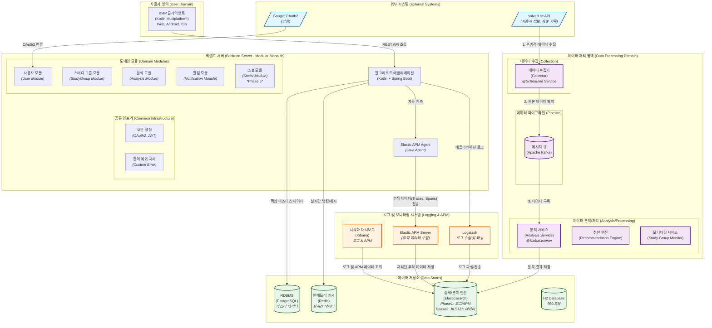
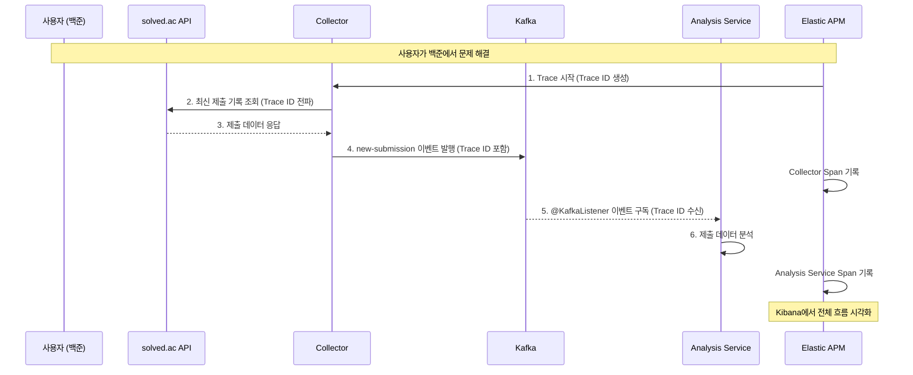
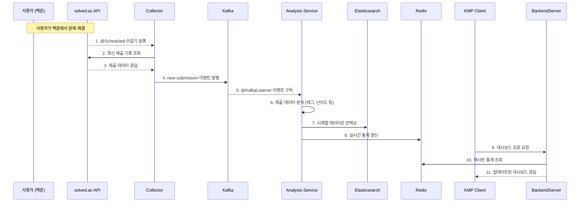
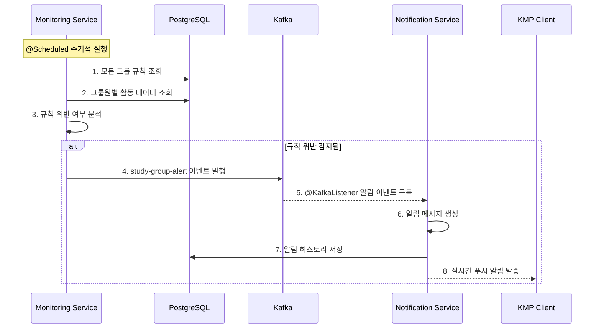
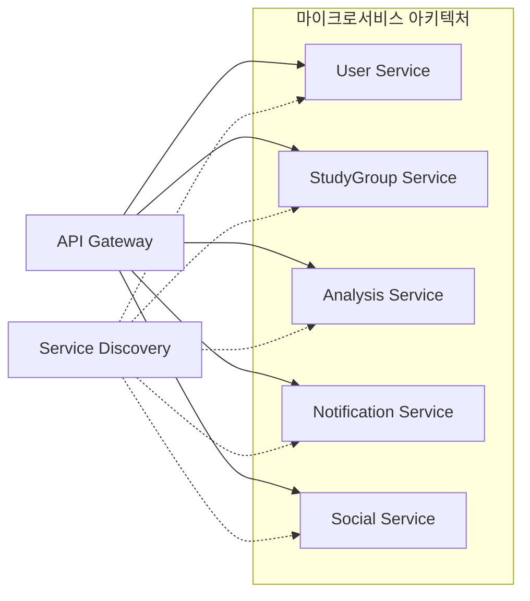

# 시스템 아키텍처 - 알고리포트 (Algo-Report)

이 시스템은 **모듈형 모놀리스(Modular Monolith)** 아키텍처를 기반으로 설계되었습니다. solved.ac API에서 데이터 수집부터 사용자에게 분석 결과를 제공하는 전체 과정을 도식화하고 각 구성 요소의 역할을 명확히 정의합니다.

---

## 🏗️ **아키텍처 다이어그램 (Elastic APM 포함)**



### **5. 모니터링 및 관리 (확장)**

#### **5.1 Elastic APM (Application Performance Monitoring)**
- **역할**: 분산 추적(Distributed Tracing)을 통해 마이크로서비스 및 이벤트 기반 아키텍처의 복잡한 상호작용을 시각화하고 성능 병목을 분석합니다.
- **구성 요소**:
  - **APM Agent**: Spring Boot 애플리케이션에 라이브러리로 추가되어, 코드 수정 없이 자동으로 요청, 쿼리, 이벤트 등을 추적합니다.
  - **APM Server**: 에이전트로부터 수집된 데이터를 처리하여 Elasticsearch에 저장합니다.
- **주요 기능**:
  - **분산 추적**: `Correlation ID`를 통해 여러 모듈과 메시지 큐를 거치는 전체 트랜잭션 흐름을 시각적으로 추적합니다.
  - **성능 분석**: 각 단계(Span)별 지연 시간을 측정하여 병목 지점을 정확히 찾아냅니다.
  - **에러 추적**: 발생한 에러를 트랜잭션 컨텍스트와 함께 기록하여 디버깅을 용이하게 합니다.

#### **5.2 Kibana (확장된 역할)**
- **기존 역할**: 애플리케이션 로그 시각화 및 운영 모니터링.
- **확장된 역할**: APM 데이터를 활용한 **분산 트랜잭션 시각화**. 서비스 맵, 트랜잭션 타임라인, 의존성 그래프 등을 제공하여 시스템 전체의 동작을 한눈에 파악할 수 있게 합니다.

---

## 🔄 **데이터 흐름 시나리오 (APM 추적 포함)**

### **시나리오 1: 새로운 문제 제출 감지 및 분석**

"메시지 큐<br>(Apache Kafka)")]
        end
        subgraph "데이터 분석/처리 (Analysis/Processing)"
            AnalysisService["분석 서비스<br>(Analysis Service)<br><i>@KafkaListener</i>"]
            RecommendationEngine["추천 엔진<br>(Recommendation Engine)"]
            MonitoringService["모니터링 서비스<br>(Study Group Monitor)"]
        end
    end

    subgraph "외부 시스템 (External Systems)"
        SolvedACAPI[/"solved.ac API<br><i>(사용자 정보, 제출 기록)</i>"/]
        GoogleOAuth[/"Google OAuth2<br><i>(인증)</i>"/]
    end

    subgraph "데이터 저장소 (Data Stores)"
        PostgreSQL[("RDBMS<br>(PostgreSQL)<br><i>마스터 데이터</i>")]
        Redis[("인메모리 캐시<br>(Redis)<br><i>실시간 데이터</i>")]
        Elasticsearch[("검색/분석 엔진<br>(Elasticsearch)<br><i>Phase1: 로그 저장<br>Phase2: 비즈니스 데이터</i>")]
        H2[("H2 Database<br><i>테스트용</i>")]
    end

    subgraph "로그 관리 시스템 (Logging System - Phase 1)"
        ELKStack["ELK Stack<br>(Elasticsearch + Logstash + Kibana)<br><i>Spring Boot 로그 관리</i>"]
        Logstash["Logstash<br><i>로그 수집 및 파싱</i>"]
    end

    subgraph "모니터링/관리 (Monitoring/Admin)"
        Kibana["로그 시각화<br>(Kibana)<br><i>Phase1: 애플리케이션 로그<br>Phase2: 비즈니스 대시보드</i>"]
        SpringActuator["애플리케이션 모니터링<br>(Spring Actuator)"]
    end

    %% 외부 시스템 연동 (External Integration)
    GoogleOAuth -- "OAuth2 인증" --> UserModule
    SolvedACAPI -- "1. 주기적 데이터 수집" --> Collector
    
    %% 사용자 상호작용 (User Interaction)
    KMPClient -- "REST API 호출" --> BackendServer
    
    %% 모듈 간 상호작용 (Inter-module Communication)
    UserModule -.-> StudyGroupModule
    StudyGroupModule -.-> AnalysisModule
    AnalysisModule -.-> NotificationModule
    StudyGroupModule -.-> SocialModule
    
    %% 데이터 흐름 (Data Flow)
    Collector -- "2. 원본 데이터 발행" --> Kafka
    Kafka -- "3. 데이터 구독" --> AnalysisService
    Kafka -- "4. 그룹 이벤트 구독" --> MonitoringService
    AnalysisService -.-> RecommendationEngine
    
    %% 데이터 저장 (Data Storage)
    BackendServer -- "핵심 비즈니스 데이터" --> PostgreSQL
    BackendServer -- "실시간 랭킹/캐시" --> Redis
    AnalysisService -- "Phase2: 분석 결과 저장" --> Elasticsearch
    AnalysisService -- "실시간 통계 캐싱" --> Redis
    AnalysisService -- "메타데이터 저장" --> PostgreSQL
    MonitoringService -- "알림 이벤트 발행" --> Kafka
    
    %% 로그 관리 (Phase 1)
    BackendServer -- "애플리케이션 로그" --> Logstash
    Logstash -- "로그 파싱 및 전송" --> Elasticsearch
    
    %% 개발/테스트 환경
    BackendServer -.- H2
    
    %% 모니터링 (Monitoring)
    Kibana -- "Phase1: 로그 조회<br>Phase2: 비즈니스 시각화" --> Elasticsearch
    SpringActuator -- "헬스체크/메트릭" --> BackendServer

    %% 스타일링
    classDef external fill:#e1f5fe,stroke:#01579b,stroke-width:2px
    classDef processing fill:#f3e5f5,stroke:#4a148c,stroke-width:2px
    classDef storage fill:#e8f5e8,stroke:#1b5e20,stroke-width:2px
    classDef monitoring fill:#fff3e0,stroke:#e65100,stroke-width:2px
    
    class SolvedACAPI,GoogleOAuth external
    class Collector,Kafka,AnalysisService,RecommendationEngine,MonitoringService processing
    class PostgreSQL,Redis,Elasticsearch,H2 storage
    class Kibana,SpringActuator monitoring
```

---

## 📋 **구성 요소별 역할 정의**

### **1. KMP 클라이언트 (Kotlin Multiplatform Client)**

**역할**: 사용자가 직접 상호작용하는 프런트엔드. 웹(Web), 안드로이드(Android), iOS 앱으로 빌드 가능.

**주요 기능**:
- 개인/그룹 학습 대시보드 시각화 (잔디밭, 레이더 차트)
- 문제 추천 목록 표시
- 스터디 그룹 관리 및 설정
- 실시간 알림 수신 (WebSocket 또는 SSE)
- 소셜 기능 (토론, 코드 리뷰) *Phase 5*

---

### **2. 백엔드 서버 (Modular Monolith)**

**역할**: 프로젝트의 핵심. 비즈니스 로직을 수행하고 데이터를 관리하는 중앙 서버.

**기술 스택**: Kotlin + Spring Boot 3.2.x + JDK 17

#### **2.1 도메인 모듈 (Domain Modules)**

##### **사용자 모듈 (User Module)**
```kotlin
// 패키지 구조 예시
com.algoreport.module.user/
├── controller/     # UserController, OAuth2Controller
├── service/        # UserService, SolvedacLinkService
├── repository/     # UserRepository, SolvedacUserRepository
├── entity/         # User, SolvedacUser
└── dto/            # CreateUserRequest, LinkSolvedacRequest
```

**주요 기능**:
- Google OAuth2 로그인/로그아웃
- solved.ac 계정 연동 및 유효성 검증
- 사용자 프로필 관리

##### **스터디 그룹 모듈 (StudyGroup Module)**
```kotlin
com.algoreport.module.studygroup/
├── controller/     # StudyGroupController
├── service/        # StudyGroupService, StudyGroupRuleService
├── repository/     # StudyGroupRepository, StudyGroupMemberRepository
├── entity/         # StudyGroup, StudyGroupMember, StudyGroupRule
└── dto/            # CreateStudyGroupRequest, JoinStudyGroupRequest
```

**주요 기능**:
- 스터디 그룹 CRUD 및 멤버십 관리
- 자동 관리 규칙 설정 및 적용
- 문제 자동 할당 시스템 *Phase 2.5*
- 그룹 목표 설정 및 달성도 추적 *Phase 2.5*

##### **분석 모듈 (Analysis Module)**
```kotlin
com.algoreport.module.analysis/
├── controller/     # AnalysisController, RecommendationController
├── service/        # DashboardService, RecommendationService
├── repository/     # SubmissionRepository, ProblemMetadataRepository
├── entity/         # Submission, ProblemMetadata
└── dto/            # DashboardResponse, RecommendationResponse
```

**주요 기능**:
- 개인/그룹 학습 현황 분석 및 대시보드 데이터 제공
- 맞춤 문제 추천 알고리즘 실행
- Elasticsearch 집계 쿼리를 통한 통계 생성

##### **알림 모듈 (Notification Module)**
```kotlin
com.algoreport.module.notification/
├── controller/     # NotificationController
├── service/        # NotificationService, AlertService
├── repository/     # NotificationSettingsRepository, NotificationHistoryRepository
├── entity/         # NotificationSettings, NotificationHistory
└── dto/            # NotificationSettingsResponse, SendNotificationRequest
```

**주요 기능**:
- 사용자별 알림 설정 관리
- 스터디 그룹 규칙 위반 감지 시 알림 발송
- 이메일/푸시 알림 통합 관리

##### **소셜 모듈 (Social Module)** *Phase 5*
```kotlin
com.algoreport.module.social/
├── controller/     # DiscussionController, CodeReviewController
├── service/        # DiscussionService, CodeReviewService
├── repository/     # ProblemDiscussionRepository, CodeReviewRepository
├── entity/         # ProblemDiscussion, CodeReview, DiscussionComment
└── dto/            # CreateDiscussionRequest, CodeReviewRequest
```

**주요 기능**:
- 문제별 토론 게시판 (힌트, 질문, 풀이 공유)
- 코드 리뷰 시스템 (라인별 댓글)
- 풀이 아카이브 및 검색
- 실시간 협업 기능 (WebSocket)

#### **2.2 공통 인프라 (Common Infrastructure)**

##### **보안 설정 (Security Configuration)**
```kotlin
com.algoreport.config.security/
├── SecurityConfig.kt           # Spring Security 설정
├── OAuth2SuccessHandler.kt     # OAuth2 로그인 성공 처리
├── JwtAuthenticationFilter.kt  # JWT 토큰 검증
└── CustomUserDetailsService.kt # 사용자 정보 로드
```

##### **전역 예외 처리 (Global Exception Handling)**
```kotlin
com.algoreport.config.exception/
├── GlobalExceptionHandler.kt   # @RestControllerAdvice
├── CustomException.kt          # 커스텀 예외 클래스
└── Error.kt                    # 에러 코드 enum
```

---

### **3. 데이터 처리 영역**

#### **3.1 데이터 수집기 (Collector)**

**역할**: solved.ac API에서 주기적으로 데이터를 수집하여 Kafka로 전송.

```kotlin
com.algoreport.collector/
├── service/
│   ├── SolvedacDataCollector.kt    # @Scheduled 메인 수집기
│   └── SolvedacApiClient.kt        # solved.ac API 호출 클라이언트
├── config/
│   └── SchedulerConfig.kt          # 스케줄링 설정
└── dto/
    └── SolvedacApiResponse.kt      # API 응답 DTO
```

**주요 기능**:
- `@Scheduled(fixedRate = 300000)` 5분마다 실행
- 등록된 사용자들의 최신 제출 기록 수집
- 신규 제출 데이터만 필터링하여 `new-submission` 토픽으로 발행
- API 호출 실패 시 재시도 로직 (Resilience4j 활용)

#### **3.2 메시지 큐 (Apache Kafka)**

**역할**: 대용량 실시간 데이터를 안정적으로 처리하기 위한 이벤트 스트리밍 플랫폼.

**주요 토픽**:
```yaml
토픽 구성:
  new-submission:           # 새로운 문제 제출 이벤트
    - partition: 3
    - replication: 1
    - retention: 7 days
  
  study-group-alert:        # 스터디 그룹 알림 이벤트
    - partition: 2  
    - replication: 1
    - retention: 30 days
  
  problem-assigned:         # 문제 할당 이벤트 (Phase 2.5)
    - partition: 2
    - replication: 1
    - retention: 14 days
```

#### **3.3 분석 및 처리 서비스들**

##### **분석 서비스 (Analysis Service)**
```kotlin
com.algoreport.analysis/
├── listener/
│   └── SubmissionEventListener.kt      # @KafkaListener
├── service/
│   ├── SubmissionAnalysisService.kt    # 제출 데이터 분석
│   └── ElasticsearchIndexService.kt    # ES 인덱싱
└── config/
    └── KafkaConsumerConfig.kt          # Kafka Consumer 설정
```

**주요 기능**:
- `new-submission` 토픽 구독하여 실시간 제출 데이터 처리
- 태그별 숙련도, 문제 해결 패턴 분석
- Elasticsearch에 시계열 데이터로 인덱싱
- Redis에 실시간 통계 캐싱

##### **추천 엔진 (Recommendation Engine)**
```kotlin
com.algoreport.recommendation/
├── service/
│   ├── WeaknessAnalysisService.kt      # 취약점 분석
│   ├── ProblemRecommendationService.kt # 문제 추천 로직
│   └── CollaborativeFilteringService.kt # 협업 필터링 (향후)
└── algorithm/
    ├── TagBasedRecommender.kt          # 태그 기반 추천
    └── DifficultyMatcher.kt            # 난이도 매칭
```

##### **모니터링 서비스 (Study Group Monitor)** 
```kotlin
com.algoreport.monitoring/
├── service/
│   ├── StudyGroupMonitorService.kt     # @Scheduled 그룹 모니터링
│   └── RuleViolationDetector.kt        # 규칙 위반 감지
└── publisher/
    └── AlertEventPublisher.kt          # 알림 이벤트 발행
```

**주요 기능**:
- 스터디 그룹 규칙 위반 감지 (주기적 실행)
- 그룹원 활동 패턴 분석 및 이상 징후 탐지
- `study-group-alert` 토픽으로 알림 이벤트 발행

---

### **4. 데이터 저장소**

#### **4.1 PostgreSQL (RDBMS)**
- **용도**: 핵심 비즈니스 데이터의 ACID 보장이 중요한 데이터
- **저장 데이터**: 사용자 정보, 스터디 그룹, 알림 설정, 문제 메타데이터 등
- **특징**: 정규화된 관계형 데이터, 트랜잭션 보장

#### **4.2 Redis (In-Memory Cache)**
- **용도**: 빠른 응답이 필요한 실시간 데이터 캐싱
- **저장 데이터**: 
  ```
  user:profile:{userId}         # 사용자 프로필 캐시 (TTL: 1시간)
  ranking:weekly:{date}         # 주간 랭킹 (TTL: 30분)  
  recommendation:{userId}       # 개인 추천 결과 (TTL: 24시간)
  dashboard:{userId}:{period}   # 대시보드 캐시 (TTL: 1시간)
  ```

#### **4.3 Elasticsearch**
- **Phase 1 용도**: Spring Boot 애플리케이션 로그 저장 및 검색
- **Phase 2 용도**: 대규모 시계열 데이터 저장 및 복잡한 집계/검색 쿼리
- **인덱스 구조**:
  ```
  # Phase 1: 로그 관리
  algoreport-logs-{YYYY.MM.dd}  # 일별 애플리케이션 로그
  
  # Phase 2: 비즈니스 데이터 (향후 확장)
  submissions-{YYYY.MM}         # 월별 파티셔닝된 제출 데이터
  problem-metadata             # 문제 메타데이터 및 태그 검색
  user-activities-{YYYY.MM}    # 사용자 활동 로그 (분석용)
  saga-events-{YYYY.MM}        # SAGA 이벤트 추적
  ```

#### **4.4 H2 Database**
- **용도**: 개발/테스트 환경에서 빠른 인메모리 DB
- **특징**: 테스트 실행 시 매번 초기화, JPA Entity 검증

---

### **5. 모니터링 및 관리**

#### **5.1 Kibana**
- **Phase 1 용도**: 애플리케이션 로그 시각화 및 운영 모니터링
- **Phase 2 용도**: 비즈니스 데이터 시각화 및 분석 대시보드
- **주요 대시보드**:
  - **Phase 1**: 애플리케이션 로그 검색, 에러 추적, 성능 모니터링
  - **Phase 2**: 실시간 제출 현황, 사용자 활동 패턴, SAGA 실행 현황

#### **5.2 Spring Actuator**
- **용도**: 애플리케이션 상태 모니터링 및 메트릭 수집
- **엔드포인트**:
  - `/actuator/health` - 애플리케이션 헬스체크
  - `/actuator/metrics` - JVM, DB 연결 풀 등 메트릭
  - `/actuator/prometheus` - Prometheus 메트릭 노출

---

## 🔄 **데이터 흐름 시나리오**

### **시나리오 1: 새로운 문제 제출 감지 및 분석**


### **시나리오 2: 스터디 그룹 규칙 위반 감지 및 알림**


---

## ⚡ **성능 최적화 전략**

### **1. 캐싱 전략**
```kotlin
@Cacheable(value = ["userDashboard"], key = "#userId + '_' + #period")
fun getUserDashboard(userId: Long, period: String): DashboardResponse

@CacheEvict(value = ["userDashboard"], key = "#userId + '_*'")  
fun evictUserDashboardCache(userId: Long)
```

### **2. 데이터베이스 최적화**
- **읽기 전용 복제본**: 대시보드 조회용 Read Replica 구성
- **인덱스 최적화**: 자주 사용되는 쿼리 패턴에 복합 인덱스 생성
- **파티셔닝**: 큰 테이블(SUBMISSIONS) 월별 파티셔닝

### **3. 비동기 처리**
```kotlin
@Async("taskExecutor")
fun processSubmissionAsync(submissionData: SubmissionData) {
    // 시간이 오래 걸리는 분석 작업을 비동기로 처리
}
```

---

## 🛡️ **보안 고려사항**

### **1. 인증/인가**
- **OAuth2**: Google OAuth2를 통한 안전한 로그인
- **JWT**: Stateless 토큰 기반 인증, 만료시간 설정
- **Role-based Access**: 그룹장/멤버 권한 구분

### **2. 데이터 보호**  
- **API Rate Limiting**: solved.ac API 호출량 제한
- **Input Validation**: 모든 사용자 입력에 대한 검증
- **SQL Injection 방지**: JPA Prepared Statement 사용

### **3. 개인정보 보호**
- **최소 수집 원칙**: 필요한 정보만 수집 및 저장
- **데이터 암호화**: 중요 정보(이메일 등) 데이터베이스 내 암호화

---

## 📈 **확장성 로드맵**

### **Phase 1: 모듈형 모놀리스 + 로그 관리** (현재)
- 단일 애플리케이션 내 논리적 모듈 분리
- **ELK Stack 도입**: Spring Boot 로그 관리 및 모니터링
- 빠른 개발 및 배포 가능

### **Phase 2: 비즈니스 데이터 분석 확장**
- **ELK Stack 확장**: solved.ac 데이터 분석용 파이프라인 추가
- **Kafka + Debezium**: CDC 기반 실시간 데이터 스트리밍
- **Schema Registry**: SAGA 이벤트 스키마 관리
- 비즈니스 인텔리전스 및 추천 시스템 고도화

### **Phase 3: 마이크로서비스 분리** (향후)


**분리 우선순위**:
1. **Analysis Service**: CPU 집약적 작업, 독립적 스케일링 필요
2. **Notification Service**: 외부 시스템 연동이 많음
3. **Social Service**: 별도 도메인, 독립적 발전 가능

---

📝 **문서 버전**: v1.0  
📅 **최종 수정일**: 2025-07-22  
👤 **작성자**: 채기훈