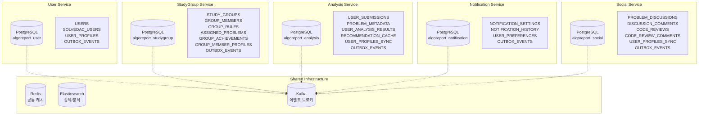
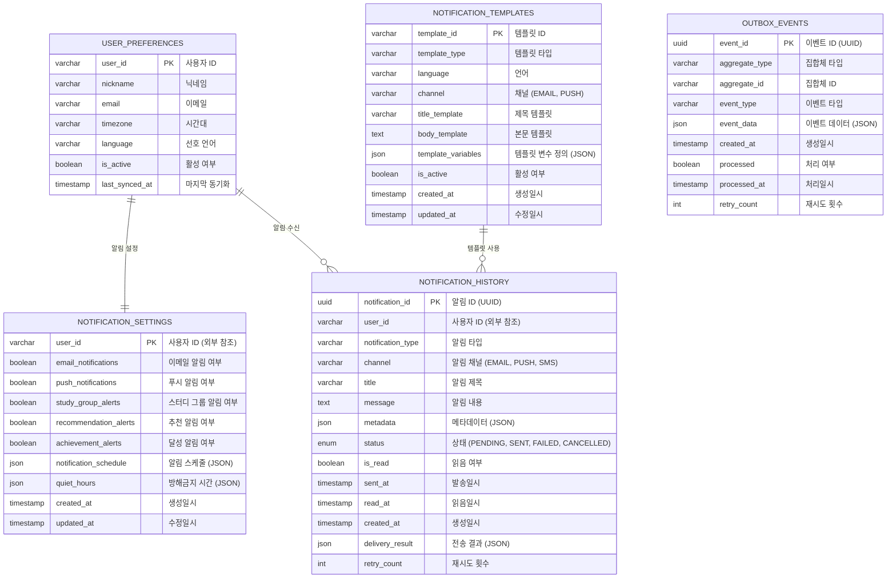
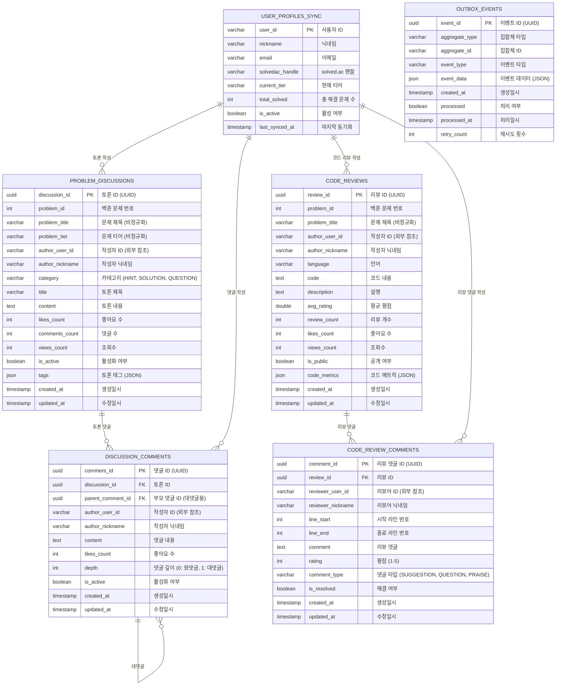
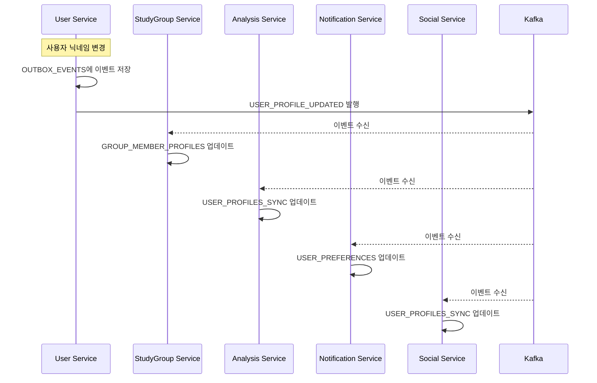

# 데이터베이스 스키마 (ERD) - 알고리포트 (MSA 고려 설계)

이 문서는 **마이크로서비스 아키텍처(MSA) 전환을 고려한** 알고리포트 시스템의 데이터베이스 스키마를 정의합니다. 각 도메인별로 **독립적인 데이터베이스**를 가지며, 서비스 간 통신은 **이벤트 기반**으로 설계되었습니다.

---

## 🏗️ **MSA 고려 설계 원칙**

### **1. Database per Service**
- 각 마이크로서비스는 자체 데이터베이스를 소유
- 다른 서비스의 데이터에 직접 접근 금지
- 서비스 간 데이터 공유는 이벤트/API 통신으로만

### **2. 데이터 비정규화 허용**  
- 성능과 독립성을 위해 필요한 데이터 복제
- 이벤트 기반 동기화로 일관성 유지
- Eventually Consistent 모델 채택

### **3. 이벤트 기반 데이터 동기화**
- 데이터 변경 시 관련 서비스들에 이벤트 발행
- Saga 패턴으로 분산 트랜잭션 관리
- Outbox 패턴으로 이벤트 발행 일관성 보장

---

## 🗄️ **서비스별 데이터베이스 분리**



---

## 📊 **서비스별 ERD**

### **1. User Service Database** 
`algoreport_user`

```mermaid
erDiagram
    USERS {
        uuid user_id PK "사용자 ID (UUID)"
        varchar email UQ "이메일 (Google OAuth2)"
        varchar nickname UQ "닉네임"
        varchar profile_image_url "프로필 이미지 URL"
        boolean is_active "활성화 여부"
        timestamp created_at "생성일시"
        timestamp updated_at "수정일시"
        bigint version "낙관적 잠금용 버전"
    }

    SOLVEDAC_USERS {
        uuid user_id PK, FK "사용자 ID"
        varchar handle UQ "solved.ac 핸들"
        varchar tier "현재 티어 (bronze1, silver3 등)"
        int solved_count "총 해결 문제 수"
        timestamp linked_at "연동일시"
        timestamp last_synced_at "마지막 동기화일시"
        bigint version "낙관적 잠금용 버전"
    }

    USER_PROFILES {
        uuid user_id PK, FK "사용자 ID"
        json preferences "사용자 설정 (JSON)"
        varchar timezone "시간대"
        varchar language "선호 언어"
        timestamp updated_at "수정일시"
    }

    OUTBOX_EVENTS {
        uuid event_id PK "이벤트 ID (UUID)"
        varchar aggregate_type "집합체 타입 (USER, SOLVEDAC_USER)"
        varchar aggregate_id "집합체 ID"
        varchar event_type "이벤트 타입"
        json event_data "이벤트 데이터 (JSON)"
        timestamp created_at "생성일시"
        boolean processed "처리 여부"
        timestamp processed_at "처리일시"
        int retry_count "재시도 횟수"
    }

    USERS ||--o| SOLVEDAC_USERS : "solved.ac 연동"
    USERS ||--|| USER_PROFILES : "프로필"
    USERS ||--o{ OUTBOX_EVENTS : "이벤트 발행"
```

**주요 이벤트**:
- `USER_REGISTERED`: 신규 사용자 가입
- `USER_PROFILE_UPDATED`: 사용자 정보 변경
- `SOLVEDAC_LINKED`: solved.ac 계정 연동
- `SOLVEDAC_UNLINKED`: solved.ac 계정 연동 해제
- `USER_DEACTIVATED`: 사용자 비활성화

---

### **2. StudyGroup Service Database**
`algoreport_studygroup`

```mermaid
erDiagram
    STUDY_GROUPS {
        uuid study_group_id PK "스터디 그룹 ID (UUID)"
        varchar owner_user_id "그룹장 사용자 ID (외부 참조)"
        varchar owner_nickname "그룹장 닉네임 (비정규화)"
        varchar owner_email "그룹장 이메일 (비정규화)"
        varchar name "그룹명"
        text description "그룹 설명"
        int max_members "최대 인원수"
        boolean is_public "공개 여부"
        boolean is_active "활성화 여부"
        varchar invite_code UQ "초대 코드 (비공개 그룹용)"
        timestamp created_at "생성일시"
        timestamp updated_at "수정일시"
        bigint version "낙관적 잠금용 버전"
    }

    GROUP_MEMBERS {
        uuid study_group_id PK, FK "스터디 그룹 ID"
        varchar user_id PK "사용자 ID (외부 참조)"
        enum role "역할 (OWNER, ADMIN, MEMBER)"
        varchar nickname "사용자 닉네임 (비정규화)"
        varchar email "사용자 이메일 (비정규화)"
        varchar solvedac_handle "solved.ac 핸들 (비정규화)"
        timestamp joined_at "참여일시"
        boolean is_active "활성 멤버 여부"
        timestamp last_active_at "마지막 활동일시"
    }

    GROUP_RULES {
        uuid rule_id PK "규칙 ID (UUID)"
        uuid study_group_id FK "스터디 그룹 ID"
        varchar rule_type "규칙 타입"
        json rule_config "규칙 설정 (JSON)"
        text description "규칙 설명"
        boolean is_active "활성화 여부"
        varchar created_by_user_id "생성자 ID"
        timestamp created_at "생성일시"
        timestamp updated_at "수정일시"
    }

    ASSIGNED_PROBLEMS {
        uuid assignment_id PK "할당 ID (UUID)"
        uuid study_group_id FK "스터디 그룹 ID"
        varchar user_id "사용자 ID (외부 참조)"
        varchar user_nickname "사용자 닉네임"
        int problem_id "백준 문제 번호"
        varchar problem_title "문제 제목"
        varchar problem_tier "문제 티어"
        json problem_tags "문제 태그 (JSON)"
        varchar assignment_type "할당 타입 (AUTO, MANUAL)"
        timestamp assigned_at "할당일시"
        timestamp due_date "마감일시"
        boolean is_completed "완료 여부"
        timestamp completed_at "완료일시"
        varchar assigned_by_user_id "할당자 ID"
    }

    GROUP_ACHIEVEMENTS {
        uuid achievement_id PK "달성 기록 ID (UUID)"
        uuid study_group_id FK "스터디 그룹 ID"
        varchar goal_type "목표 타입"
        text goal_description "목표 설명"
        json goal_config "목표 설정 (JSON)"
        json progress_data "진척도 데이터 (JSON)"
        boolean is_achieved "달성 여부"
        timestamp period_start "목표 기간 시작"
        timestamp period_end "목표 기간 종료"
        timestamp created_at "생성일시"
        timestamp achieved_at "달성일시"
    }

    GROUP_MEMBER_PROFILES {
        varchar user_id PK "사용자 ID"
        varchar nickname "닉네임 (최신)"
        varchar email "이메일 (최신)"
        varchar solvedac_handle "solved.ac 핸들"
        varchar current_tier "현재 티어"
        int total_solved "총 해결 문제 수"
        json activity_stats "활동 통계 (JSON)"
        timestamp last_synced_at "마지막 동기화"
    }

    OUTBOX_EVENTS {
        uuid event_id PK "이벤트 ID (UUID)"
        varchar aggregate_type "집합체 타입"
        varchar aggregate_id "집합체 ID"
        varchar event_type "이벤트 타입"
        json event_data "이벤트 데이터 (JSON)"
        timestamp created_at "생성일시"
        boolean processed "처리 여부"
        timestamp processed_at "처리일시"
        int retry_count "재시도 횟수"
    }

    STUDY_GROUPS ||--o{ GROUP_MEMBERS : "멤버십"
    STUDY_GROUPS ||--o{ GROUP_RULES : "그룹 규칙"
    STUDY_GROUPS ||--o{ ASSIGNED_PROBLEMS : "문제 할당"
    STUDY_GROUPS ||--o{ GROUP_ACHIEVEMENTS : "그룹 달성 기록"
    GROUP_MEMBERS ||--o| GROUP_MEMBER_PROFILES : "멤버 프로필 캐시"
```

**주요 이벤트**:
- `STUDY_GROUP_CREATED`: 스터디 그룹 생성
- `MEMBER_JOINED`: 멤버 참여
- `MEMBER_LEFT`: 멤버 탈퇴  
- `PROBLEM_ASSIGNED`: 문제 할당
- `RULE_VIOLATION_DETECTED`: 규칙 위반 감지
- `GROUP_ACHIEVEMENT_UNLOCKED`: 그룹 목표 달성

---

### **3. Analysis Service Database**
`algoreport_analysis`

```mermaid
erDiagram
    USER_SUBMISSIONS {
        uuid submission_id PK "제출 ID (UUID)"
        varchar user_id "사용자 ID (외부 참조)"
        varchar solvedac_handle "solved.ac 핸들"
        bigint solvedac_submission_id UQ "solved.ac 제출 ID"
        int problem_id "백준 문제 번호"
        varchar result "제출 결과 (AC, WA 등)"
        varchar language "사용 언어"
        int code_length "코드 길이"
        timestamp submitted_at "제출일시"
        timestamp synced_at "동기화일시"
        json metadata "추가 메타데이터 (JSON)"
    }

    PROBLEM_METADATA {
        int problem_id PK "백준 문제 번호"
        varchar title "문제 제목"
        varchar tier "문제 티어"
        json tags "알고리즘 태그 배열"
        int accepted_count "맞힌 사람 수"
        int submitted_count "제출 횟수"
        double average_tries "평균 시도 횟수"
        json difficulty_stats "난이도 통계 (JSON)"
        text problem_description "문제 설명 (요약)"
        timestamp created_at "생성일시"
        timestamp updated_at "수정일시"
    }

    USER_ANALYSIS_RESULTS {
        uuid analysis_id PK "분석 ID (UUID)"
        varchar user_id "사용자 ID"
        varchar period_type "기간 타입 (WEEK, MONTH, YEAR)"
        date period_start "분석 기간 시작"
        date period_end "분석 기간 종료"
        json submission_stats "제출 통계 (JSON)"
        json tag_proficiency "태그별 숙련도 (JSON)"
        json weakness_analysis "취약점 분석 (JSON)"
        json strength_analysis "강점 분석 (JSON)"
        json heatmap_data "잔디밭 데이터 (JSON)"
        int total_solved "해결 문제 수"
        double average_difficulty "평균 난이도"
        int streak_days "연속 해결 일수"
        timestamp analyzed_at "분석일시"
        timestamp created_at "생성일시"
    }

    RECOMMENDATION_CACHE {
        uuid recommendation_id PK "추천 ID (UUID)"
        varchar user_id "사용자 ID"
        varchar recommendation_type "추천 타입 (WEAKNESS, PROGRESSION, COLLABORATIVE)"
        json recommended_problems "추천 문제 목록 (JSON)"
        json recommendation_reasons "추천 이유 (JSON)"
        json user_context "사용자 컨텍스트 (JSON)"
        int cache_hit_count "캐시 히트 횟수"
        timestamp generated_at "생성일시"
        timestamp expires_at "만료일시"
        boolean is_active "활성 여부"
    }

    USER_PROFILES_SYNC {
        varchar user_id PK "사용자 ID"
        varchar nickname "닉네임"
        varchar email "이메일"
        varchar solvedac_handle "solved.ac 핸들"
        varchar current_tier "현재 티어"
        int total_solved "총 해결 문제 수"
        boolean is_active "활성 여부"
        timestamp last_synced_at "마지막 동기화"
        bigint sync_version "동기화 버전"
    }

    OUTBOX_EVENTS {
        uuid event_id PK "이벤트 ID (UUID)"
        varchar aggregate_type "집합체 타입"
        varchar aggregate_id "집합체 ID"
        varchar event_type "이벤트 타입"
        json event_data "이벤트 데이터 (JSON)"
        timestamp created_at "생성일시"
        boolean processed "처리 여부"
        timestamp processed_at "처리일시"
        int retry_count "재시도 횟수"
    }

    USER_PROFILES_SYNC ||--o{ USER_SUBMISSIONS : "사용자별 제출 데이터"
    USER_PROFILES_SYNC ||--o{ USER_ANALYSIS_RESULTS : "사용자별 분석 결과"
    USER_PROFILES_SYNC ||--o{ RECOMMENDATION_CACHE : "사용자별 추천 캐시"
    PROBLEM_METADATA ||--o{ USER_SUBMISSIONS : "문제 메타데이터"
```

**주요 이벤트**:
- `USER_ANALYSIS_UPDATED`: 사용자 분석 결과 업데이트
- `RECOMMENDATION_GENERATED`: 새로운 추천 생성
- `SUBMISSION_ANALYZED`: 제출 데이터 분석 완료
- `WEAKNESS_DETECTED`: 취약점 감지
- `IMPROVEMENT_DETECTED`: 실력 향상 감지

---

### **4. Notification Service Database**
`algoreport_notification`



**주요 이벤트**:
- `NOTIFICATION_SENT`: 알림 발송 완료
- `NOTIFICATION_FAILED`: 알림 발송 실패
- `NOTIFICATION_SETTINGS_UPDATED`: 알림 설정 변경

---

### **5. Social Service Database** *(Phase 5)*
`algoreport_social`



**주요 이벤트**:
- `DISCUSSION_CREATED`: 새 토론 생성
- `CODE_REVIEW_SUBMITTED`: 코드 리뷰 제출
- `COMMENT_ADDED`: 댓글 추가
- `CONTENT_LIKED`: 좋아요 추가
- `CONTENT_REPORTED`: 신고 접수

---

## 🔄 **이벤트 기반 데이터 동기화**

### **1. 사용자 정보 동기화 흐름**



### **2. 주요 이벤트 타입별 동기화**

| 이벤트 타입 | 발행 서비스 | 구독 서비스 | 동기화 대상 |
|------------|------------|------------|------------|
| `USER_PROFILE_UPDATED` | User | StudyGroup, Analysis, Notification, Social | 사용자 기본 정보 |
| `SOLVEDAC_LINKED` | User | Analysis, StudyGroup | solved.ac 핸들 정보 |
| `MEMBER_JOINED` | StudyGroup | Analysis, Notification | 그룹 멤버십 정보 |
| `SUBMISSION_SYNCED` | Analysis | StudyGroup | 문제 해결 현황 |
| `RULE_VIOLATION_DETECTED` | StudyGroup | Notification | 규칙 위반 알림 |

---

## 🔧 **Outbox Pattern 구현**

### **Outbox Event 처리 흐름**

```kotlin
// 1. 비즈니스 로직과 함께 Outbox에 이벤트 저장
@Transactional
fun updateUserProfile(userId: UUID, request: UpdateProfileRequest) {
    // 비즈니스 로직 실행
    val user = userRepository.findById(userId)
    user.updateProfile(request)
    userRepository.save(user)
    
    // Outbox 이벤트 저장 (같은 트랜잭션)
    val event = OutboxEvent(
        aggregateType = "USER",
        aggregateId = userId.toString(),
        eventType = "USER_PROFILE_UPDATED",
        eventData = objectMapper.writeValueAsString(user.toEvent())
    )
    outboxRepository.save(event)
}

// 2. 별도 프로세스가 Outbox 스캔하여 Kafka로 발행
@Scheduled(fixedDelay = 5000)
fun publishOutboxEvents() {
    val unpublishedEvents = outboxRepository.findUnprocessedEvents()
    unpublishedEvents.forEach { event ->
        kafkaTemplate.send(event.eventType, event.eventData)
        event.markAsProcessed()
        outboxRepository.save(event)
    }
}
```

---

## 📈 **확장성 및 성능 고려사항**

### **1. 샤딩 전략**

```sql
-- USER_SUBMISSIONS 샤딩 (사용자 ID 기준)
CREATE TABLE user_submissions_shard_0 () INHERITS (user_submissions);
CREATE TABLE user_submissions_shard_1 () INHERITS (user_submissions);
CREATE TABLE user_submissions_shard_2 () INHERITS (user_submissions);

-- 샤드 키: user_id의 해시값 % 3
```

### **2. 인덱스 전략**

```sql
-- 서비스별 최적화된 인덱스
-- StudyGroup Service
CREATE INDEX idx_group_members_user_active ON group_members(user_id, is_active);
CREATE INDEX idx_assigned_problems_group_due ON assigned_problems(study_group_id, due_date, is_completed);

-- Analysis Service  
CREATE INDEX idx_submissions_user_date ON user_submissions(user_id, submitted_at DESC);
CREATE INDEX idx_analysis_results_user_period ON user_analysis_results(user_id, period_type, period_start);

-- Social Service
CREATE INDEX idx_discussions_problem_date ON problem_discussions(problem_id, created_at DESC);
CREATE INDEX idx_code_reviews_author_rating ON code_reviews(author_user_id, avg_rating DESC);
```

### **3. 캐싱 전략**

```yaml
# Redis 캐시 키 구조
user:profile:{userId}                    # TTL: 1시간
studygroup:dashboard:{groupId}           # TTL: 30분  
analysis:recommendations:{userId}        # TTL: 24시간
social:trending:discussions             # TTL: 1시간
```

---

## 🚀 **마이그레이션 계획**

### **Phase 1: 모놀리스 with MSA-Ready Schema**
1. 현재 단일 DB를 MSA 고려 스키마로 리팩토링
2. Outbox Pattern 도입
3. 이벤트 기반 통신 구조 구축

### **Phase 2: Database 분리**  
1. 서비스별 DB 인스턴스 분리
2. 데이터 마이그레이션 스크립트 실행
3. 서비스 간 통신을 API/이벤트로 전환

### **Phase 3: 완전한 MSA**
1. 서비스별 독립 배포
2. API Gateway 도입
3. Service Discovery 구축

---

📝 **문서 버전**: v2.0 (MSA 고려 설계)  
📅 **최종 수정일**: 2025-07-22  
👤 **작성자**: 채기훈