# Saga Pattern + Outbox Pattern 통합 설계

이 문서는 **모듈형 모놀리스 환경에서 스키마별 분리**로 인한 분산 트랜잭션 문제를 해결하기 위한 **Saga Pattern과 Outbox Pattern의 통합 설계**를 정의합니다.

---

## 🏗️ **아키텍처 개요**

### **Saga 분류 체계 (신규 설계 원칙)**

모든 모듈 간 통신을 Saga로 구현하는 것은 과도한 복잡성을 유발할 수 있습니다. 따라서 다음과 같이 트랜잭션의 중요도에 따라 구현 방식을 분류합니다.

- **Critical Saga (핵심 Saga)**
  - **대상**: 사용자 등록, 그룹 가입/탈퇴, 결제 등 **롤백이 반드시 필요한** 비즈니스 트랜잭션.
  - **구현**: 기존과 같이 Choreography Saga 패턴을 사용하여 데이터 정합성을 강하게 보장합니다.

- **Simple Event (단순 이벤트 발행/구독)**
  - **대상**: 프로필 업데이트, 토론 생성 후 알림 등 **롤백이 불필요한** 단순 정보 동기화 또는 부가 기능.
  - **구현**: Producer는 자신의 DB에만 원자적으로 커밋 후, Outbox 패턴으로 이벤트를 발행합니다. Consumer는 이벤트를 구독하여 비동기적으로 데이터를 동기화하며, 실패 시 자체적으로 재시도합니다.

**[리팩토링 계획]** `USER_PROFILE_UPDATE_SAGA`, `DISCUSSION_CREATE_SAGA`, `PERSONAL_STATS_REFRESH_SAGA` 등은 **Simple Event** 방식으로 전환될 예정입니다. (Phase 6 참조)

### **문제 상황**
- 각 도메인 모듈이 **독립된 데이터베이스 스키마** 소유
- 단일 `@Transactional`로 **여러 스키마를 커버할 수 없음**
- 비즈니스 플로우가 **여러 모듈에 걸쳐** 실행됨

### **해결 방안**
- **Outbox Pattern**: 각 모듈 내 이벤트 발행의 원자성 보장
- **Choreography Saga**: 모듈 간 분산 트랜잭션 관리
- **이벤트 기반 보상**: 실패 시 자동 롤백

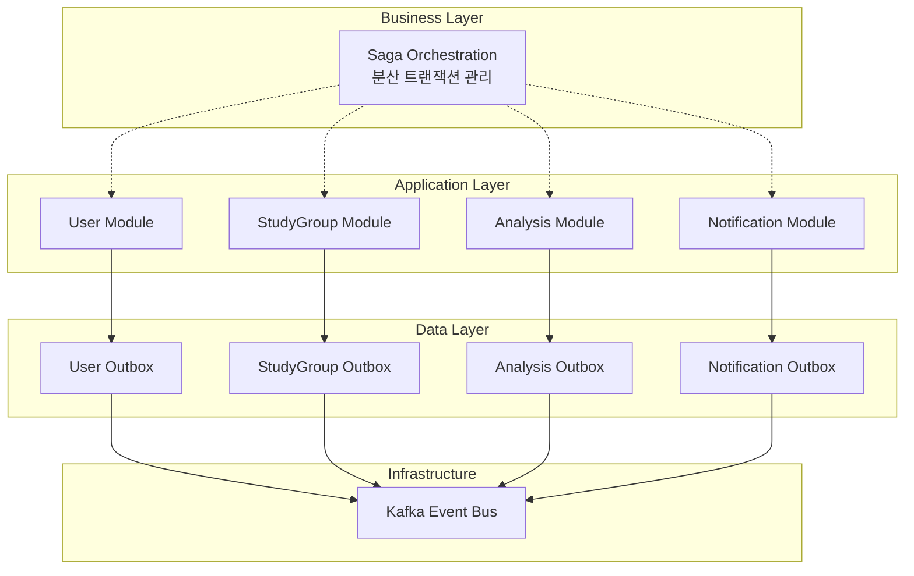
``` mermaid
graph TD
    subgraph "Business Layer"
        Saga[Saga Orchestration<br>분산 트랜잭션 관리]
    end
    
    subgraph "Application Layer"
        UM[User Module] 
        SGM[StudyGroup Module]
        AM[Analysis Module]
        NM[Notification Module]
    end
    
    subgraph "Data Layer"  
        UOutbox[User Outbox]
        SGOutbox[StudyGroup Outbox]
        AOutbox[Analysis Outbox] 
        NOutbox[Notification Outbox]
    end
    
    subgraph "Infrastructure"
        Kafka[Kafka Event Bus]
    end
    
    Saga -.-> UM
    Saga -.-> SGM
    Saga -.-> AM
    Saga -.-> NM
    
    UM --> UOutbox
    SGM --> SGOutbox
    AM --> AOutbox
    NM --> NOutbox
    
    UOutbox --> Kafka
    SGOutbox --> Kafka
    AOutbox --> Kafka
    NOutbox --> Kafka
```

---

## 📋 **전체 Saga 플로우 목록**

### **🔥 Phase 1 필수 Saga (즉시 구현)**
1. **USER_REGISTRATION_SAGA** - Google OAuth2 회원가입
2. **SOLVEDAC_LINK_SAGA** - solved.ac 계정 연동  
3. **JOIN_GROUP_SAGA** - 스터디 그룹 참여
4. **CREATE_GROUP_SAGA** - 스터디 그룹 생성
5. **SUBMISSION_SYNC_SAGA** - 새 제출 데이터 동기화
6. **ANALYSIS_UPDATE_SAGA** - 사용자 분석 결과 업데이트

### **🟡 Phase 2 확장 Saga**
7. **LEAVE_GROUP_SAGA** - 스터디 그룹 탈퇴
8. **GROUP_RULE_UPDATE_SAGA** - 그룹 규칙 변경
9. **PROBLEM_ASSIGNMENT_SAGA** - 문제 자동 할당
10. **RULE_VIOLATION_SAGA** - 규칙 위반 처리
11. **RECOMMENDATION_GENERATION_SAGA** - 개인 추천 생성
12. **GROUP_ACHIEVEMENT_SAGA** - 그룹 목표 달성

### **🔵 Phase 3 고급 Saga (소셜 기능)**  
13. **DISCUSSION_CREATE_SAGA** - 문제 토론 생성
14. **CODE_REVIEW_SUBMIT_SAGA** - 코드 리뷰 제출
15. **CONTENT_MODERATION_SAGA** - 컨텐츠 신고 처리

---

## 📋 **Phase 1 핵심 Saga 상세 설계**

### **1. USER_REGISTRATION_SAGA**

**목표**: Google OAuth2를 통한 신규 사용자 등록과 초기 설정

#### **Happy Path 흐름**

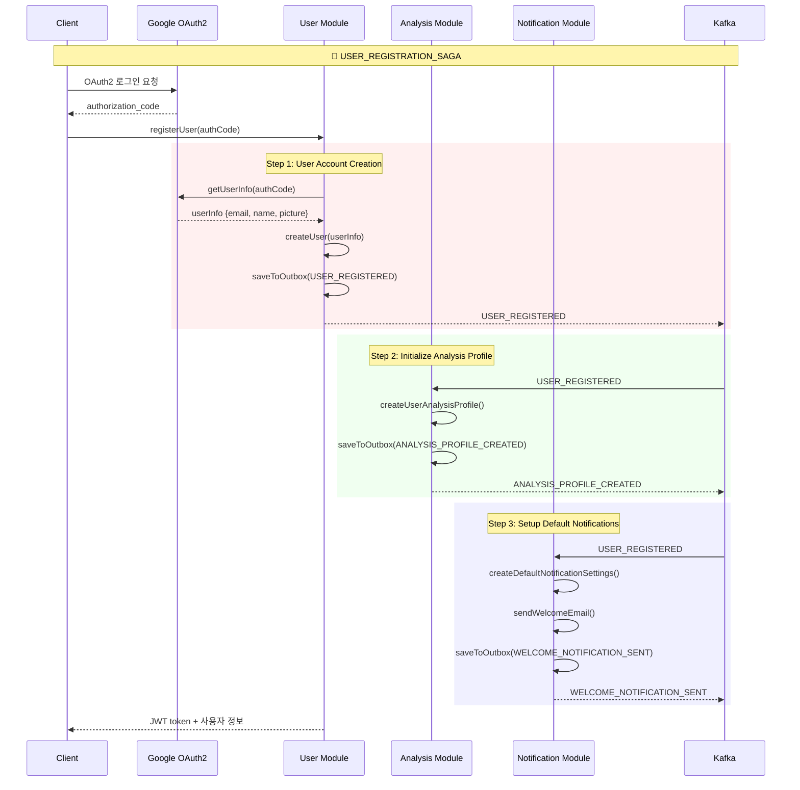
```mermaid
sequenceDiagram
    participant Client
    participant Google as Google OAuth2
    participant U as User Module
    participant A as Analysis Module
    participant N as Notification Module
    participant K as Kafka

    Note over Client,K: 🔄 USER_REGISTRATION_SAGA
    
    Client->>Google: OAuth2 로그인 요청
    Google-->>Client: authorization_code
    Client->>U: registerUser(authCode)
    
    rect rgb(255, 240, 240)
        Note over U: Step 1: User Account Creation
        U->>Google: getUserInfo(authCode)
        Google-->>U: userInfo {email, name, picture}
        U->>U: createUser(userInfo)
        U->>U: saveToOutbox(USER_REGISTERED)
        U-->>K: USER_REGISTERED
    end
    
    rect rgb(240, 255, 240)
        Note over A: Step 2: Initialize Analysis Profile
        K->>A: USER_REGISTERED
        A->>A: createUserAnalysisProfile()
        A->>A: saveToOutbox(ANALYSIS_PROFILE_CREATED)
        A-->>K: ANALYSIS_PROFILE_CREATED
    end
    
    rect rgb(240, 240, 255)
        Note over N: Step 3: Setup Default Notifications
        K->>N: USER_REGISTERED
        N->>N: createDefaultNotificationSettings()
        N->>N: sendWelcomeEmail()
        N->>N: saveToOutbox(WELCOME_NOTIFICATION_SENT)
        N-->>K: WELCOME_NOTIFICATION_SENT
    end
    
    U-->>Client: JWT token + 사용자 정보
```

#### **이벤트 명세**

| 이벤트 타입 | 발행 모듈 | 구독 모듈 | 페이로드 |
|------------|----------|----------|---------|
| `USER_REGISTERED` | User | Analysis, Notification | `{userId, email, nickname, profileImageUrl}` |
| `ANALYSIS_PROFILE_CREATED` | Analysis | - | `{userId, profileId}` |
| `WELCOME_NOTIFICATION_SENT` | Notification | - | `{userId, notificationId}` |

---

### **2. CREATE_GROUP_SAGA**

**목표**: 스터디 그룹 생성과 그룹장 설정, 초기 환경 구축

#### **Happy Path 흐름**

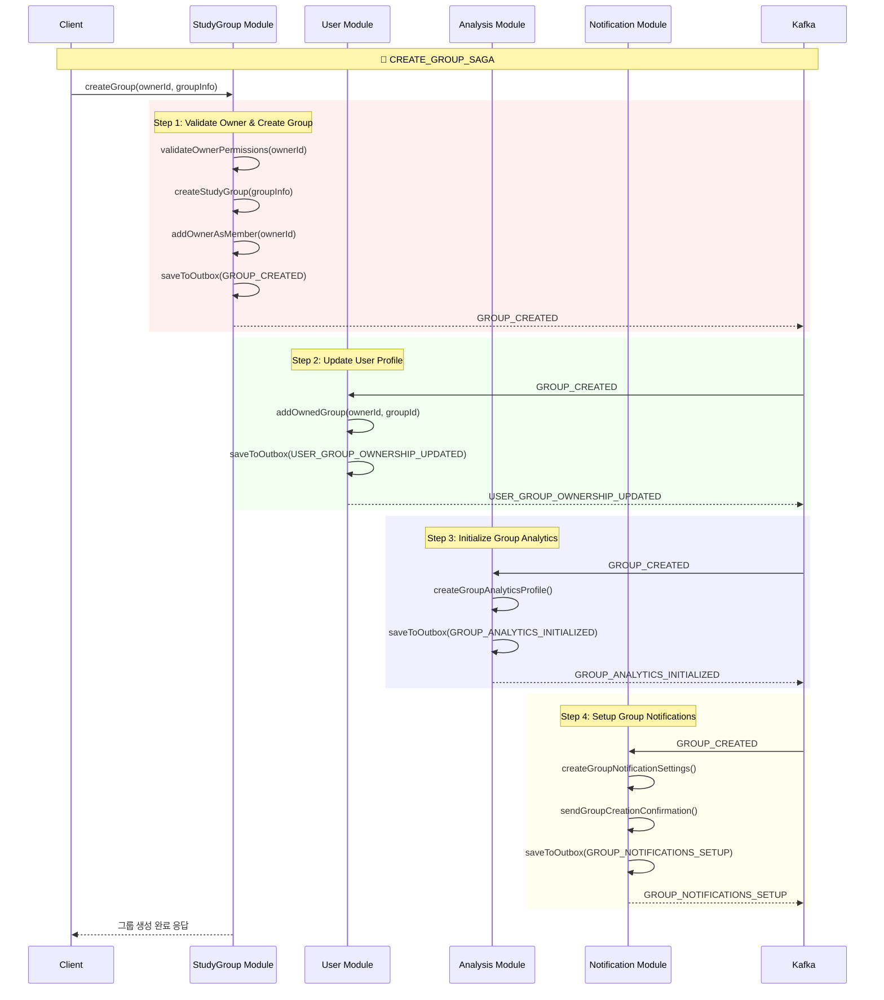
```mermaid
sequenceDiagram
    participant Client
    participant SG as StudyGroup Module
    participant U as User Module
    participant A as Analysis Module
    participant N as Notification Module
    participant K as Kafka

    Note over Client,K: 🔄 CREATE_GROUP_SAGA
    
    Client->>SG: createGroup(ownerId, groupInfo)
    
    rect rgb(255, 240, 240)
        Note over SG: Step 1: Validate Owner & Create Group
        SG->>SG: validateOwnerPermissions(ownerId)
        SG->>SG: createStudyGroup(groupInfo)
        SG->>SG: addOwnerAsMember(ownerId)
        SG->>SG: saveToOutbox(GROUP_CREATED)
        SG-->>K: GROUP_CREATED
    end
    
    rect rgb(240, 255, 240)
        Note over U: Step 2: Update User Profile
        K->>U: GROUP_CREATED
        U->>U: addOwnedGroup(ownerId, groupId)
        U->>U: saveToOutbox(USER_GROUP_OWNERSHIP_UPDATED)
        U-->>K: USER_GROUP_OWNERSHIP_UPDATED
    end
    
    rect rgb(240, 240, 255)
        Note over A: Step 3: Initialize Group Analytics
        K->>A: GROUP_CREATED
        A->>A: createGroupAnalyticsProfile()
        A->>A: saveToOutbox(GROUP_ANALYTICS_INITIALIZED)
        A-->>K: GROUP_ANALYTICS_INITIALIZED
    end
    
    rect rgb(255, 255, 240)
        Note over N: Step 4: Setup Group Notifications
        K->>N: GROUP_CREATED
        N->>N: createGroupNotificationSettings()
        N->>N: sendGroupCreationConfirmation()
        N->>N: saveToOutbox(GROUP_NOTIFICATIONS_SETUP)
        N-->>K: GROUP_NOTIFICATIONS_SETUP
    end
    
    SG-->>Client: 그룹 생성 완료 응답
```

#### **이벤트 명세**

| 이벤트 타입 | 발행 모듈 | 구독 모듈 | 페이로드 |
|------------|----------|----------|---------|
| `GROUP_CREATED` | StudyGroup | User, Analysis, Notification | `{groupId, ownerId, groupName, isPublic}` |
| `USER_GROUP_OWNERSHIP_UPDATED` | User | - | `{userId, ownedGroups[]}` |
| `GROUP_ANALYTICS_INITIALIZED` | Analysis | - | `{groupId, analyticsProfileId}` |
| `GROUP_NOTIFICATIONS_SETUP` | Notification | - | `{groupId, notificationSettingsId}` |

---

### **3. SUBMISSION_SYNC_SAGA**

**목표**: solved.ac에서 새로운 제출을 감지하여 모든 관련 서비스에 동기화

#### **Happy Path 흐름**

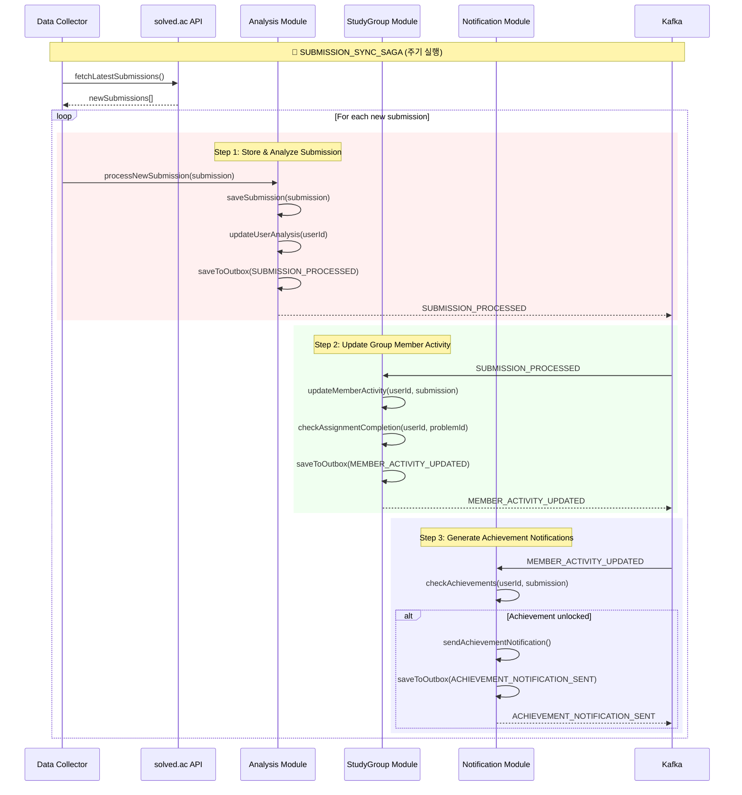
```mermaid
sequenceDiagram
    participant Scheduler as Data Collector
    participant API as solved.ac API
    participant A as Analysis Module
    participant SG as StudyGroup Module
    participant N as Notification Module
    participant K as Kafka

    Note over Scheduler,K: 🔄 SUBMISSION_SYNC_SAGA (주기 실행)
    
    Scheduler->>API: fetchLatestSubmissions()
    API-->>Scheduler: newSubmissions[]
    
    loop For each new submission
        rect rgb(255, 240, 240)
            Note over A: Step 1: Store & Analyze Submission
            Scheduler->>A: processNewSubmission(submission)
            A->>A: saveSubmission(submission)
            A->>A: updateUserAnalysis(userId)
            A->>A: saveToOutbox(SUBMISSION_PROCESSED)
            A-->>K: SUBMISSION_PROCESSED
        end
        
        rect rgb(240, 255, 240)
            Note over SG: Step 2: Update Group Member Activity
            K->>SG: SUBMISSION_PROCESSED
            SG->>SG: updateMemberActivity(userId, submission)
            SG->>SG: checkAssignmentCompletion(userId, problemId)
            SG->>SG: saveToOutbox(MEMBER_ACTIVITY_UPDATED)
            SG-->>K: MEMBER_ACTIVITY_UPDATED
        end
        
        rect rgb(240, 240, 255)
            Note over N: Step 3: Generate Achievement Notifications
            K->>N: MEMBER_ACTIVITY_UPDATED
            N->>N: checkAchievements(userId, submission)
            alt Achievement unlocked
                N->>N: sendAchievementNotification()
                N->>N: saveToOutbox(ACHIEVEMENT_NOTIFICATION_SENT)
                N-->>K: ACHIEVEMENT_NOTIFICATION_SENT
            end
        end
    end
```

#### **이벤트 명세**

| 이벤트 타입 | 발행 모듈 | 구독 모듈 | 페이로드 |
|------------|----------|----------|---------|
| `SUBMISSION_PROCESSED` | Analysis | StudyGroup, Notification | `{userId, submissionId, problemId, result, solvedAt}` |
| `MEMBER_ACTIVITY_UPDATED` | StudyGroup | Notification, Analysis | `{groupId, userId, activityData, assignmentCompleted?}` |
| `ACHIEVEMENT_NOTIFICATION_SENT` | Notification | - | `{userId, achievementType, notificationId}` |

---

### **4. ANALYSIS_UPDATE_SAGA**

**목표**: 사용자 분석 결과 업데이트와 추천 갱신

#### **Happy Path 흐름**

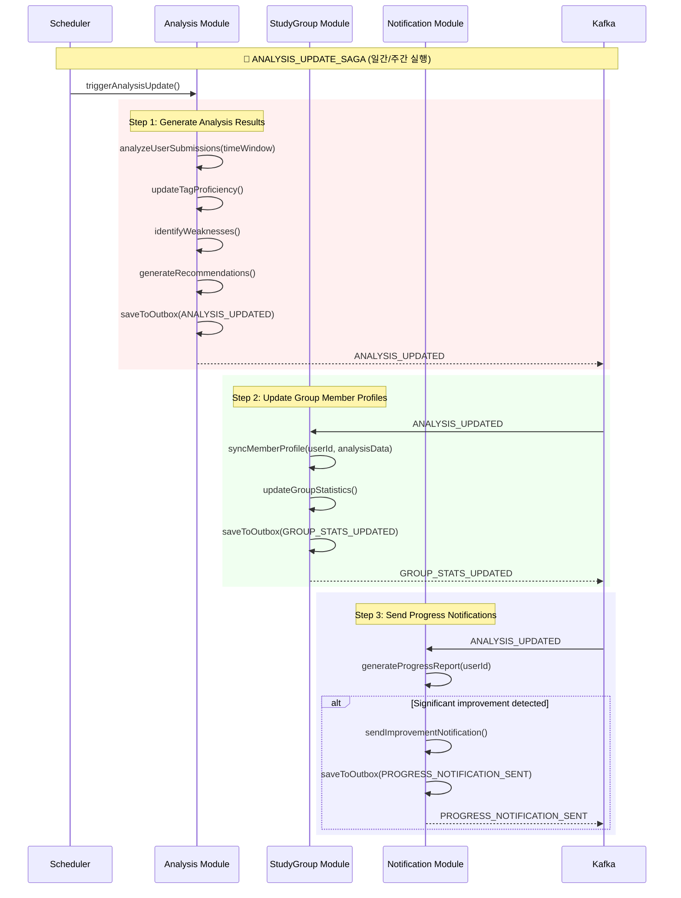
```mermaid
sequenceDiagram
    participant Scheduler
    participant A as Analysis Module
    participant SG as StudyGroup Module
    participant N as Notification Module
    participant K as Kafka

    Note over Scheduler,K: 🔄 ANALYSIS_UPDATE_SAGA (일간/주간 실행)
    
    Scheduler->>A: triggerAnalysisUpdate()
    
    rect rgb(255, 240, 240)
        Note over A: Step 1: Generate Analysis Results
        A->>A: analyzeUserSubmissions(timeWindow)
        A->>A: updateTagProficiency()
        A->>A: identifyWeaknesses()
        A->>A: generateRecommendations()
        A->>A: saveToOutbox(ANALYSIS_UPDATED)
        A-->>K: ANALYSIS_UPDATED
    end
    
    rect rgb(240, 255, 240)
        Note over SG: Step 2: Update Group Member Profiles
        K->>SG: ANALYSIS_UPDATED
        SG->>SG: syncMemberProfile(userId, analysisData)
        SG->>SG: updateGroupStatistics()
        SG->>SG: saveToOutbox(GROUP_STATS_UPDATED)
        SG-->>K: GROUP_STATS_UPDATED
    end
    
    rect rgb(240, 240, 255)
        Note over N: Step 3: Send Progress Notifications
        K->>N: ANALYSIS_UPDATED
        N->>N: generateProgressReport(userId)
        alt Significant improvement detected
            N->>N: sendImprovementNotification()
            N->>N: saveToOutbox(PROGRESS_NOTIFICATION_SENT)
            N-->>K: PROGRESS_NOTIFICATION_SENT
        end
    end
```

#### **이벤트 명세**

| 이벤트 타입 | 발행 모듈 | 구독 모듈 | 페이로드 |
|------------|----------|----------|---------|
| `ANALYSIS_UPDATED` | Analysis | StudyGroup, Notification | `{userId, analysisData, weaknesses[], recommendations[]}` |
| `GROUP_STATS_UPDATED` | StudyGroup | Analysis | `{groupId, memberStats, groupStats}` |
| `PROGRESS_NOTIFICATION_SENT` | Notification | - | `{userId, progressType, notificationId}` |

---

### **5. LEAVE_GROUP_SAGA**

**목표**: 스터디 그룹 탈퇴와 관련 데이터 정리

#### **Happy Path 흐름**

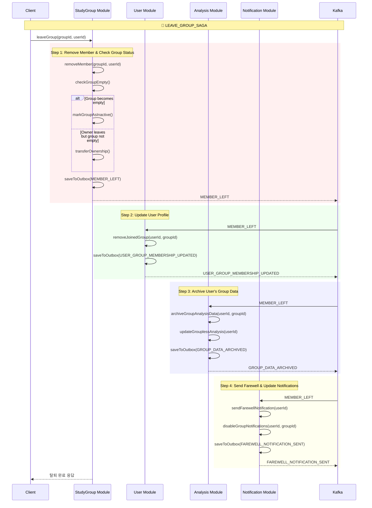
```mermaid
sequenceDiagram
    participant Client
    participant SG as StudyGroup Module
    participant U as User Module
    participant A as Analysis Module
    participant N as Notification Module
    participant K as Kafka

    Note over Client,K: 🔄 LEAVE_GROUP_SAGA
    
    Client->>SG: leaveGroup(groupId, userId)
    
    rect rgb(255, 240, 240)
        Note over SG: Step 1: Remove Member & Check Group Status
        SG->>SG: removeMember(groupId, userId)
        SG->>SG: checkGroupEmpty()
        alt Group becomes empty
            SG->>SG: markGroupAsInactive()
        else Owner leaves but group not empty
            SG->>SG: transferOwnership()
        end
        SG->>SG: saveToOutbox(MEMBER_LEFT)
        SG-->>K: MEMBER_LEFT
    end
    
    rect rgb(240, 255, 240)
        Note over U: Step 2: Update User Profile
        K->>U: MEMBER_LEFT
        U->>U: removeJoinedGroup(userId, groupId)
        U->>U: saveToOutbox(USER_GROUP_MEMBERSHIP_UPDATED)
        U-->>K: USER_GROUP_MEMBERSHIP_UPDATED
    end
    
    rect rgb(240, 240, 255)
        Note over A: Step 3: Archive User's Group Data
        K->>A: MEMBER_LEFT
        A->>A: archiveGroupAnalysisData(userId, groupId)
        A->>A: updateGrouplessAnalysis(userId)
        A->>A: saveToOutbox(GROUP_DATA_ARCHIVED)
        A-->>K: GROUP_DATA_ARCHIVED
    end
    
    rect rgb(255, 255, 240)
        Note over N: Step 4: Send Farewell & Update Notifications
        K->>N: MEMBER_LEFT
        N->>N: sendFarewellNotification(userId)
        N->>N: disableGroupNotifications(userId, groupId)
        N->>N: saveToOutbox(FAREWELL_NOTIFICATION_SENT)
        N-->>K: FAREWELL_NOTIFICATION_SENT
    end
    
    SG-->>Client: 탈퇴 완료 응답
```

---

### **6. GROUP_RULE_UPDATE_SAGA**

**목표**: 그룹 규칙 변경과 모든 멤버에게 알림

#### **Happy Path 흐름**

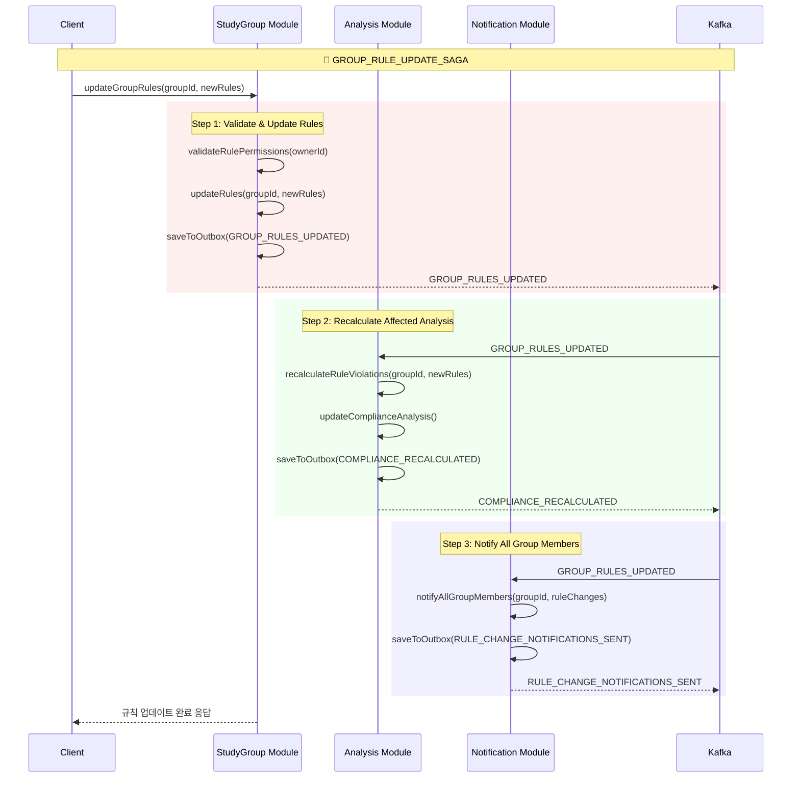
```mermaid
sequenceDiagram
    participant Client
    participant SG as StudyGroup Module
    participant A as Analysis Module
    participant N as Notification Module
    participant K as Kafka

    Note over Client,K: 🔄 GROUP_RULE_UPDATE_SAGA
    
    Client->>SG: updateGroupRules(groupId, newRules)
    
    rect rgb(255, 240, 240)
        Note over SG: Step 1: Validate & Update Rules
        SG->>SG: validateRulePermissions(ownerId)
        SG->>SG: updateRules(groupId, newRules)
        SG->>SG: saveToOutbox(GROUP_RULES_UPDATED)
        SG-->>K: GROUP_RULES_UPDATED
    end
    
    rect rgb(240, 255, 240)
        Note over A: Step 2: Recalculate Affected Analysis
        K->>A: GROUP_RULES_UPDATED
        A->>A: recalculateRuleViolations(groupId, newRules)
        A->>A: updateComplianceAnalysis()
        A->>A: saveToOutbox(COMPLIANCE_RECALCULATED)
        A-->>K: COMPLIANCE_RECALCULATED
    end
    
    rect rgb(240, 240, 255)
        Note over N: Step 3: Notify All Group Members
        K->>N: GROUP_RULES_UPDATED
        N->>N: notifyAllGroupMembers(groupId, ruleChanges)
        N->>N: saveToOutbox(RULE_CHANGE_NOTIFICATIONS_SENT)
        N-->>K: RULE_CHANGE_NOTIFICATIONS_SENT
    end
    
    SG-->>Client: 규칙 업데이트 완료 응답
```

---

### **7. RULE_VIOLATION_SAGA**

**목표**: 규칙 위반 감지와 단계적 조치

#### **Happy Path 흐름**

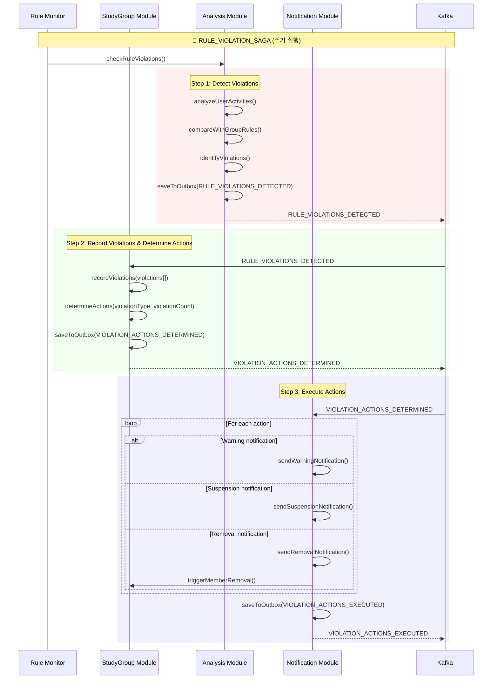
```mermaid
sequenceDiagram
    participant Monitor as Rule Monitor
    participant SG as StudyGroup Module
    participant A as Analysis Module
    participant N as Notification Module
    participant K as Kafka

    Note over Monitor,K: 🔄 RULE_VIOLATION_SAGA (주기 실행)
    
    Monitor->>A: checkRuleViolations()
    
    rect rgb(255, 240, 240)
        Note over A: Step 1: Detect Violations
        A->>A: analyzeUserActivities()
        A->>A: compareWithGroupRules()
        A->>A: identifyViolations()
        A->>A: saveToOutbox(RULE_VIOLATIONS_DETECTED)
        A-->>K: RULE_VIOLATIONS_DETECTED
    end
    
    rect rgb(240, 255, 240)
        Note over SG: Step 2: Record Violations & Determine Actions
        K->>SG: RULE_VIOLATIONS_DETECTED
        SG->>SG: recordViolations(violations[])
        SG->>SG: determineActions(violationType, violationCount)
        SG->>SG: saveToOutbox(VIOLATION_ACTIONS_DETERMINED)
        SG-->>K: VIOLATION_ACTIONS_DETERMINED
    end
    
    rect rgb(240, 240, 255)
        Note over N: Step 3: Execute Actions
        K->>N: VIOLATION_ACTIONS_DETERMINED
        loop For each action
            alt Warning notification
                N->>N: sendWarningNotification()
            else Suspension notification
                N->>N: sendSuspensionNotification()
            else Removal notification  
                N->>N: sendRemovalNotification()
                N->>SG: triggerMemberRemoval()
            end
        end
        N->>N: saveToOutbox(VIOLATION_ACTIONS_EXECUTED)
        N-->>K: VIOLATION_ACTIONS_EXECUTED
    end
```

---

## 🎯 **Saga 복잡도 및 우선순위**

### **🔥 Critical (즉시 구현)**
1. `USER_REGISTRATION_SAGA` - 기본 회원가입
2. `SOLVEDAC_LINK_SAGA` - 핵심 기능  
3. `CREATE_GROUP_SAGA` - 필수 그룹 기능
4. `JOIN_GROUP_SAGA` - 필수 그룹 기능

### **🟡 Important (Phase 1 후반)**
5. `SUBMISSION_SYNC_SAGA` - 데이터 동기화
6. `ANALYSIS_UPDATE_SAGA` - 분석 결과 갱신
7. `LEAVE_GROUP_SAGA` - 완전한 그룹 관리

### **🟢 Enhancement (Phase 2)**
8. `GROUP_RULE_UPDATE_SAGA` - 고급 그룹 관리
9. `PROBLEM_ASSIGNMENT_SAGA` - 자동화 기능
10. `RULE_VIOLATION_SAGA` - 자동 규칙 관리

---

### **1. 스터디 그룹 참여 Saga**

**목표**: 사용자가 스터디 그룹에 안전하게 참여하도록 보장

#### **Happy Path 흐름**

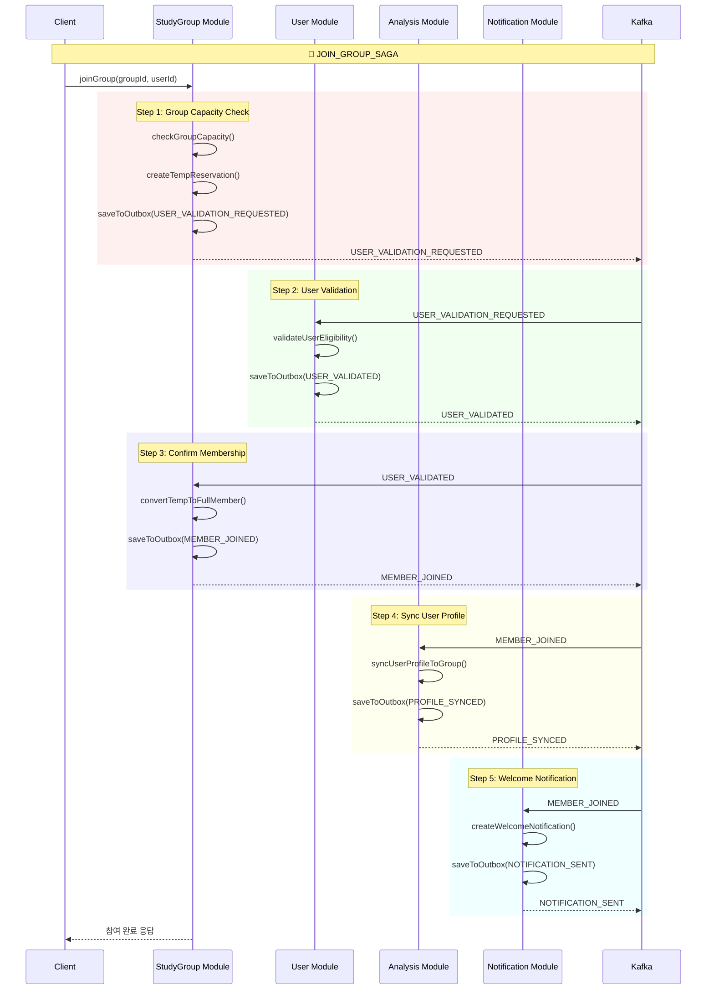
```mermaid
sequenceDiagram
    participant Client
    participant SG as StudyGroup Module
    participant U as User Module
    participant A as Analysis Module  
    participant N as Notification Module
    participant K as Kafka

    Note over Client,K: 🔄 JOIN_GROUP_SAGA
    
    Client->>SG: joinGroup(groupId, userId)
    
    rect rgb(255, 240, 240)
        Note over SG: Step 1: Group Capacity Check
        SG->>SG: checkGroupCapacity()
        SG->>SG: createTempReservation()
        SG->>SG: saveToOutbox(USER_VALIDATION_REQUESTED)
        SG-->>K: USER_VALIDATION_REQUESTED
    end
    
    rect rgb(240, 255, 240)
        Note over U: Step 2: User Validation
        K->>U: USER_VALIDATION_REQUESTED
        U->>U: validateUserEligibility()
        U->>U: saveToOutbox(USER_VALIDATED)
        U-->>K: USER_VALIDATED
    end
    
    rect rgb(240, 240, 255)
        Note over SG: Step 3: Confirm Membership
        K->>SG: USER_VALIDATED
        SG->>SG: convertTempToFullMember()
        SG->>SG: saveToOutbox(MEMBER_JOINED)
        SG-->>K: MEMBER_JOINED
    end
    
    rect rgb(255, 255, 240)
        Note over A: Step 4: Sync User Profile
        K->>A: MEMBER_JOINED
        A->>A: syncUserProfileToGroup()
        A->>A: saveToOutbox(PROFILE_SYNCED)
        A-->>K: PROFILE_SYNCED
    end
    
    rect rgb(240, 255, 255)
        Note over N: Step 5: Welcome Notification
        K->>N: MEMBER_JOINED
        N->>N: createWelcomeNotification()
        N->>N: saveToOutbox(NOTIFICATION_SENT)
        N-->>K: NOTIFICATION_SENT
    end
    
    SG-->>Client: 참여 완료 응답
```

#### **Compensation 흐름**

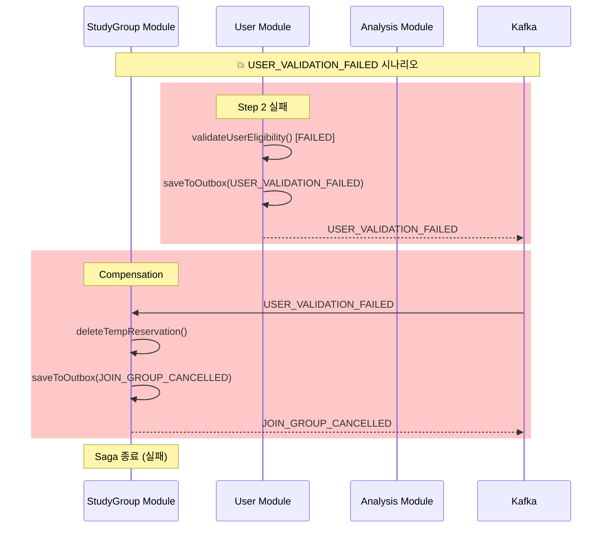
``` mermaid
sequenceDiagram 
    participant SG as StudyGroup Module
    participant U as User Module
    participant A as Analysis Module
    participant K as Kafka

    Note over SG,K: 💥 USER_VALIDATION_FAILED 시나리오
    
    rect rgb(255, 200, 200)
        Note over U: Step 2 실패
        U->>U: validateUserEligibility() [FAILED]
        U->>U: saveToOutbox(USER_VALIDATION_FAILED)
        U-->>K: USER_VALIDATION_FAILED
    end
    
    rect rgb(255, 200, 200)
        Note over SG: Compensation
        K->>SG: USER_VALIDATION_FAILED
        SG->>SG: deleteTempReservation()
        SG->>SG: saveToOutbox(JOIN_GROUP_CANCELLED)
        SG-->>K: JOIN_GROUP_CANCELLED
    end
    
    Note over SG: Saga 종료 (실패)
```

#### **이벤트 명세**

| 이벤트 타입 | 발행 모듈 | 구독 모듈 | 페이로드 | 보상 이벤트 |
|------------|----------|----------|---------|-----------|
| `USER_VALIDATION_REQUESTED` | StudyGroup | User | `{groupId, userId, sagaId}` | - |
| `USER_VALIDATED` | User | StudyGroup | `{groupId, userId, sagaId}` | `USER_VALIDATION_FAILED` |
| `USER_VALIDATION_FAILED` | User | StudyGroup | `{groupId, userId, sagaId, reason}` | - |
| `MEMBER_JOINED` | StudyGroup | Analysis, Notification | `{groupId, userId, joinedAt}` | `MEMBER_LEFT` |
| `PROFILE_SYNCED` | Analysis | StudyGroup | `{groupId, userId, profileData}` | - |
| `JOIN_GROUP_CANCELLED` | StudyGroup | - | `{groupId, userId, reason}` | - |

---

### **2. solved.ac 계정 연동 Saga**

**목표**: solved.ac 계정 연동과 관련 서비스들의 데이터 동기화

#### **Happy Path 흐름**

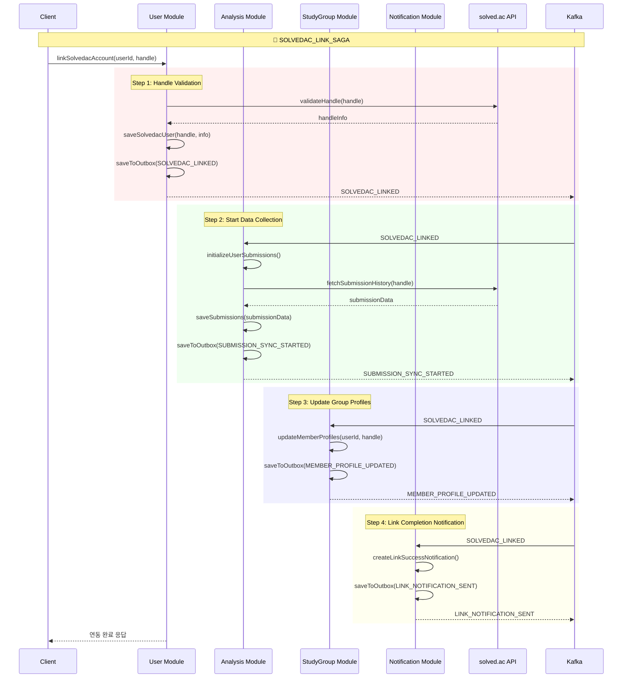
```mermaid
sequenceDiagram
    participant Client
    participant U as User Module
    participant A as Analysis Module
    participant SG as StudyGroup Module
    participant N as Notification Module
    participant API as solved.ac API
    participant K as Kafka

    Note over Client,K: 🔄 SOLVEDAC_LINK_SAGA
    
    Client->>U: linkSolvedacAccount(userId, handle)
    
    rect rgb(255, 240, 240)
        Note over U: Step 1: Handle Validation
        U->>API: validateHandle(handle)
        API-->>U: handleInfo
        U->>U: saveSolvedacUser(handle, info)
        U->>U: saveToOutbox(SOLVEDAC_LINKED)
        U-->>K: SOLVEDAC_LINKED
    end
    
    rect rgb(240, 255, 240)
        Note over A: Step 2: Start Data Collection
        K->>A: SOLVEDAC_LINKED
        A->>A: initializeUserSubmissions()
        A->>API: fetchSubmissionHistory(handle)
        API-->>A: submissionData
        A->>A: saveSubmissions(submissionData)
        A->>A: saveToOutbox(SUBMISSION_SYNC_STARTED)
        A-->>K: SUBMISSION_SYNC_STARTED
    end
    
    rect rgb(240, 240, 255)
        Note over SG: Step 3: Update Group Profiles
        K->>SG: SOLVEDAC_LINKED
        SG->>SG: updateMemberProfiles(userId, handle)
        SG->>SG: saveToOutbox(MEMBER_PROFILE_UPDATED)
        SG-->>K: MEMBER_PROFILE_UPDATED
    end
    
    rect rgb(255, 255, 240)
        Note over N: Step 4: Link Completion Notification
        K->>N: SOLVEDAC_LINKED
        N->>N: createLinkSuccessNotification()
        N->>N: saveToOutbox(LINK_NOTIFICATION_SENT)
        N-->>K: LINK_NOTIFICATION_SENT
    end
    
    U-->>Client: 연동 완료 응답
```

#### **Compensation 흐름**

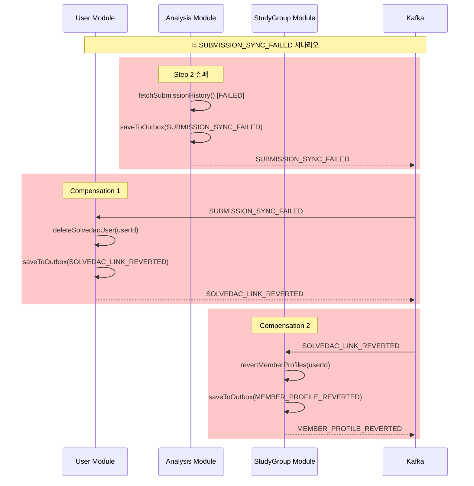
```mermaid
sequenceDiagram
    participant U as User Module
    participant A as Analysis Module
    participant SG as StudyGroup Module
    participant K as Kafka

    Note over U,K: 💥 SUBMISSION_SYNC_FAILED 시나리오
    
    rect rgb(255, 200, 200)
        Note over A: Step 2 실패
        A->>A: fetchSubmissionHistory() [FAILED]
        A->>A: saveToOutbox(SUBMISSION_SYNC_FAILED)
        A-->>K: SUBMISSION_SYNC_FAILED
    end
    
    rect rgb(255, 200, 200)
        Note over U: Compensation 1
        K->>U: SUBMISSION_SYNC_FAILED
        U->>U: deleteSolvedacUser(userId)
        U->>U: saveToOutbox(SOLVEDAC_LINK_REVERTED)
        U-->>K: SOLVEDAC_LINK_REVERTED
    end
    
    rect rgb(255, 200, 200)
        Note over SG: Compensation 2
        K->>SG: SOLVEDAC_LINK_REVERTED
        SG->>SG: revertMemberProfiles(userId)
        SG->>SG: saveToOutbox(MEMBER_PROFILE_REVERTED)
        SG-->>K: MEMBER_PROFILE_REVERTED
    end
```

#### **이벤트 명세**

| 이벤트 타입 | 발행 모듈 | 구독 모듈 | 페이로드 | 보상 이벤트 |
|------------|----------|----------|---------|-----------|
| `SOLVEDAC_LINKED` | User | Analysis, StudyGroup, Notification | `{userId, handle, tier, solvedCount}` | `SOLVEDAC_LINK_REVERTED` |
| `SUBMISSION_SYNC_STARTED` | Analysis | StudyGroup | `{userId, handle, syncStartedAt}` | `SUBMISSION_SYNC_FAILED` |
| `SUBMISSION_SYNC_FAILED` | Analysis | User, StudyGroup | `{userId, handle, error}` | - |
| `MEMBER_PROFILE_UPDATED` | StudyGroup | - | `{userId, profileData}` | `MEMBER_PROFILE_REVERTED` |
| `LINK_NOTIFICATION_SENT` | Notification | - | `{userId, notificationId}` | - |

---

### **3. 문제 자동 할당 Saga**

**목표**: 스터디 그룹 규칙에 따른 문제 자동 할당 및 알림

#### **Happy Path 흐름**

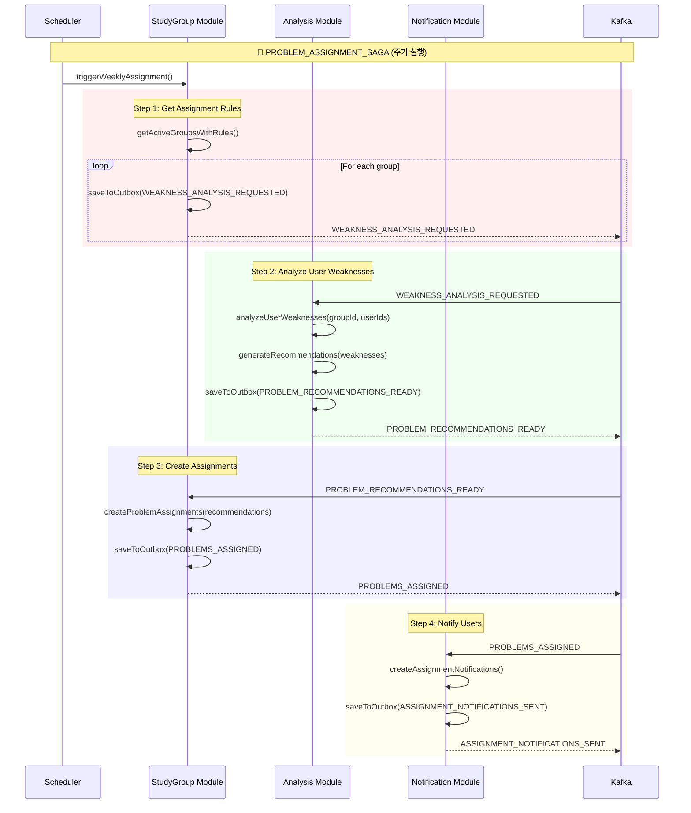
```mermaid
sequenceDiagram
    participant Scheduler
    participant SG as StudyGroup Module
    participant A as Analysis Module  
    participant N as Notification Module
    participant K as Kafka

    Note over Scheduler,K: 🔄 PROBLEM_ASSIGNMENT_SAGA (주기 실행)
    
    Scheduler->>SG: triggerWeeklyAssignment()
    
    rect rgb(255, 240, 240)
        Note over SG: Step 1: Get Assignment Rules
        SG->>SG: getActiveGroupsWithRules()
        loop For each group
            SG->>SG: saveToOutbox(WEAKNESS_ANALYSIS_REQUESTED)
            SG-->>K: WEAKNESS_ANALYSIS_REQUESTED
        end
    end
    
    rect rgb(240, 255, 240)
        Note over A: Step 2: Analyze User Weaknesses
        K->>A: WEAKNESS_ANALYSIS_REQUESTED
        A->>A: analyzeUserWeaknesses(groupId, userIds)
        A->>A: generateRecommendations(weaknesses)
        A->>A: saveToOutbox(PROBLEM_RECOMMENDATIONS_READY)
        A-->>K: PROBLEM_RECOMMENDATIONS_READY
    end
    
    rect rgb(240, 240, 255)
        Note over SG: Step 3: Create Assignments
        K->>SG: PROBLEM_RECOMMENDATIONS_READY
        SG->>SG: createProblemAssignments(recommendations)
        SG->>SG: saveToOutbox(PROBLEMS_ASSIGNED)
        SG-->>K: PROBLEMS_ASSIGNED
    end
    
    rect rgb(255, 255, 240)
        Note over N: Step 4: Notify Users
        K->>N: PROBLEMS_ASSIGNED
        N->>N: createAssignmentNotifications()
        N->>N: saveToOutbox(ASSIGNMENT_NOTIFICATIONS_SENT)
        N-->>K: ASSIGNMENT_NOTIFICATIONS_SENT
    end
```

#### **이벤트 명세**

| 이벤트 타입 | 발행 모듈 | 구독 모듈 | 페이로드 |
|------------|----------|----------|---------|
| `WEAKNESS_ANALYSIS_REQUESTED` | StudyGroup | Analysis | `{groupId, userIds, analysisConfig}` |
| `PROBLEM_RECOMMENDATIONS_READY` | Analysis | StudyGroup | `{groupId, recommendations[]}` |
| `PROBLEMS_ASSIGNED` | StudyGroup | Notification, Analysis | `{groupId, assignments[]}` |
| `ASSIGNMENT_NOTIFICATIONS_SENT` | Notification | - | `{userIds, notificationIds}` |

---

## 🔧 **Outbox Pattern 구현 설계**

### **공통 Outbox 테이블 스키마**

```sql
-- 각 서비스별 동일한 구조의 OUTBOX_EVENTS 테이블
CREATE TABLE OUTBOX_EVENTS (
    event_id UUID PRIMARY KEY,
    aggregate_type VARCHAR(50) NOT NULL,  -- USER, STUDY_GROUP, ANALYSIS 등
    aggregate_id VARCHAR(100) NOT NULL,   -- 집합체 ID
    event_type VARCHAR(100) NOT NULL,     -- 이벤트 타입
    event_data JSONB NOT NULL,            -- 이벤트 페이로드
    saga_id UUID,                         -- Saga 추적 ID (선택적)
    saga_type VARCHAR(50),                -- Saga 타입 (선택적)
    created_at TIMESTAMP DEFAULT NOW(),
    processed BOOLEAN DEFAULT FALSE,
    processed_at TIMESTAMP,
    retry_count INTEGER DEFAULT 0,
    max_retries INTEGER DEFAULT 3,
    next_retry_at TIMESTAMP,
    error_message TEXT
);

-- CDC 최적화 인덱스 (재시도 관련 인덱스 제거)
CREATE INDEX idx_outbox_processed ON OUTBOX_EVENTS(processed);
CREATE INDEX idx_outbox_saga ON OUTBOX_EVENTS(saga_id, saga_type);
CREATE INDEX idx_outbox_aggregate ON OUTBOX_EVENTS(aggregate_type, aggregate_id, created_at);
CREATE INDEX idx_outbox_cleanup ON OUTBOX_EVENTS(processed_at); -- 정리 작업용
```

### **CDC 기반 Outbox Pattern 구현**

**Change Data Capture (CDC)를 통한 실시간 이벤트 발행**

```kotlin
// Debezium Connector가 WAL 변경사항을 감지하여 자동으로 Kafka 발행
// 별도의 스케줄링이나 폴링 불필요

@Component  
class OutboxEventHandler {
    
    // CDC에서 발행된 이벤트의 후처리만 담당
    @KafkaListener(topics = ["outbox.events"])
    fun handleOutboxEvent(event: OutboxEventMessage) {
        try {
                publishEvent(event)
                event.markAsProcessed()
            } catch (ex: Exception) {
                handlePublishFailure(event, ex)
            }
        }
    }
    
    private fun publishEvent(event: OutboxEvent) {
        val message = KafkaMessage(
            key = event.aggregateId,
            value = event.eventData,
            headers = mapOf(
                "eventType" to event.eventType,
                "sagaId" to event.sagaId,
                "sagaType" to event.sagaType
            )
        )
        
        kafkaTemplate.send(event.eventType, message)
            .addCallback(
                { result -> logger.info("Event published: ${event.eventId}") },
                { failure -> throw failure.cause ?: failure }
            )
    }
    
    private fun handlePublishFailure(event: OutboxEvent, ex: Exception) {
        event.retryCount++
        event.errorMessage = ex.message
        
        if (event.retryCount >= event.maxRetries) {
            event.processed = true // DLQ 처리 또는 수동 처리 필요
            logger.error("Event publishing failed after max retries: ${event.eventId}", ex)
        } else {
            event.nextRetryAt = LocalDateTime.now().plusMinutes(event.retryCount * 5L)
            logger.warn("Event publishing failed, will retry: ${event.eventId}", ex)
        }
        
        outboxRepository.save(event)
    }
}
```

---

## 📊 **Saga State 관리**

### **Saga 상태 추적 테이블**

```sql
CREATE TABLE SAGA_INSTANCES (
    saga_id UUID PRIMARY KEY,
    saga_type VARCHAR(50) NOT NULL,
    saga_status VARCHAR(20) NOT NULL, -- STARTED, IN_PROGRESS, COMPLETED, FAILED, COMPENSATING, COMPENSATED
    correlation_data JSONB NOT NULL,  -- Saga 관련 데이터 (groupId, userId 등)
    current_step VARCHAR(50),         -- 현재 단계
    completed_steps JSONB,            -- 완료된 단계들
    failed_step VARCHAR(50),          -- 실패한 단계
    compensation_steps JSONB,         -- 실행된 보상 단계들
    started_at TIMESTAMP DEFAULT NOW(),
    updated_at TIMESTAMP DEFAULT NOW(),
    completed_at TIMESTAMP,
    timeout_at TIMESTAMP,
    error_message TEXT
);

CREATE INDEX idx_saga_status ON SAGA_INSTANCES(saga_status, started_at);
CREATE INDEX idx_saga_timeout ON SAGA_INSTANCES(timeout_at) WHERE timeout_at IS NOT NULL;
```

### **Saga Coordinator 인터페이스**

```kotlin
interface SagaCoordinator {
    fun startSaga(sagaType: String, correlationData: Map<String, Any>): UUID
    fun handleSagaEvent(sagaId: UUID, eventType: String, eventData: Any)
    fun compensateSaga(sagaId: UUID, reason: String)
    fun getSagaStatus(sagaId: UUID): SagaStatus
}

@Component
class ChoreographySagaCoordinator : SagaCoordinator {
    
    override fun startSaga(sagaType: String, correlationData: Map<String, Any>): UUID {
        val sagaId = UUID.randomUUID()
        val sagaInstance = SagaInstance(
            sagaId = sagaId,
            sagaType = sagaType,
            sagaStatus = SagaStatus.STARTED,
            correlationData = correlationData,
            timeoutAt = LocalDateTime.now().plusHours(24) // 24시간 타임아웃
        )
        sagaRepository.save(sagaInstance)
        
        // 첫 번째 이벤트 발행
        publishInitialSagaEvent(sagaType, sagaId, correlationData)
        
        return sagaId
    }
    
    override fun handleSagaEvent(sagaId: UUID, eventType: String, eventData: Any) {
        val saga = sagaRepository.findById(sagaId) ?: return
        
        when (eventType) {
            "USER_VALIDATED" -> {
                saga.completeStep("USER_VALIDATION")
                saga.currentStep = "MEMBER_ADDITION"
                sagaRepository.save(saga)
            }
            "USER_VALIDATION_FAILED" -> {
                saga.failStep("USER_VALIDATION")
                compensateSaga(sagaId, "User validation failed")
            }
            // ... 다른 이벤트들
        }
    }
    
    @Scheduled(fixedDelay = 60000) // 1분마다 타임아웃 체크
    fun handleTimeouts() {
        val timedOutSagas = sagaRepository.findTimedOutSagas()
        timedOutSagas.forEach { saga ->
            logger.warn("Saga timeout: ${saga.sagaId}")
            compensateSaga(saga.sagaId, "Saga timeout")
        }
    }
}
```

---

## 🚨 **장애 대응 시나리오**

### **1. 이벤트 발행 실패**
- **문제**: DB는 업데이트되었지만 Kafka 발행 실패
- **해결**: Outbox Pattern의 재시도 메커니즘
- **모니터링**: 미처리 Outbox 이벤트 수 알림

### **2. 이벤트 수신 실패**  
- **문제**: Consumer가 이벤트 처리 중 실패
- **해결**: Kafka의 offset commit 지연, DLQ 활용
- **모니터링**: Consumer lag, 처리 실패율

### **3. Saga 타임아웃**
- **문제**: 일부 단계가 응답하지 않음
- **해결**: 자동 타임아웃 + 보상 트랜잭션
- **모니터링**: 장기 실행 Saga 추적

### **4. 보상 트랜잭션 실패**
- **문제**: 롤백 과정에서 추가 실패 발생  
- **해결**: 수동 개입 필요한 상태로 마킹
- **모니터링**: 보상 실패 알림

---

## 📈 **모니터링 및 관찰성**

### **핵심 메트릭**

```yaml
# Outbox 메트릭
outbox.events.unpublished.count          # 미발행 이벤트 수
outbox.events.retry.count               # 재시도 중인 이벤트 수
outbox.events.failed.count              # 발행 실패 이벤트 수
outbox.publish.latency                  # 발행 지연시간

# Saga 메트릭  
saga.instances.active.count             # 진행 중인 Saga 수
saga.instances.timeout.count            # 타임아웃된 Saga 수
saga.completion.rate                    # Saga 성공률
saga.compensation.rate                  # 보상 실행률
saga.duration.avg                       # 평균 Saga 실행 시간
```

### **알림 규칙**

```yaml
# 즉시 알림
- 보상 트랜잭션 실패
- Saga 타임아웃 5개 이상
- 미발행 Outbox 이벤트 100개 이상

# 일간 리포트
- Saga 성공/실패 통계
- 평균 처리 시간 추이
- 주요 실패 원인 분석
```

---

## 🎯 **구현 순서**

### **Phase 1: 기본 인프라**
1. ✅ Outbox 테이블 및 Publisher 구현
2. ✅ Saga 상태 관리 테이블
3. ✅ 기본 이벤트 발행/구독 구조

### **Phase 2: 핵심 Saga**
1. ✅ JOIN_GROUP_SAGA 구현 및 테스트
2. ✅ SOLVEDAC_LINK_SAGA 구현 및 테스트  
3. 🟡 PROBLEM_ASSIGNMENT_SAGA 구현

### **Phase 3: 운영 도구**
1. 🟡 Saga 모니터링 대시보드
2. 🟡 수동 보상 도구
3. 🟡 이벤트 재처리 도구

---

📝 **문서 버전**: v1.0  
📅 **최종 수정일**: 2025-07-22  
👤 **작성자**: 채기훈