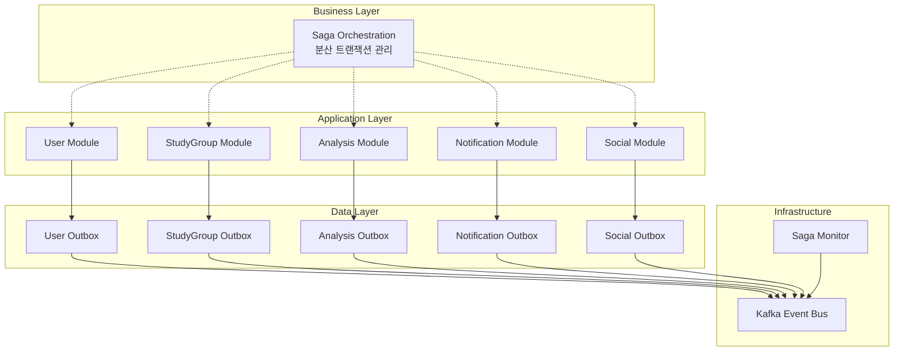

# Saga Pattern + Outbox Pattern 설계 개요

이 문서는 **알고리포트 시스템의 분산 트랜잭션 관리**를 위한 Saga Pattern과 Outbox Pattern의 전체 개요와 공통 패턴을 정의합니다.

---

## 🎯 **설계 배경**

### **문제 상황**
- 각 도메인 모듈이 **독립된 데이터베이스 스키마** 소유 (MSA 고려 설계)
- 단일 `@Transactional`로 **여러 스키마를 커버할 수 없음**
- 비즈니스 플로우가 **여러 모듈에 걸쳐** 실행됨 (예: 그룹 참여, 계정 연동 등)

### **해결 방안**
- **Outbox Pattern**: 각 모듈 내 이벤트 발행의 원자성 보장
- **Choreography Saga**: 모듈 간 분산 트랜잭션 관리  
- **이벤트 기반 보상**: 실패 시 자동 롤백

---

## 🏗️ **아키텍처 개요**



---

## 📋 **전체 Saga 목록**

### **🔥 Phase 1: 핵심 Saga (즉시 구현)**
| Saga 이름 | 복잡도 | 주요 모듈 | 설명 |
|----------|--------|----------|------|
| `USER_REGISTRATION_SAGA` | Medium | User, Analysis, Notification | Google OAuth2 회원가입 |
| `SOLVEDAC_LINK_SAGA` | High | User, Analysis, StudyGroup, Notification | solved.ac 계정 연동 |
| `CREATE_GROUP_SAGA` | Medium | StudyGroup, User, Analysis, Notification | 스터디 그룹 생성 |
| `JOIN_GROUP_SAGA` | High | StudyGroup, User, Analysis, Notification | 스터디 그룹 참여 |
| `SUBMISSION_SYNC_SAGA` | Medium | Analysis, StudyGroup, Notification | 새 제출 데이터 동기화 |
| `ANALYSIS_UPDATE_SAGA` | Medium | Analysis, StudyGroup, Notification | 분석 결과 갱신 |

### **🟡 Phase 2: 확장 Saga**
| Saga 이름 | 복잡도 | 주요 모듈 | 설명 |
|----------|--------|----------|------|
| `LEAVE_GROUP_SAGA` | High | StudyGroup, User, Analysis, Notification | 그룹 탈퇴 및 정리 |
| `GROUP_RULE_UPDATE_SAGA` | Medium | StudyGroup, Analysis, Notification | 그룹 규칙 변경 |
| `PROBLEM_ASSIGNMENT_SAGA` | High | StudyGroup, Analysis, Notification | 문제 자동 할당 |
| `RULE_VIOLATION_SAGA` | High | Analysis, StudyGroup, Notification | 규칙 위반 처리 |
| `RECOMMENDATION_GENERATION_SAGA` | Medium | Analysis, StudyGroup, Notification | 개인 추천 생성 |
| `GROUP_ACHIEVEMENT_SAGA` | Medium | StudyGroup, Analysis, Notification | 그룹 목표 달성 |

### **🔵 Phase 3: 소셜 Saga** 
| Saga 이름 | 복잡도 | 주요 모듈 | 설명 |
|----------|--------|----------|------|
| `DISCUSSION_CREATE_SAGA` | Low | Social, Notification | 문제 토론 생성 |
| `CODE_REVIEW_SUBMIT_SAGA` | Medium | Social, Analysis, Notification | 코드 리뷰 제출 |
| `CONTENT_MODERATION_SAGA` | High | Social, User, Notification | 컨텐츠 신고 처리 |

**총 15개 Saga, 약 50+ 도메인 이벤트**

---

## 🔧 **공통 패턴 정의**

### **1. Outbox Pattern 구현**

#### **CDC 최적화된 Outbox 테이블 스키마**

```sql
-- CDC 기반으로 최적화된 Outbox 테이블
-- retry 관련 필드 제거 (CDC가 실시간 발행 보장)
CREATE TABLE OUTBOX_EVENTS (
    event_id UUID PRIMARY KEY DEFAULT gen_random_uuid(),
    aggregate_type VARCHAR(50) NOT NULL,  -- USER, STUDY_GROUP, ANALYSIS 등
    aggregate_id VARCHAR(100) NOT NULL,   -- 집합체 ID  
    event_type VARCHAR(100) NOT NULL,     -- 이벤트 타입
    event_data TEXT NOT NULL,             -- 이벤트 페이로드 (JSON)
    saga_id UUID,                         -- Saga 추적 ID (선택적)
    saga_type VARCHAR(50),                -- Saga 타입 (선택적)
    created_at TIMESTAMP DEFAULT NOW(),
    processed BOOLEAN DEFAULT FALSE,      -- CDC 후처리 완료 여부
    processed_at TIMESTAMP,               -- CDC 후처리 완료 시각
    version INTEGER DEFAULT 1             -- 스키마 버전 관리
);

-- CDC 최적화 인덱스 (재시도 관련 인덱스 제거)
CREATE INDEX idx_outbox_processed 
ON OUTBOX_EVENTS(processed);

CREATE INDEX idx_outbox_saga 
ON OUTBOX_EVENTS(saga_id, saga_type);

CREATE INDEX idx_outbox_aggregate
ON OUTBOX_EVENTS(aggregate_type, aggregate_id, created_at);

CREATE INDEX idx_outbox_cleanup
ON OUTBOX_EVENTS(processed_at); -- 정리 작업용
```

#### **CDC 기반 Outbox Event Handler**

**🔄 CDC 아키텍처**: PostgreSQL WAL → Debezium → Kafka → Event Handler

```kotlin
@Component
class OutboxEventHandler(
    private val outboxEventRepository: OutboxEventRepository,
    private val objectMapper: ObjectMapper
) {
    
    private val logger = LoggerFactory.getLogger(OutboxEventHandler::class.java)
    
    /**
     * CDC에서 발행된 Outbox 이벤트 수신 및 후처리
     * 
     * Debezium Outbox Event Router에 의해 이벤트 타입별 토픽으로 라우팅된 메시지를 수신
     */
    @KafkaListener(
        topicPattern = "USER_.*|STUDY_GROUP_.*|ANALYSIS_.*|NOTIFICATION_.*",
        groupId = "algoreport-outbox-handler",
        concurrency = "3"
    )
    @Transactional
    fun handleOutboxEvent(
        @Payload eventPayload: String,
        @Header(KafkaHeaders.RECEIVED_TOPIC) topic: String,
        @Header("eventId", required = false) eventId: String?,
        @Header("sagaId", required = false) sagaId: String?,
        @Header("sagaType", required = false) sagaType: String?,
        @Header("aggregateType", required = false) aggregateType: String?
    ) {
        try {
            logger.debug("Processing outbox event: topic={}, eventId={}, sagaId={}", topic, eventId, sagaId)
            
            // 이벤트 페이로드 파싱
            val eventData = parseEventPayload(eventPayload)
            
            // 이벤트별 비즈니스 로직 처리
            processBusinessLogic(topic, eventData, sagaId, aggregateType)
            
            // Outbox 테이블에서 처리 완료 마킹
            eventId?.let { id ->
                markEventAsProcessed(UUID.fromString(id))
            }
            
            logger.info("Successfully processed outbox event: topic={}, eventId={}", topic, eventId)
            
        } catch (ex: Exception) {
            logger.error("Failed to process outbox event: topic={}, eventId={}", topic, eventId, ex)
            // CDC 기반에서는 자동 재시도가 Kafka Consumer에 의해 처리됨
            throw ex // 재시도를 위해 예외를 다시 던짐
        }
    }
    
    private fun markEventAsProcessed(eventId: UUID) {
        try {
            outboxEventRepository.findById(eventId).ifPresent { event ->
                event.markAsProcessed()
                outboxEventRepository.save(event)
                logger.debug("Marked outbox event as processed: {}", eventId)
            }
        } catch (ex: Exception) {
            logger.warn("Failed to mark outbox event as processed: {}", eventId, ex)
        }
    }
}
```

### **2. Saga State Management**

#### **Saga 인스턴스 추적 테이블**

```sql
CREATE TABLE SAGA_INSTANCES (
    saga_id UUID PRIMARY KEY,
    saga_type VARCHAR(50) NOT NULL,
    saga_status VARCHAR(20) NOT NULL, -- STARTED, IN_PROGRESS, COMPLETED, FAILED, COMPENSATING, COMPENSATED
    correlation_data JSONB NOT NULL,  -- Saga 관련 데이터 (groupId, userId 등)
    current_step VARCHAR(50),         -- 현재 단계
    completed_steps JSONB DEFAULT '[]', -- 완료된 단계들
    failed_step VARCHAR(50),          -- 실패한 단계
    compensation_steps JSONB DEFAULT '[]', -- 실행된 보상 단계들
    step_history JSONB DEFAULT '[]',  -- 전체 단계 이력
    started_at TIMESTAMP DEFAULT NOW(),
    updated_at TIMESTAMP DEFAULT NOW(),
    completed_at TIMESTAMP,
    timeout_at TIMESTAMP,
    error_message TEXT,
    version INTEGER DEFAULT 1
);

-- 인덱스
CREATE INDEX idx_saga_status ON SAGA_INSTANCES(saga_status, started_at);
CREATE INDEX idx_saga_timeout ON SAGA_INSTANCES(timeout_at) WHERE timeout_at IS NOT NULL;
CREATE INDEX idx_saga_type_status ON SAGA_INSTANCES(saga_type, saga_status);
```

#### **Saga 상태 관리 인터페이스**

```kotlin
interface SagaCoordinator {
    fun startSaga(sagaType: String, correlationData: Map<String, Any>, timeoutHours: Long = 24): UUID
    fun updateSagaStep(sagaId: UUID, stepName: String, stepStatus: SagaStepStatus, stepData: Any? = null)
    fun completeSaga(sagaId: UUID, result: Any? = null)
    fun failSaga(sagaId: UUID, reason: String, failedStep: String)
    fun compensateSaga(sagaId: UUID, reason: String)
    fun getSagaStatus(sagaId: UUID): SagaInstance?
    fun findActiveSagas(sagaType: String? = null): List<SagaInstance>
}

@Service
class ChoreographySagaCoordinator(
    private val sagaRepository: SagaInstanceRepository,
    private val sagaEventPublisher: SagaEventPublisher
) : SagaCoordinator {
    
    private val sagaCounter = Counter.build()
        .name("sagas_total")
        .labelNames("type", "status")
        .help("Total number of sagas by type and status")
        .register()
    
    @Transactional
    override fun startSaga(sagaType: String, correlationData: Map<String, Any>, timeoutHours: Long): UUID {
        val sagaId = UUID.randomUUID()
        val sagaInstance = SagaInstance(
            sagaId = sagaId,
            sagaType = sagaType,
            sagaStatus = SagaStatus.STARTED,
            correlationData = correlationData,
            timeoutAt = LocalDateTime.now().plusHours(timeoutHours)
        )
        
        sagaRepository.save(sagaInstance)
        sagaCounter.labels(sagaType, SagaStatus.STARTED.name).inc()
        
        logger.info("Started saga: {} of type: {} with correlation: {}", 
                   sagaId, sagaType, correlationData)
        
        // 첫 번째 이벤트 발행
        publishInitialSagaEvent(sagaType, sagaId, correlationData)
        
        return sagaId
    }
    
    @Transactional
    override fun updateSagaStep(sagaId: UUID, stepName: String, stepStatus: SagaStepStatus, stepData: Any?) {
        val saga = sagaRepository.findById(sagaId) 
            ?: throw SagaNotFoundException("Saga not found: $sagaId")
        
        saga.updateStep(stepName, stepStatus, stepData)
        sagaRepository.save(saga)
        
        logger.debug("Updated saga {} step {} with status {}", sagaId, stepName, stepStatus)
    }
    
    @Scheduled(fixedDelay = 60000) // 1분마다 타임아웃 체크
    @Transactional
    fun handleTimeouts() {
        val timedOutSagas = sagaRepository.findTimedOutSagas()
        timedOutSagas.forEach { saga ->
            logger.warn("Saga timeout detected: {} of type: {}", saga.sagaId, saga.sagaType)
            compensateSaga(saga.sagaId, "Saga timeout after ${saga.timeoutAt}")
            sagaCounter.labels(saga.sagaType, "TIMEOUT").inc()
        }
    }
}
```

---

## 📊 **이벤트 명명 규칙**

### **이벤트 타입 네이밍 컨벤션**

```yaml
# 패턴: {AGGREGATE}_{ACTION}[_{STATUS}]
# 예시:
USER_REGISTERED                    # 사용자 등록 완료
USER_PROFILE_UPDATED              # 사용자 프로필 업데이트
USER_VALIDATION_REQUESTED         # 사용자 검증 요청
USER_VALIDATION_COMPLETED         # 사용자 검증 완료
USER_VALIDATION_FAILED            # 사용자 검증 실패

STUDY_GROUP_CREATED               # 스터디 그룹 생성
STUDY_GROUP_MEMBER_JOINED         # 멤버 참여
STUDY_GROUP_MEMBER_LEFT           # 멤버 탈퇴
STUDY_GROUP_RULES_UPDATED         # 규칙 업데이트

SUBMISSION_PROCESSED              # 제출 데이터 처리 완료
ANALYSIS_UPDATED                  # 분석 결과 업데이트
RECOMMENDATION_GENERATED          # 추천 생성 완료

NOTIFICATION_SENT                 # 알림 발송 완료
NOTIFICATION_FAILED               # 알림 발송 실패
```

### **이벤트 페이로드 표준 구조**

```json
{
  "eventId": "uuid",
  "eventType": "USER_REGISTERED", 
  "aggregateId": "user-123",
  "aggregateType": "USER",
  "sagaId": "saga-uuid",
  "sagaType": "USER_REGISTRATION_SAGA",
  "timestamp": "2025-07-22T10:30:00Z",
  "version": 1,
  "data": {
    // 이벤트별 구체적 데이터
    "userId": "user-123",
    "email": "user@example.com", 
    "nickname": "알고마스터"
  },
  "metadata": {
    "correlationId": "correlation-uuid",
    "causationId": "previous-event-uuid", 
    "source": "user-service",
    "environment": "production"
  }
}
```

---

## 🚨 **장애 대응 전략**

### **CDC 기반 장애 시나리오별 대응**

| 장애 유형 | 감지 방법 | 자동 복구 | 수동 개입 |
|----------|----------|----------|----------|
| **WAL 복제 지연** | Debezium lag 메트릭 | 자동 따라잡기 | Debezium 재시작 |
| **이벤트 처리 실패** | Consumer Lag 증가 | Kafka 재시도 + DLQ | 실패 이벤트 재처리 |
| **Outbox 테이블 락** | DB 락 대기 시간 증가 | 트랜잭션 타임아웃 | 장기 트랜잭션 분석 |
| **Saga 타임아웃** | 장시간 실행 Saga 감지 | 자동 보상 트랜잭션 | Saga 수동 완료/취소 |
| **보상 실패** | 보상 이벤트 실패 알림 | 제한적 재시도 | 데이터 정합성 수동 복구 |
| **중복 이벤트** | 멱등성 키 중복 | 이벤트 무시 | - |
| **Debezium 커넥터 오류** | 커넥터 상태 모니터링 | 자동 재시작 | 수동 커넥터 재설정 |

### **CDC 최적화 핵심 메트릭**

```yaml
# CDC & Outbox 관련
debezium.connector.status               # Debezium 커넥터 상태
debezium.lag.milliseconds              # WAL 복제 지연시간
outbox.events.unprocessed.count        # CDC 후처리 미완료 이벤트 수
outbox.events.insert.rate              # 초당 이벤트 생성율
outbox.table.size                      # Outbox 테이블 크기

# Saga 관련
saga.instances.active.count             # 진행 중인 Saga 수
saga.instances.timeout.count            # 타임아웃된 Saga 수
saga.completion.rate                    # Saga 성공률
saga.compensation.rate                  # 보상 실행률
saga.duration.percentiles               # Saga 실행 시간 분포

# Kafka 이벤트 처리 관련  
kafka.consumer.lag                      # Consumer lag (이벤트 처리 지연)
kafka.consumer.throughput               # 초당 이벤트 처리량
kafka.consumer.errors.rate              # 이벤트 처리 오류율
kafka.dlq.messages.count                # Dead Letter Queue 메시지 수

# 성능 지표
postgresql.wal.size                     # WAL 파일 크기
postgresql.replication.lag              # 복제 지연
```

---

## 📚 **관련 문서**

- **[SAGA_PHASE1_CORE.md](SAGA_PHASE1_CORE.md)** - Phase 1 핵심 Saga 상세 설계
- **[SAGA_PHASE2_EXTENDED.md](SAGA_PHASE2_EXTENDED.md)** - Phase 2 확장 Saga 설계
- **[SAGA_PHASE3_SOCIAL.md](SAGA_PHASE3_SOCIAL.md)** - Phase 3 소셜 Saga 설계  
- **[SAGA_IMPLEMENTATION_GUIDE.md](SAGA_IMPLEMENTATION_GUIDE.md)** - 구현 가이드 및 운영 도구

---

📝 **문서 버전**: v1.0  
📅 **최종 수정일**: 2025-07-22  
👤 **작성자**: 채기훈