# Phase 1 핵심 Saga 설계

이 문서는 **알고리포트 Phase 1에서 구현해야 하는 6개 핵심 Saga**의 상세 설계를 다룹니다. 이들은 플랫폼의 기본 기능을 위해 반드시 필요한 분산 트랜잭션들입니다.

---

## 🎯 **Phase 1 Saga 개요**

| 순서 | Saga 이름 | 복잡도 | 트리거 | 관련 모듈 | 구현 우선순위 |
|-----|----------|-------|--------|----------|-------------|
| 1 | `INITIAL_DATA_SYNC_SAGA` | Very High | solved.ac 연동 | User, Analysis, StudyGroup, Notification | 🔥 Critical |
| 2 | `USER_REGISTRATION_SAGA` | Medium | OAuth2 로그인 | User, Analysis, Notification | 🔥 Critical |
| 3 | `SOLVEDAC_LINK_SAGA` | High | 사용자 요청 | User, Analysis, StudyGroup, Notification | 🔥 Critical |
| 4 | `CREATE_GROUP_SAGA` | Medium | 사용자 요청 | StudyGroup, User, Analysis, Notification | 🔥 Critical |
| 5 | `JOIN_GROUP_SAGA` | High | 사용자 요청 | StudyGroup, User, Analysis, Notification | 🔥 Critical |
| 6 | `SUBMISSION_SYNC_SAGA` | Medium | 스케줄러 | Analysis, StudyGroup, Notification | 🟡 Important |
| 7 | `ANALYSIS_UPDATE_SAGA` | Medium | 스케줄러 | Analysis, StudyGroup, Notification | 🟡 Important |

---

## 📋 **상세 Saga 설계**

### **1. INITIAL_DATA_SYNC_SAGA**

**목표**: solved.ac 계정 연동 시 과거 데이터 대량 수집 및 초기 분석 환경 구축

#### **비즈니스 요구사항**
- solved.ac 연동 시 **과거 6개월간** 모든 제출 이력 수집
- **대용량 데이터 처리**를 위한 배치 작업 관리
- **점진적 데이터 수집**으로 API 레이트 리밋 준수
- 수집 진행 상황 실시간 알림
- **실패 시 부분 복구** 가능한 체크포인트 시스템

#### **Saga 흐름도**

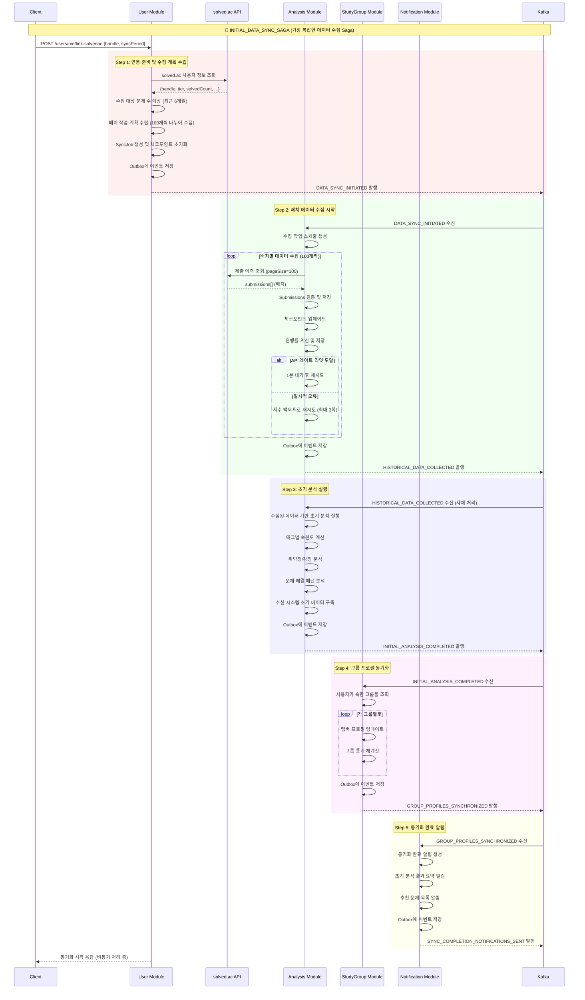

#### **이벤트 명세**

##### `DATA_SYNC_INITIATED`
```json
{
  "eventType": "DATA_SYNC_INITIATED",
  "aggregateId": "sync-job-{uuid}",
  "sagaId": "{saga-uuid}",
  "data": {
    "userId": "{uuid}",
    "solvedacHandle": "algosolver",
    "syncPeriodMonths": 6,
    "estimatedSubmissions": 450,
    "batchSize": 100,
    "syncJobId": "{uuid}",
    "priority": "HIGH"
  }
}
```

##### `HISTORICAL_DATA_COLLECTED`
```json
{
  "eventType": "HISTORICAL_DATA_COLLECTED",
  "aggregateId": "sync-job-{uuid}",
  "sagaId": "{saga-uuid}",
  "data": {
    "userId": "{uuid}",
    "syncJobId": "{uuid}",
    "collectedSubmissions": 387,
    "collectedProblems": 245,
    "syncDurationMinutes": 23,
    "dataQualityScore": 0.98,
    "collectionStats": {
      "totalBatches": 4,
      "successfulBatches": 4,
      "failedBatches": 0,
      "retryCount": 2
    }
  }
}
```

##### `INITIAL_ANALYSIS_COMPLETED`
```json
{
  "eventType": "INITIAL_ANALYSIS_COMPLETED",
  "aggregateId": "analysis-{uuid}",
  "sagaId": "{saga-uuid}",
  "data": {
    "userId": "{uuid}",
    "analysisId": "{uuid}",
    "currentTier": "gold3",
    "strongTags": ["implementation", "math", "string"],
    "weakTags": ["dp", "graph", "tree"],
    "solvedProblems": 387,
    "averageDifficulty": "silver2",
    "streakDays": 45,
    "recommendedNextTier": "gold2"
  }
}
```

#### **복잡한 보상 트랜잭션**

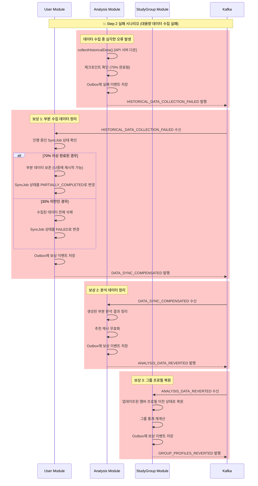

#### **체크포인트 기반 복구 시스템**

```kotlin
data class DataSyncCheckpoint(
    val syncJobId: UUID,
    val userId: UUID,
    val currentBatch: Int,
    val totalBatches: Int,
    val lastProcessedSubmissionId: Long,
    val collectedCount: Int,
    val failedAttempts: Int,
    val checkpointAt: LocalDateTime,
    val canResume: Boolean
)

@Service
class DataSyncRecoveryService {
    
    fun resumeFromCheckpoint(syncJobId: UUID): Boolean {
        val checkpoint = checkpointRepository.findBySyncJobId(syncJobId)
            ?: return false
            
        if (!checkpoint.canResume || checkpoint.failedAttempts > 3) {
            return false
        }
        
        // 체크포인트부터 재시작
        dataCollectionService.resumeCollection(
            syncJobId = checkpoint.syncJobId,
            startFromBatch = checkpoint.currentBatch,
            lastProcessedId = checkpoint.lastProcessedSubmissionId
        )
        
        return true
    }
    
    fun createCheckpoint(syncJob: DataSyncJob) {
        val checkpoint = DataSyncCheckpoint(
            syncJobId = syncJob.id,
            userId = syncJob.userId,
            currentBatch = syncJob.currentBatch,
            totalBatches = syncJob.totalBatches,
            lastProcessedSubmissionId = syncJob.lastProcessedSubmissionId,
            collectedCount = syncJob.collectedCount,
            failedAttempts = syncJob.failedAttempts,
            checkpointAt = LocalDateTime.now(),
            canResume = syncJob.failedAttempts < 3
        )
        
        checkpointRepository.save(checkpoint)
    }
}
```

---

### **2. USER_REGISTRATION_SAGA**

**목표**: Google OAuth2를 통한 신규 사용자 등록과 초기 프로필 설정

#### **비즈니스 요구사항**
- Google OAuth2로 인증된 사용자만 가입 가능
- 가입 즉시 분석 프로필과 알림 설정 초기화
- 가입 완료 시 환영 이메일 발송
- 모든 단계가 성공해야 가입 완료로 처리

#### **Saga 흐름도**

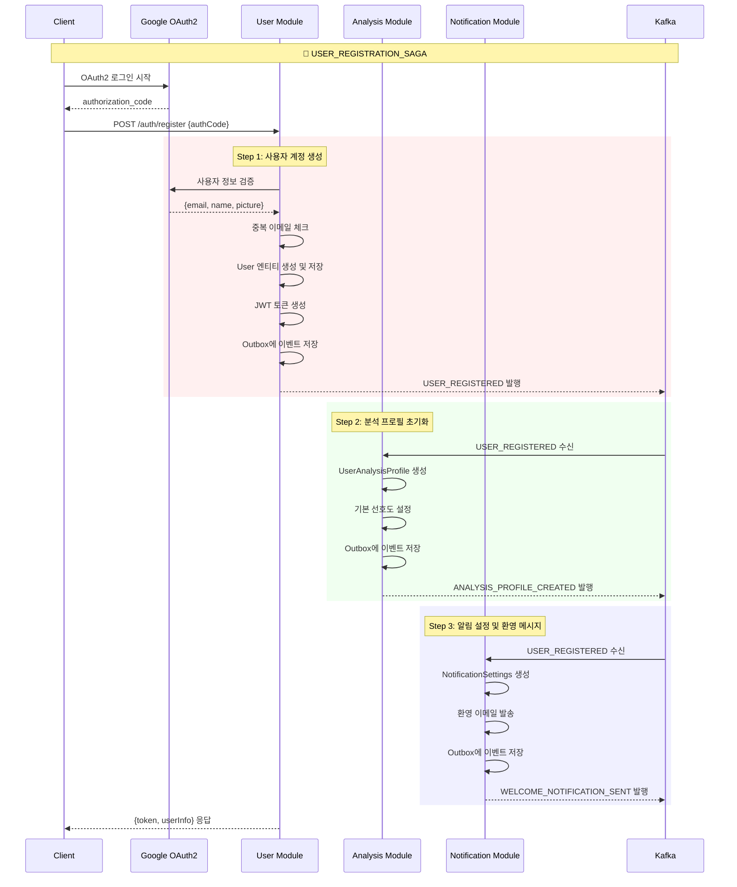

#### **이벤트 명세**

##### `USER_REGISTERED`
```json
{
  "eventType": "USER_REGISTERED",
  "aggregateId": "user-{uuid}",
  "sagaId": "{saga-uuid}",
  "data": {
    "userId": "{uuid}",
    "email": "user@gmail.com",
    "nickname": "알고마스터",
    "profileImageUrl": "https://lh3.googleusercontent.com/...",
    "provider": "GOOGLE"
  }
}
```

##### `ANALYSIS_PROFILE_CREATED`
```json
{
  "eventType": "ANALYSIS_PROFILE_CREATED", 
  "aggregateId": "analysis-profile-{uuid}",
  "sagaId": "{saga-uuid}",
  "data": {
    "userId": "{uuid}",
    "profileId": "{uuid}",
    "initializedAt": "2025-07-22T10:30:00Z"
  }
}
```

##### `WELCOME_NOTIFICATION_SENT`
```json
{
  "eventType": "WELCOME_NOTIFICATION_SENT",
  "aggregateId": "notification-{uuid}",
  "sagaId": "{saga-uuid}",
  "data": {
    "userId": "{uuid}",
    "notificationId": "{uuid}",
    "channel": "EMAIL",
    "sentAt": "2025-07-22T10:30:00Z"
  }
}
```

#### **보상 트랜잭션**

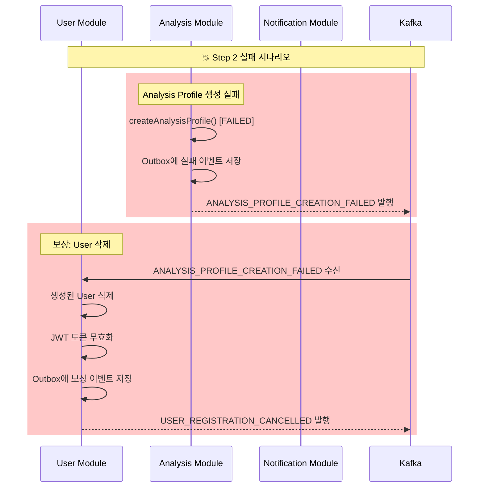

---

### **2. SOLVEDAC_LINK_SAGA**

**목표**: solved.ac 계정 연동과 모든 관련 서비스의 데이터 동기화

#### **비즈니스 요구사항**
- solved.ac 핸들 유효성 검증 필수
- 연동 즉시 제출 이력 수집 시작
- 참여 중인 스터디 그룹들에 프로필 업데이트
- 연동 완료 알림 발송

#### **Saga 흐름도**

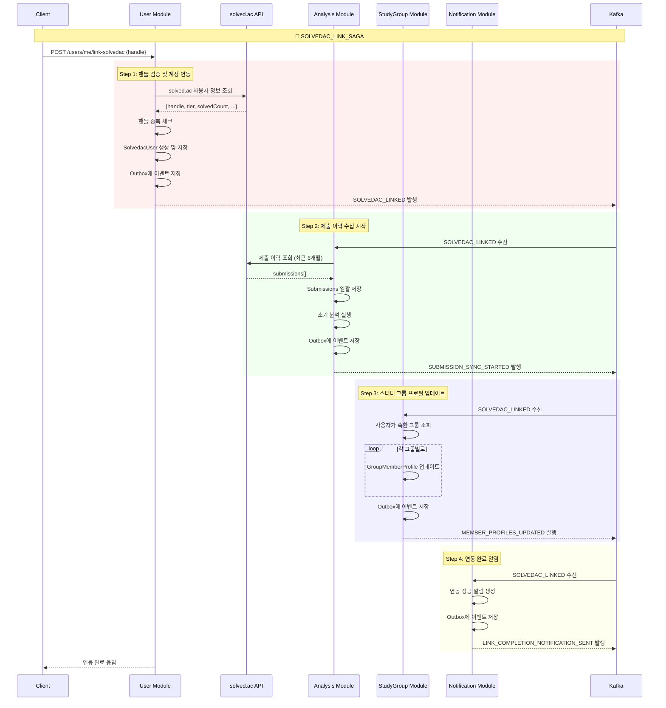

#### **보상 트랜잭션 (복잡한 시나리오)**

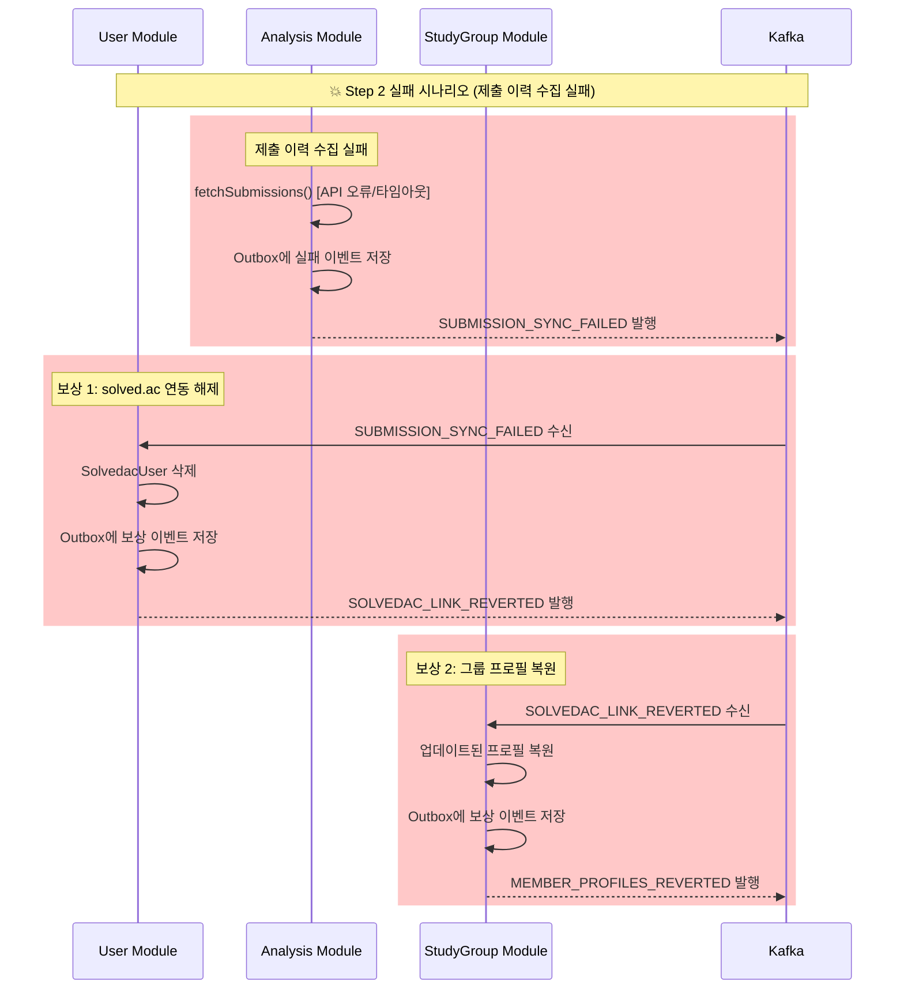

---

### **3. CREATE_GROUP_SAGA**

**목표**: 스터디 그룹 생성과 그룹장 설정, 초기 환경 구축

#### **Saga 흐름도**

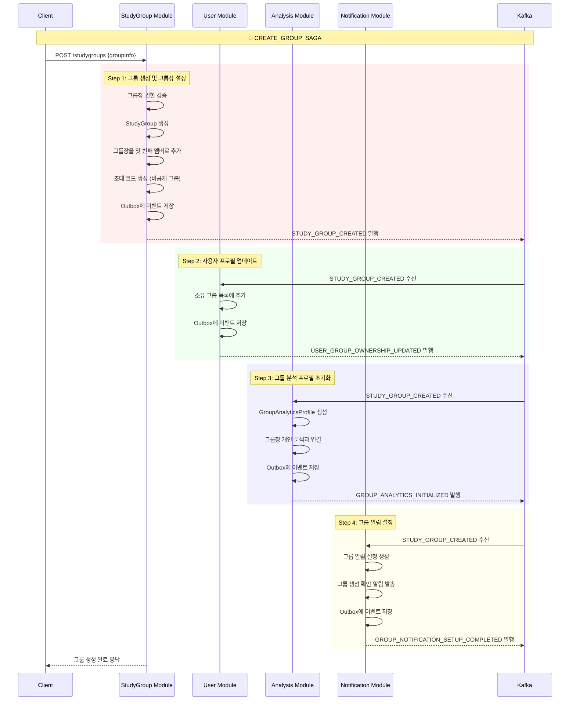

---

### **4. JOIN_GROUP_SAGA**

**목표**: 사용자의 스터디 그룹 참여와 모든 관련 데이터 동기화

이는 가장 복잡한 Saga 중 하나로, 여러 검증 단계와 보상 로직이 필요합니다.

#### **Saga 흐름도**

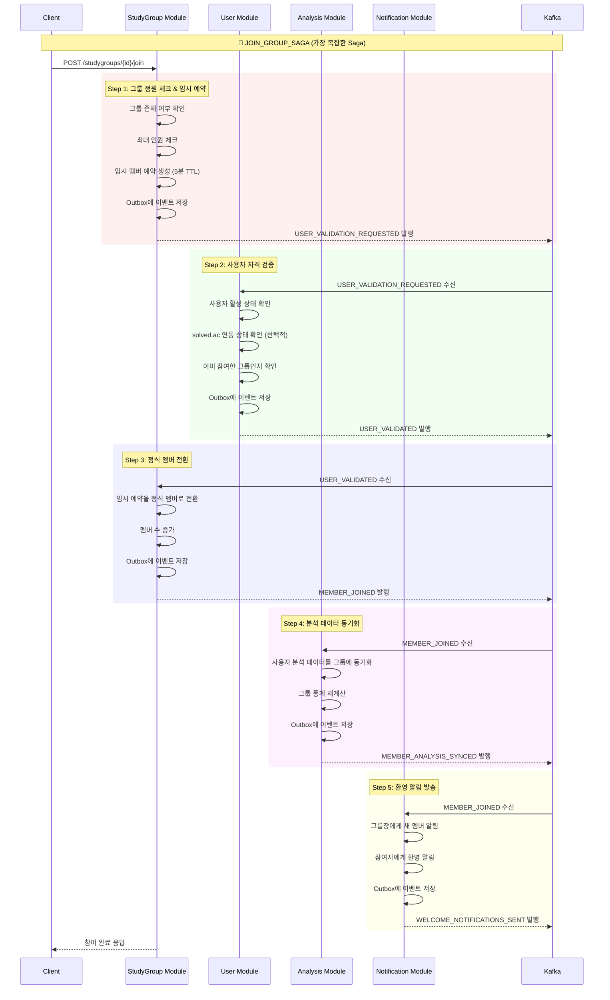

#### **복잡한 보상 시나리오들**

##### **시나리오 1: 사용자 검증 실패**

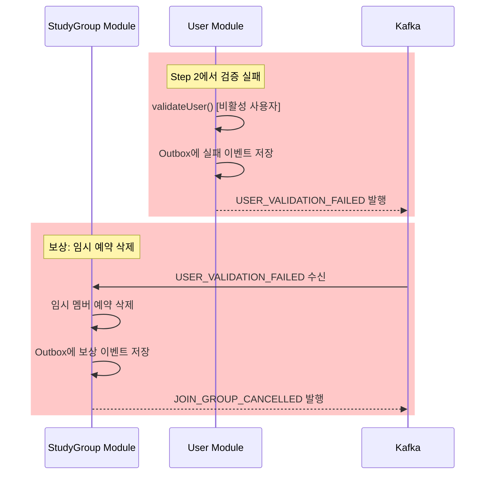

##### **시나리오 2: 분석 동기화 실패**

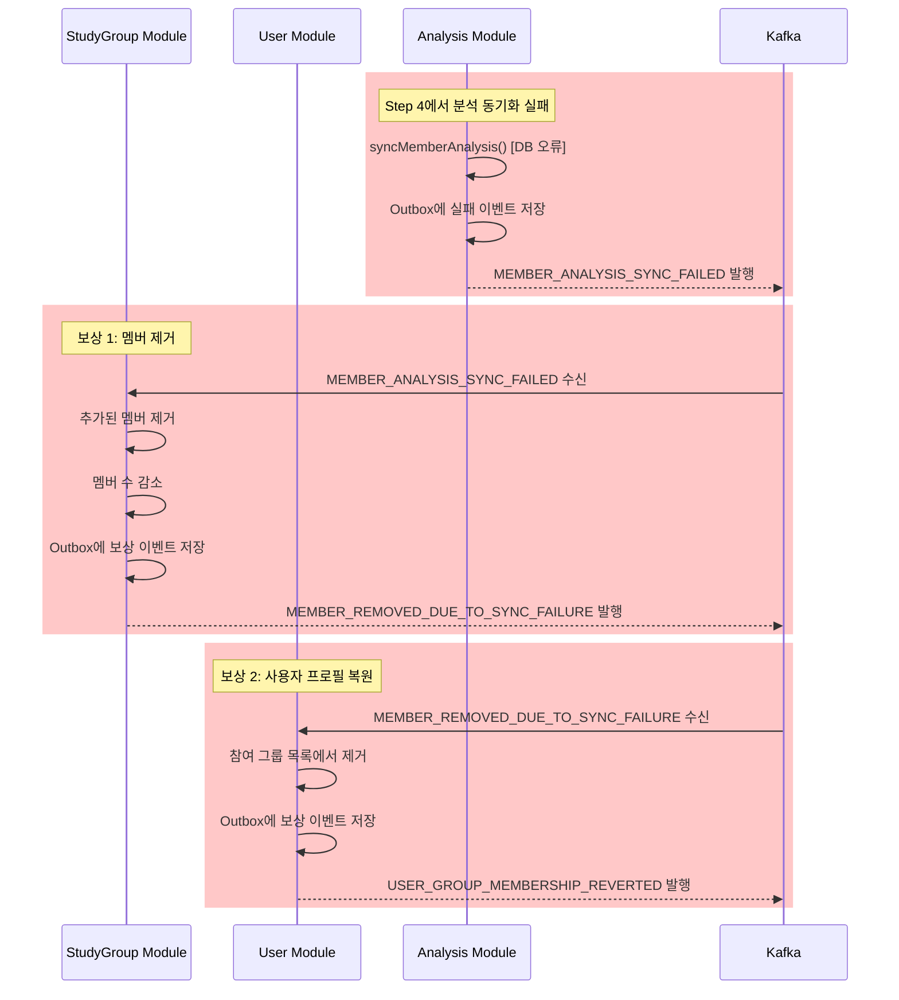

---

### **5. SUBMISSION_SYNC_SAGA**

**목표**: solved.ac에서 새로운 제출 데이터를 수집하여 전체 시스템에 동기화

#### **Saga 흐름도**

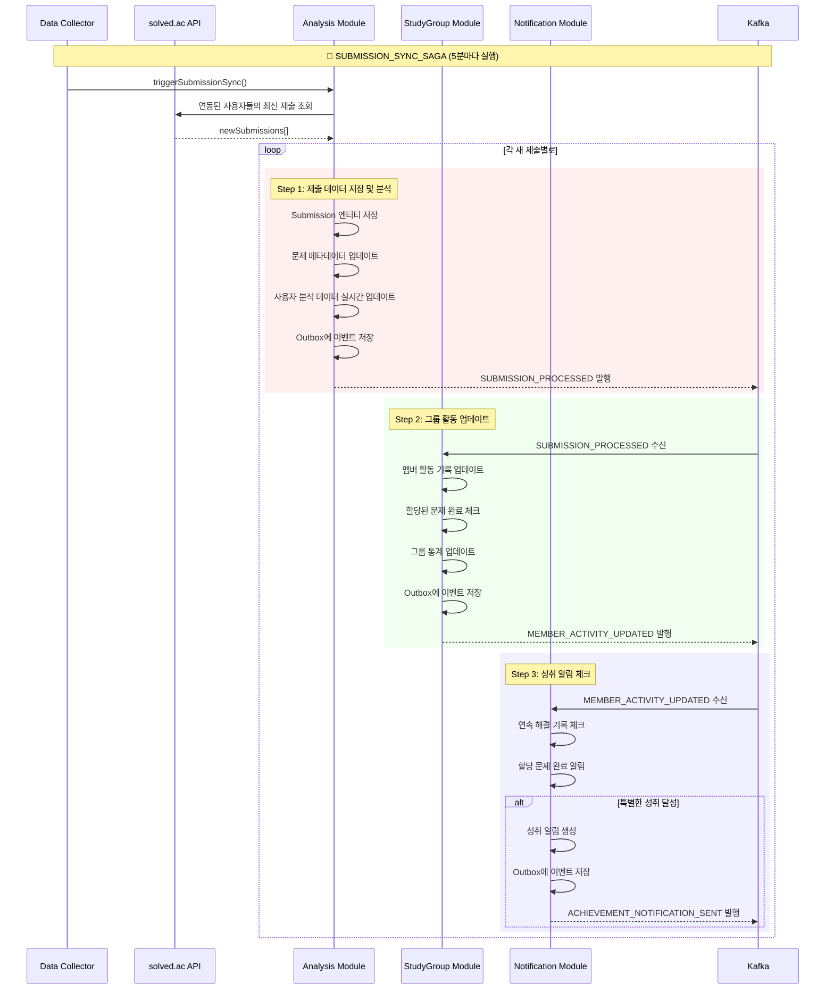

---

### **6. ANALYSIS_UPDATE_SAGA**

**목표**: 정기적인 사용자/그룹 분석 결과 업데이트와 추천 갱신

#### **Saga 흐름도**

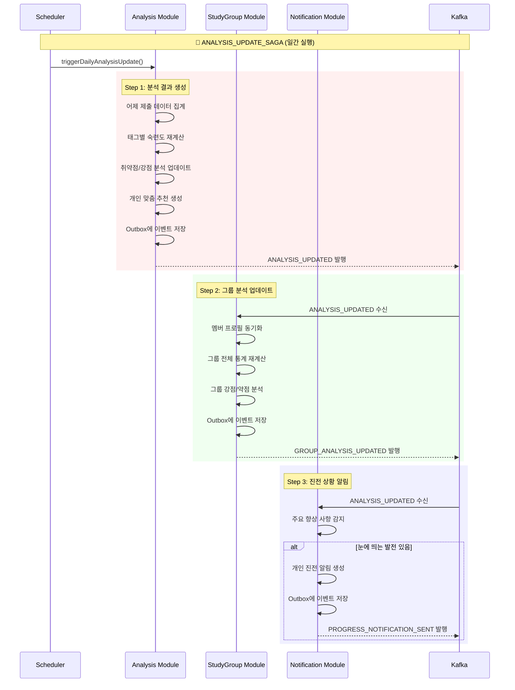

---

## 🎯 **구현 순서 및 테스트 전략**

### **1단계: 기본 인프라**
1. ✅ Outbox Pattern 기본 구현
2. ✅ Saga Coordinator 인터페이스
3. ✅ 기본 이벤트 발행/구독 구조

### **2단계: 데이터 파이프라인 구축 (NEXT_TASKS.md Phase 1 우선순위)**
1. ✅ `INITIAL_DATA_SYNC_SAGA` - **최우선 구현** (대용량 데이터 수집)
2. ✅ `SUBMISSION_SYNC_SAGA` - 실시간 데이터 동기화

### **3단계: 사용자 관리 기반 구축**
3. ✅ `USER_REGISTRATION_SAGA` - 가장 단순한 3단계 Saga
4. ✅ `SOLVEDAC_LINK_SAGA` - INITIAL_DATA_SYNC_SAGA와 연계

### **4단계: 그룹 관리 기능**
5. ✅ `CREATE_GROUP_SAGA` - 4단계 Saga로 복잡도 증가
6. ✅ `JOIN_GROUP_SAGA` - 가장 복잡한 5단계 보상 로직

### **5단계: 분석 및 최적화**
7. ✅ `ANALYSIS_UPDATE_SAGA` - 대용량 데이터 처리

### **테스트 전략**

```kotlin
// 각 Saga별 테스트 클래스 예시
@SpringBootTest
@TestPropertySource(properties = ["kafka.enabled=false"])
class UserRegistrationSagaTest {
    
    @Test
    fun `사용자 등록 Saga 성공 시나리오`() {
        // Given: OAuth2 인증 코드와 사용자 정보
        val authCode = "mock_auth_code"
        val expectedUserInfo = createMockUserInfo()
        
        // When: 회원가입 요청
        val result = userRegistrationSaga.start(authCode)
        
        // Then: 모든 단계 완료 확인
        assertThat(result.sagaStatus).isEqualTo(SagaStatus.COMPLETED)
        assertThat(userRepository.findByEmail(expectedUserInfo.email)).isNotNull()
        assertThat(analysisService.hasProfile(result.userId)).isTrue()
        assertThat(notificationService.hasSettings(result.userId)).isTrue()
    }
    
    @Test
    fun `분석 프로필 생성 실패 시 보상 트랜잭션 실행`() {
        // Given: 분석 서비스 장애 상황
        whenever(analysisService.createProfile(any())).thenThrow(RuntimeException("DB Error"))
        
        // When: 회원가입 시도
        val result = userRegistrationSaga.start("auth_code")
        
        // Then: Saga 실패 및 보상 실행 확인
        assertThat(result.sagaStatus).isEqualTo(SagaStatus.COMPENSATED)
        assertThat(userRepository.findByEmail(any())).isNull() // 사용자 삭제됨
    }
}
```

---

📝 **문서 버전**: v1.0  
📅 **최종 수정일**: 2025-07-22  
👤 **작성자**: 채기훈