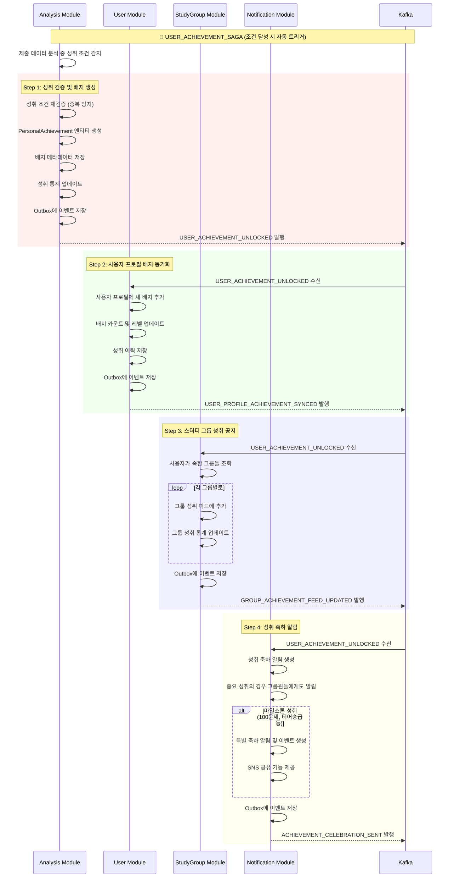
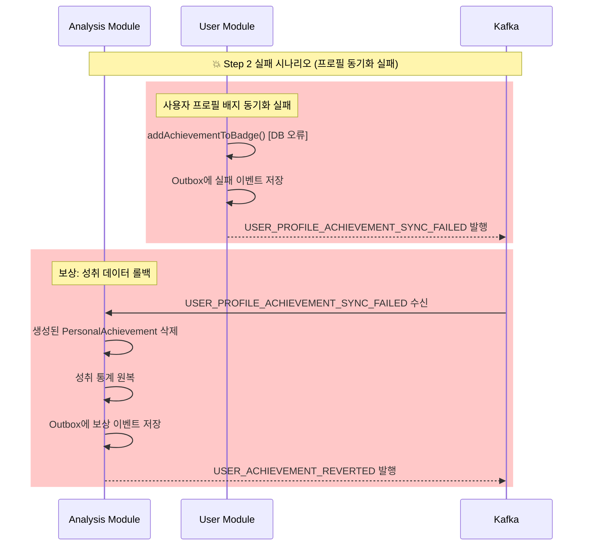
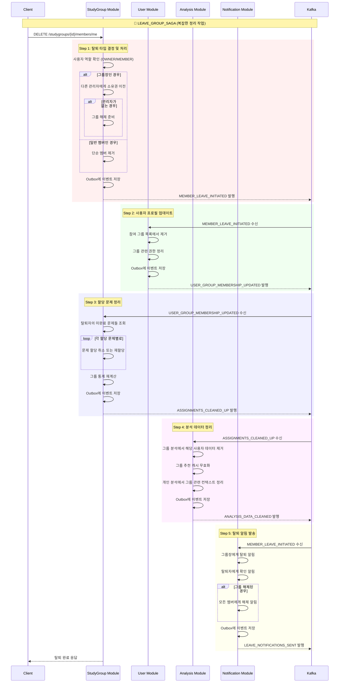
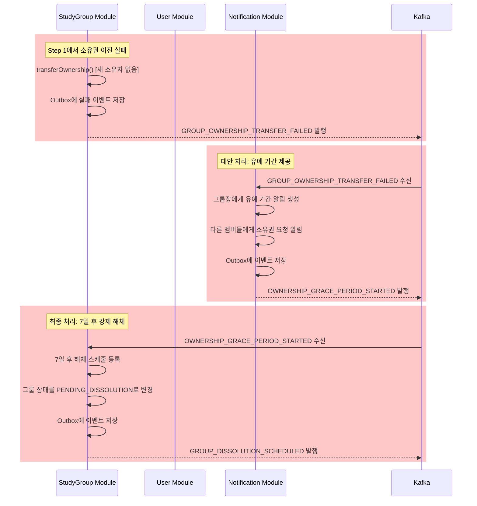
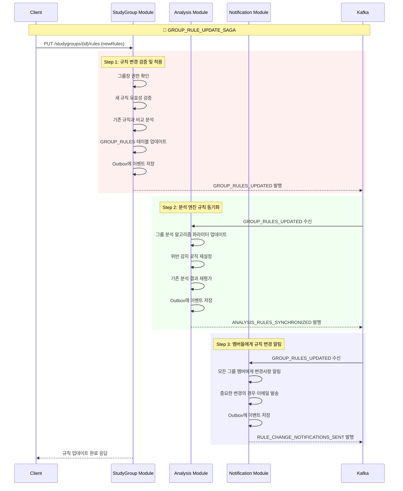
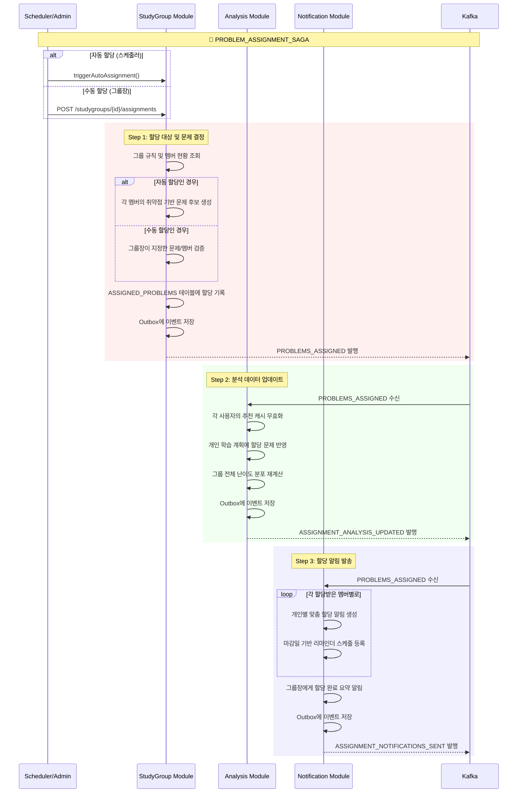
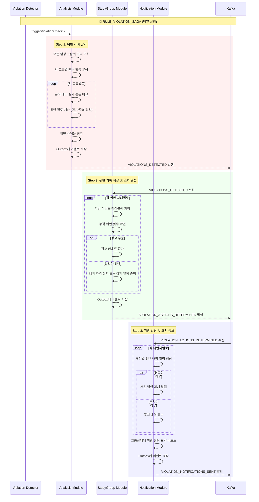
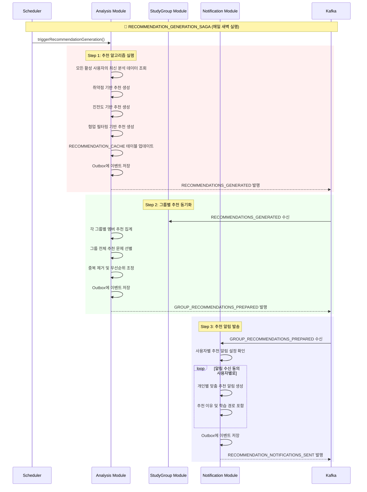
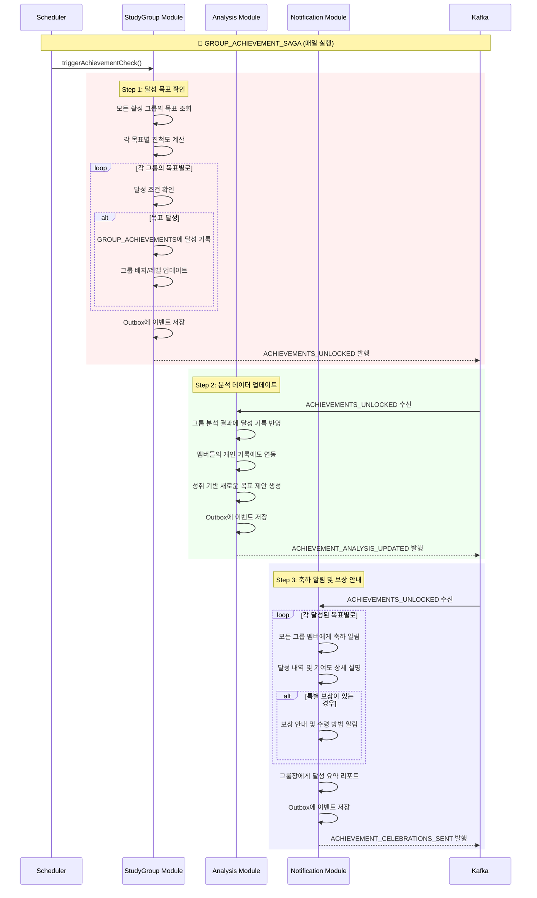

# Phase 2 확장 Saga 설계

이 문서는 **알고리포트 Phase 2에서 구현할 7개 확장 Saga**의 상세 설계를 다룹니다. 이들은 플랫폼의 고급 기능과 사용자 경험 향상을 위한 분산 트랜잭션들입니다.

---

## 🎯 **Phase 2 Saga 개요**

| 순서 | Saga 이름 | 복잡도 | 트리거 | 관련 모듈 | 구현 우선순위 |
|-----|----------|-------|--------|----------|-------------|
| 10 | `LEAVE_GROUP_SAGA` | High | 사용자 요청 | StudyGroup, User, Analysis, Notification | 🟡 Important |
| 11 | `GROUP_RULE_UPDATE_SAGA` | Medium | 그룹장 요청 | StudyGroup, Analysis, Notification | 🟡 Important |
| 12 | `PROBLEM_ASSIGNMENT_SAGA` | High | 스케줄러/그룹장 | StudyGroup, Analysis, Notification | 🟡 Important |
| 13 | `RULE_VIOLATION_SAGA` | High | 스케줄러 | Analysis, StudyGroup, Notification | 🟡 Important |
| 14 | `USER_ACHIEVEMENT_SAGA` | Medium | 조건 달성 시 | Analysis, User, Notification | 🔵 Normal |
| 15 | `RECOMMENDATION_GENERATION_SAGA` | Medium | 스케줄러 | Analysis, StudyGroup, Notification | 🔵 Normal |
| 16 | `GROUP_ACHIEVEMENT_SAGA` | Medium | 스케줄러 | StudyGroup, Analysis, Notification | 🔵 Normal |

---

## 📋 **상세 Saga 설계**

### **14. USER_ACHIEVEMENT_SAGA**

**목표**: 개인 성취/배지 획득과 관련 모듈 동기화 및 알림

#### **비즈니스 요구사항**
- 개인 성취 조건 달성 시 자동 배지 부여
- 성취 이력 관리 및 프로필 업데이트
- 성취 알림 및 공유 기능
- 스터디 그룹 내 성취 공지

#### **성취 타입**

```kotlin
enum class PersonalAchievementType {
    PROBLEM_MILESTONE,           // "100문제, 500문제, 1000문제 해결"
    TIER_PROMOTION,             // "티어 승급 (Bronze → Silver 등)"
    TAG_MASTERY,               // "특정 태그 90% 이상 숙련도"
    STREAK_ACHIEVEMENT,        // "연속 해결 기록 (7일, 30일, 100일)"
    SPEED_SOLVING,             // "빠른 문제 해결 (1시간 내 10문제 등)"
    DIFFICULTY_CHALLENGE,      // "본인 티어 +2 이상 문제 해결"
    CONSISTENCY,               // "매일 꾸준히 문제 해결"
    FIRST_BLOOD               // "새로 출제된 문제 최초 해결"
}
```

#### **Saga 흐름도**



#### **이벤트 명세**

##### `USER_ACHIEVEMENT_UNLOCKED`
```json
{
  "eventType": "USER_ACHIEVEMENT_UNLOCKED",
  "aggregateId": "achievement-{uuid}",
  "sagaId": "{saga-uuid}",
  "data": {
    "userId": "{uuid}",
    "achievementId": "{uuid}",
    "achievementType": "PROBLEM_MILESTONE",
    "title": "문제 해결 마스터",
    "description": "500문제 해결 달성",
    "badgeImageUrl": "https://badges.algoreport.com/500problems.png",
    "rarity": "RARE",
    "points": 100,
    "unlockedAt": "2025-07-22T15:30:00Z",
    "triggerData": {
      "problemCount": 500,
      "milestoneType": "PROBLEM_COUNT"
    }
  }
}
```

#### **보상 트랜잭션**



---

### **10. LEAVE_GROUP_SAGA**

**목표**: 사용자의 스터디 그룹 탈퇴와 모든 관련 데이터 정리

#### **비즈니스 요구사항**
- 그룹장 탈퇴 시 소유권 이전 또는 그룹 해체
- 할당된 문제 정리 및 보상
- 분석 데이터에서 그룹 관련 정보 제거
- 탈퇴 알림 발송

#### **Saga 흐름도**



#### **복잡한 보상 시나리오: 그룹장 탈퇴 실패**



---

### **8. GROUP_RULE_UPDATE_SAGA**

**목표**: 스터디 그룹 규칙 변경과 모든 관련 시스템 업데이트

#### **Saga 흐름도**



#### **이벤트 명세**

##### `GROUP_RULES_UPDATED`
```json
{
  "eventType": "GROUP_RULES_UPDATED",
  "aggregateId": "study-group-{uuid}",
  "sagaId": "{saga-uuid}",
  "data": {
    "groupId": "{uuid}",
    "groupName": "알고리즘 마스터즈",
    "updatedBy": "{user-uuid}",
    "updatedByNickname": "그룹장",
    "changes": [
      {
        "ruleType": "MINIMUM_PROBLEMS_PER_WEEK",
        "oldValue": 2,
        "newValue": 3,
        "changeReason": "난이도 상향 조정"
      }
    ],
    "newRuleSet": {
      "minimumProblemsPerWeek": 3,
      "allowedDifficultyRange": ["bronze1", "gold5"],
      "deadlinePenalty": {
        "type": "WARNING",
        "escalationDays": 3
      }
    }
  }
}
```

---

### **9. PROBLEM_ASSIGNMENT_SAGA**

**목표**: 스터디 그룹 내 문제 자동/수동 할당과 관련 데이터 동기화

#### **Saga 흐름도**



#### **자동 할당 로직**

```kotlin
data class AssignmentCriteria(
    val memberWeaknessMap: Map<String, List<String>>, // userId -> 취약 태그들
    val groupDifficultyRange: Pair<String, String>,   // 그룹 난이도 범위
    val weeklyQuota: Int,                             // 주간 할당 문제 수
    val avoidRecentlySolved: Boolean = true           // 최근 풀은 문제 제외
)

@Service
class AutoAssignmentService {
    
    fun generateAssignments(groupId: UUID): List<ProblemAssignment> {
        val group = studyGroupRepository.findById(groupId)
        val activeMembers = getActiveMembers(groupId)
        val groupRules = getGroupRules(groupId)
        
        return activeMembers.flatMap { member ->
            val weaknessTags = analysisService.getMemberWeaknesses(member.userId)
            val availableProblems = problemRepository.findProblemsForWeaknesses(
                tags = weaknessTags,
                tierRange = groupRules.difficultyRange,
                excludeSolved = member.solvedProblems,
                limit = groupRules.weeklyQuota
            )
            
            availableProblems.map { problem ->
                ProblemAssignment(
                    groupId = groupId,
                    userId = member.userId,
                    problemId = problem.id,
                    assignmentType = AssignmentType.AUTO,
                    dueDate = calculateDueDate(groupRules),
                    reasoning = "취약 태그: ${weaknessTags.joinToString()}"
                )
            }
        }
    }
}
```

---

### **10. RULE_VIOLATION_SAGA**

**목표**: 그룹 규칙 위반 감지 및 자동 처리

#### **Saga 흐름도**



#### **위반 감지 로직**

```kotlin
data class ViolationCase(
    val userId: String,
    val groupId: UUID,
    val violationType: ViolationType,
    val severity: ViolationSeverity,
    val details: ViolationDetails,
    val detectedAt: LocalDateTime
)

enum class ViolationType {
    INSUFFICIENT_WEEKLY_PROBLEMS,    // 주간 문제 수 부족
    MISSED_DEADLINE,                 // 마감일 미준수
    CONSECUTIVE_INACTIVITY,          // 연속 비활성
    ASSIGNMENT_IGNORE               // 할당 문제 무시
}

enum class ViolationSeverity {
    WARNING,    // 경고 (1-2회)
    CAUTION,    // 주의 (3-4회)  
    CRITICAL    // 심각 (5회 이상, 조치 필요)
}

@Service
class ViolationDetectionService {
    
    fun detectViolations(): List<ViolationCase> {
        val activeGroups = studyGroupRepository.findActiveGroups()
        
        return activeGroups.flatMap { group ->
            val rules = getGroupRules(group.id)
            val members = getActiveMembers(group.id)
            
            members.mapNotNull { member ->
                checkMemberViolations(member, rules, group)
            }
        }
    }
    
    private fun checkMemberViolations(
        member: GroupMember, 
        rules: GroupRules, 
        group: StudyGroup
    ): ViolationCase? {
        val weeklySubmissions = getWeeklySubmissions(member.userId)
        val requiredCount = rules.minimumProblemsPerWeek
        
        return when {
            weeklySubmissions < requiredCount -> {
                val previousViolations = getViolationHistory(member.userId, group.id)
                val severity = calculateSeverity(previousViolations.size)
                
                ViolationCase(
                    userId = member.userId,
                    groupId = group.id,
                    violationType = ViolationType.INSUFFICIENT_WEEKLY_PROBLEMS,
                    severity = severity,
                    details = ViolationDetails(
                        expected = requiredCount,
                        actual = weeklySubmissions,
                        deficit = requiredCount - weeklySubmissions
                    ),
                    detectedAt = LocalDateTime.now()
                )
            }
            else -> null
        }
    }
}
```

---

### **11. RECOMMENDATION_GENERATION_SAGA**

**목표**: 개인/그룹 맞춤 문제 추천 생성 및 배포

#### **Saga 흐름도**



#### **추천 알고리즘**

```kotlin
interface RecommendationEngine {
    fun generateRecommendations(userId: String): List<ProblemRecommendation>
}

@Component
class WeaknessBasedRecommendationEngine : RecommendationEngine {
    
    override fun generateRecommendations(userId: String): List<ProblemRecommendation> {
        val userProfile = analysisService.getUserProfile(userId)
        val weakTags = userProfile.tagProficiency
            .filter { it.value < 0.6 } // 60% 미만 숙련도
            .keys.toList()
        
        return weakTags.flatMap { tag ->
            problemRepository.findSuitableProblems(
                tag = tag,
                userTier = userProfile.currentTier,
                excludeSolved = userProfile.solvedProblems,
                limit = 3
            ).map { problem ->
                ProblemRecommendation(
                    problemId = problem.id,
                    recommendationType = RecommendationType.WEAKNESS_IMPROVEMENT,
                    targetTag = tag,
                    difficulty = problem.tier,
                    reason = "취약한 ${tag} 알고리즘 보완을 위한 추천",
                    expectedImprovement = calculateImprovement(userProfile, problem)
                )
            }
        }.sortedByDescending { it.expectedImprovement }
         .take(10)
    }
}

@Component  
class CollaborativeFilteringEngine : RecommendationEngine {
    
    override fun generateRecommendations(userId: String): List<ProblemRecommendation> {
        val userProfile = analysisService.getUserProfile(userId)
        val similarUsers = findSimilarUsers(userProfile, limit = 50)
        
        val recommendedProblems = similarUsers.flatMap { similarUser ->
            getRecentSolvedProblems(similarUser.id, days = 30)
        }.groupBy { it.id }
         .mapValues { it.value.size } // 문제별 추천 빈도
         .filter { !userProfile.solvedProblems.contains(it.key) }
         .toList()
         .sortedByDescending { it.second }
         .take(10)
        
        return recommendedProblems.map { (problemId, frequency) ->
            val problem = problemRepository.findById(problemId)
            ProblemRecommendation(
                problemId = problemId,
                recommendationType = RecommendationType.COLLABORATIVE_FILTERING,
                reason = "비슷한 실력의 ${frequency}명이 최근 해결한 문제",
                confidence = calculateConfidence(frequency, similarUsers.size)
            )
        }
    }
}
```

---

### **12. GROUP_ACHIEVEMENT_SAGA**

**목표**: 그룹 목표 달성 감지 및 보상 처리

#### **Saga 흐름도**



#### **달성 목표 타입**

```kotlin
enum class AchievementType {
    COLLECTIVE_SOLVING,          // "한 달간 그룹 전체 100문제 해결"
    CONSISTENCY,                 // "모든 멤버가 2주 연속 활동"  
    DIFFICULTY_PROGRESSION,      // "그룹 평균 티어 1단계 상승"
    TAG_MASTERY,                // "특정 알고리즘 태그 그룹 전체 숙달"
    PARTICIPATION,              // "신규 멤버 5명 이상 영입"
    RETENTION,                  // "6개월 이상 활동 지속"
    COLLABORATION               // "멤버간 코드 리뷰 50회 이상"
}

data class GroupAchievement(
    val id: UUID,
    val groupId: UUID,
    val achievementType: AchievementType,
    val title: String,
    val description: String,
    val criteria: AchievementCriteria,
    val progress: AchievementProgress,
    val rewards: List<Reward>,
    val isUnlocked: Boolean,
    val unlockedAt: LocalDateTime?
)

data class AchievementCriteria(
    val targetValue: Int,
    val timeframeDays: Int,
    val conditions: Map<String, Any>
)

@Service
class AchievementChecker {
    
    fun checkGroupAchievements(groupId: UUID): List<GroupAchievement> {
        val group = studyGroupRepository.findById(groupId)
        val activeGoals = getActiveAchievements(groupId)
        
        return activeGoals.mapNotNull { goal ->
            val currentProgress = calculateProgress(goal, group)
            
            if (currentProgress >= goal.criteria.targetValue) {
                unlockAchievement(goal, currentProgress)
            } else {
                updateProgress(goal, currentProgress)
                null
            }
        }
    }
    
    private fun calculateProgress(goal: GroupAchievement, group: StudyGroup): Int {
        return when (goal.achievementType) {
            AchievementType.COLLECTIVE_SOLVING -> {
                val timeframe = LocalDateTime.now().minusDays(goal.criteria.timeframeDays.toLong())
                submissionRepository.countGroupSubmissionsSince(group.id, timeframe)
            }
            AchievementType.CONSISTENCY -> {
                val activeDays = goal.criteria.timeframeDays
                val activeMembers = getConsistentlyActiveMembers(group.id, activeDays)
                activeMembers.size
            }
            // ... 다른 타입들
            else -> 0
        }
    }
}
```

---

## 🎯 **구현 순서 및 테스트 전략**

### **구현 우선순위**

#### **Phase 2A: 핵심 확장 (먼저 구현)**
1. ✅ `LEAVE_GROUP_SAGA` - 복잡하지만 필수적인 정리 작업
2. ✅ `GROUP_RULE_UPDATE_SAGA` - 그룹 관리의 핵심  
3. ✅ `PROBLEM_ASSIGNMENT_SAGA` - 자동화의 시작점

#### **Phase 2B: 인텔리전트 기능 (나중 구현)**
4. ✅ `RULE_VIOLATION_SAGA` - 자동 모니터링 
5. ✅ `RECOMMENDATION_GENERATION_SAGA` - AI/ML 기반 추천
6. ✅ `GROUP_ACHIEVEMENT_SAGA` - 게임화 요소

### **테스트 시나리오**

```kotlin
@SpringBootTest
class Phase2SagaIntegrationTest {
    
    @Test
    fun `그룹장 탈퇴 시 소유권 이전 Saga 통합 테스트`() {
        // Given: 그룹장과 일반 멤버가 있는 그룹
        val group = createTestGroup(ownerCount = 1, memberCount = 3)
        val owner = group.owner
        
        // When: 그룹장이 탈퇴 요청
        val sagaResult = leaveGroupSaga.start(
            LeaveGroupRequest(groupId = group.id, userId = owner.id)
        )
        
        // Then: 소유권이 이전되고 모든 데이터가 정리됨
        assertThat(sagaResult.status).isEqualTo(SagaStatus.COMPLETED)
        
        val updatedGroup = studyGroupRepository.findById(group.id)!!
        assertThat(updatedGroup.ownerId).isNotEqualTo(owner.id)
        assertThat(updatedGroup.members).doesNotContain(owner.id)
        
        // 분석 데이터에서도 정리 확인
        val analysisData = analysisService.getGroupAnalysis(group.id)
        assertThat(analysisData.memberProfiles).doesNotContainKey(owner.id)
    }
    
    @Test
    fun `규칙 위반 감지 및 자동 처리 Saga 테스트`() {
        // Given: 주 3문제 규칙이 있는 그룹과 위반자
        val group = createGroupWithRule(minimumProblemsPerWeek = 3)
        val violator = group.members.first()
        
        // 이번 주에 1문제만 해결 (규칙 위반)
        createSubmissions(violator.id, count = 1, withinDays = 7)
        
        // When: 위반 감지 Saga 실행
        val sagaResult = ruleViolationSaga.start()
        
        // Then: 위반이 감지되고 알림이 발송됨
        assertThat(sagaResult.detectedViolations).hasSize(1)
        assertThat(sagaResult.detectedViolations[0].userId).isEqualTo(violator.id)
        assertThat(sagaResult.detectedViolations[0].severity).isEqualTo(ViolationSeverity.WARNING)
        
        // 알림 발송 확인
        val notifications = notificationRepository.findByUserId(violator.id)
        assertThat(notifications).anyMatch { it.type == NotificationType.RULE_VIOLATION }
    }
}
```

---

## 📊 **모니터링 및 운영**

### **Phase 2 Saga 전용 메트릭**

```yaml
# 그룹 관리 Saga 관련
saga.leave_group.completion_rate           # 탈퇴 Saga 성공률
saga.leave_group.ownership_transfer_rate   # 소유권 이전 성공률
saga.rule_update.propagation_time          # 규칙 변경 전파 시간

# 자동화 Saga 관련
saga.problem_assignment.daily_count        # 일일 자동 할당 수
saga.violation_detection.accuracy          # 위반 감지 정확도
saga.recommendation.hit_rate               # 추천 적중률 (사용자가 실제로 푼 비율)

# 성취 Saga 관련
saga.achievement.unlock_frequency          # 목표 달성 빈도
saga.group_achievement.member_satisfaction # 달성 후 멤버 만족도
```

### **알림 및 대시보드**

```kotlin
@Component
class Phase2SagaMonitor {
    
    @EventListener
    fun handleComplexSagaFailure(event: SagaFailedEvent) {
        when (event.sagaType) {
            "LEAVE_GROUP_SAGA" -> {
                if (event.failedStep == "OWNERSHIP_TRANSFER") {
                    // 그룹 해체 위험 알림
                    alertingService.sendCriticalAlert(
                        "그룹 소유권 이전 실패로 그룹 해체 위험",
                        event.sagaId
                    )
                }
            }
            "RULE_VIOLATION_SAGA" -> {
                // 위반 감지 시스템 오류 알림
                alertingService.sendOperationalAlert(
                    "규칙 위반 감지 시스템 오류",
                    event
                )
            }
        }
    }
}
```

---

📝 **문서 버전**: v1.0  
📅 **최종 수정일**: 2025-07-22  
👤 **작성자**: 채기훈