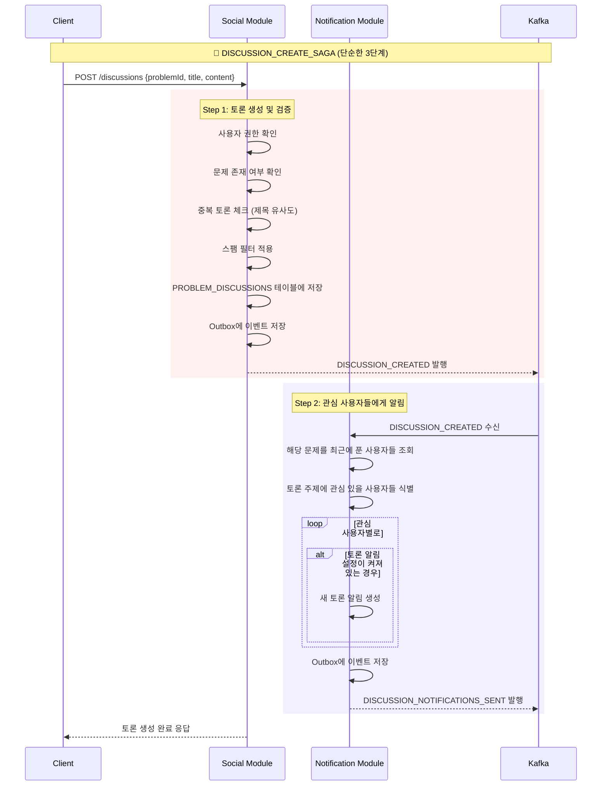
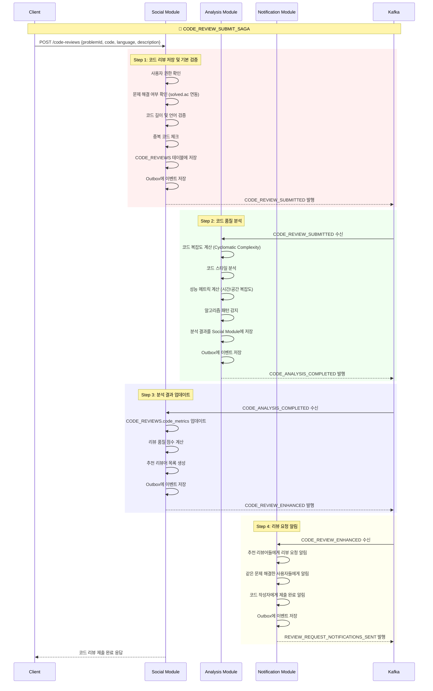
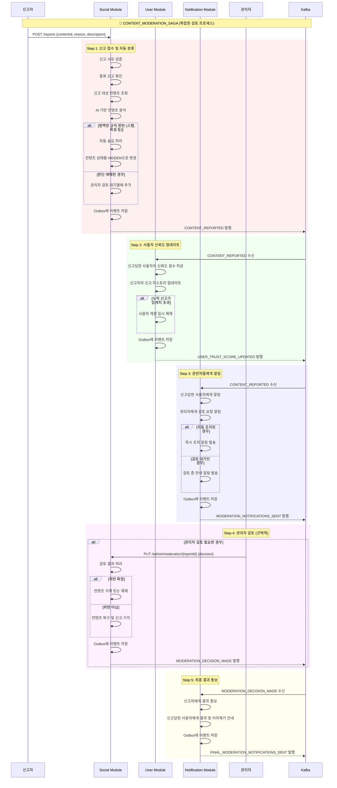

# Phase 3 소셜 Saga 설계

이 문서는 **알고리포트 Phase 3에서 구현할 3개 소셜 Saga**의 상세 설계를 다룹니다. 이들은 커뮤니티 기능과 사용자 간 상호작용을 위한 분산 트랜잭션들입니다.

---

## 🎯 **Phase 3 Saga 개요**

| 순서 | Saga 이름 | 복잡도 | 트리거 | 관련 모듈 | 구현 우선순위 |
|-----|----------|-------|--------|----------|-------------|
| 17 | `DISCUSSION_CREATE_SAGA` | Low | 사용자 요청 | Social, Notification | 🔵 Normal |
| 18 | `CODE_REVIEW_SUBMIT_SAGA` | Medium | 사용자 요청 | Social, Analysis, Notification | 🔵 Normal |
| 19 | `CONTENT_MODERATION_SAGA` | High | 신고 접수/자동 감지 | Social, User, Notification | 🔴 Low Priority |

---

## 📋 **상세 Saga 설계**

### **17. DISCUSSION_CREATE_SAGA**

**[리팩토링 예정]** 이 Saga는 알림 실패가 토론 생성을 롤백시킬 필요가 없으므로, 단순 이벤트 발행/구독 모델로 전환될 예정입니다. (Phase 6 참조)


**목표**: 문제별 토론 생성과 관련 알림 발송

#### **비즈니스 요구사항**
- 문제별 토론 스레드 생성
- 중복 토론 방지 로직
- 관련 사용자들에게 알림
- 스팸/도배 방지

#### **Saga 흐름도**



#### **이벤트 명세**

##### `DISCUSSION_CREATED`
```json
{
  "eventType": "DISCUSSION_CREATED",
  "aggregateId": "discussion-{uuid}",
  "sagaId": "{saga-uuid}",
  "data": {
    "discussionId": "{uuid}",
    "problemId": 1000,
    "problemTitle": "A+B",
    "problemTier": "bronze5",
    "authorId": "{user-uuid}",
    "authorNickname": "알고초보",
    "category": "QUESTION",
    "title": "이 문제 시간복잡도가 궁금해요",
    "content": "O(1)으로 풀 수 있나요?",
    "tags": ["complexity", "beginner"]
  }
}
```

#### **중복 방지 및 스팸 필터**

```kotlin
@Service
class DiscussionSpamFilter {
    
    fun checkDuplicateDiscussion(request: CreateDiscussionRequest): Boolean {
        val recentDiscussions = discussionRepository.findRecentByProblemId(
            problemId = request.problemId,
            since = LocalDateTime.now().minusHours(24)
        )
        
        return recentDiscussions.any { existing ->
            calculateSimilarity(existing.title, request.title) > 0.8
        }
    }
    
    fun checkSpamPattern(userId: String): SpamCheckResult {
        val recentPosts = discussionRepository.countUserPostsInLast24Hours(userId)
        val recentComments = commentRepository.countUserCommentsInLast24Hours(userId)
        
        return when {
            recentPosts > 10 -> SpamCheckResult.BLOCKED("일일 토론 생성 한도 초과")
            recentComments > 50 -> SpamCheckResult.BLOCKED("일일 댓글 한도 초과")
            hasRepeatedContent(userId) -> SpamCheckResult.WARNING("반복된 내용 감지")
            else -> SpamCheckResult.ALLOWED
        }
    }
}
```

---

### **18. CODE_REVIEW_SUBMIT_SAGA**

**목표**: 코드 리뷰 제출과 분석 데이터 연동

#### **비즈니스 요구사항**
- 코드 품질 자동 분석
- 유사 코드 중복 검사
- 리뷰 요청 알림 발송
- 분석 모듈과 코드 메트릭 연동

#### **Saga 흐름도**



#### **코드 분석 알고리즘**

```kotlin
data class CodeMetrics(
    val linesOfCode: Int,
    val cyclomaticComplexity: Int,
    val maintainabilityIndex: Double,
    val duplicatedCodePercentage: Double,
    val algorithmPatterns: List<String>,
    val estimatedTimeComplexity: String,
    val estimatedSpaceComplexity: String,
    val codeSmells: List<CodeSmell>
)

@Service
class CodeAnalysisService {
    
    fun analyzeCode(code: String, language: String, problemId: Int): CodeMetrics {
        return when (language.lowercase()) {
            "java" -> analyzeJavaCode(code, problemId)
            "python" -> analyzePythonCode(code, problemId)
            "cpp" -> analyzeCppCode(code, problemId)
            else -> getBasicMetrics(code)
        }
    }
    
    private fun analyzeJavaCode(code: String, problemId: Int): CodeMetrics {
        val ast = JavaParser.parse(code)
        
        return CodeMetrics(
            linesOfCode = countEffectiveLines(code),
            cyclomaticComplexity = calculateCyclomaticComplexity(ast),
            maintainabilityIndex = calculateMaintainabilityIndex(ast),
            duplicatedCodePercentage = findDuplicatedCode(code, problemId),
            algorithmPatterns = detectAlgorithmPatterns(ast, problemId),
            estimatedTimeComplexity = estimateTimeComplexity(ast),
            estimatedSpaceComplexity = estimateSpaceComplexity(ast),
            codeSmells = detectCodeSmells(ast)
        )
    }
    
    private fun detectAlgorithmPatterns(ast: CompilationUnit, problemId: Int): List<String> {
        val patterns = mutableListOf<String>()
        
        // 반복문 패턴 분석
        if (hasNestedLoops(ast)) patterns.add("NESTED_LOOPS")
        if (hasRecursion(ast)) patterns.add("RECURSION")
        
        // 자료구조 사용 패턴
        if (usesStack(ast)) patterns.add("STACK")
        if (usesQueue(ast)) patterns.add("QUEUE")
        if (usesPriorityQueue(ast)) patterns.add("PRIORITY_QUEUE")
        
        // 알고리즘 기법 패턴
        if (usesDynamicProgramming(ast)) patterns.add("DYNAMIC_PROGRAMMING")
        if (usesBinarySearch(ast)) patterns.add("BINARY_SEARCH")
        if (usesGreedy(ast)) patterns.add("GREEDY")
        
        return patterns
    }
}

data class CodeSmell(
    val type: CodeSmellType,
    val severity: Severity,
    val line: Int,
    val description: String,
    val suggestion: String
)

enum class CodeSmellType {
    LONG_METHOD,           // 너무 긴 메서드
    DUPLICATED_CODE,       // 중복 코드
    LARGE_CLASS,           // 거대한 클래스
    TOO_MANY_PARAMETERS,   // 매개변수 과다
    MAGIC_NUMBERS,         // 매직 넘버
    UNUSED_VARIABLES,      // 사용하지 않는 변수
    INEFFICIENT_LOOP       // 비효율적인 반복문
}
```

#### **리뷰어 추천 알고리즘**

```kotlin
@Service
class ReviewerRecommendationService {
    
    fun findSuitableReviewers(codeReview: CodeReview): List<RecommendedReviewer> {
        val problemId = codeReview.problemId
        val language = codeReview.language
        val codeMetrics = codeReview.codeMetrics
        
        // 1. 같은 문제를 해결한 사용자들
        val problemSolvers = submissionRepository.findUsersByProblemId(problemId)
            .filter { it.language == language }
            .filter { it.userId != codeReview.authorId }
        
        // 2. 해당 언어에 숙련된 사용자들
        val languageExperts = userRepository.findLanguageExperts(language, minSubmissions = 100)
        
        // 3. 비슷한 알고리즘 패턴 경험자들
        val patternExperts = findPatternExperts(codeMetrics.algorithmPatterns)
        
        // 모든 후보들을 점수화하여 정렬
        val allCandidates = (problemSolvers + languageExperts + patternExperts).distinct()
        
        return allCandidates.map { user ->
            val score = calculateReviewerScore(user, codeReview)
            RecommendedReviewer(
                userId = user.id,
                nickname = user.nickname,
                score = score,
                reason = generateRecommendationReason(user, codeReview)
            )
        }.sortedByDescending { it.score }
         .take(5)
    }
    
    private fun calculateReviewerScore(user: User, codeReview: CodeReview): Double {
        var score = 0.0
        
        // 같은 문제 해결 경험 (가중치 40%)
        if (hasSolvedProblem(user.id, codeReview.problemId)) {
            score += 0.4
        }
        
        // 언어 숙련도 (가중치 30%)
        val languageProficiency = getUserLanguageProficiency(user.id, codeReview.language)
        score += languageProficiency * 0.3
        
        // 리뷰 활동 점수 (가중치 20%)
        val reviewActivity = getReviewActivityScore(user.id)
        score += reviewActivity * 0.2
        
        // 알고리즘 패턴 경험 (가중치 10%)
        val patternExperience = getPatternExperience(user.id, codeReview.codeMetrics.algorithmPatterns)
        score += patternExperience * 0.1
        
        return score
    }
}
```

---

### **19. CONTENT_MODERATION_SAGA**

**목표**: 신고된 컨텐츠 검토 및 자동 조치

#### **비즈니스 요구사항**
- 신고 컨텐츠 자동 분류
- 심각도에 따른 단계별 조치
- 관리자 검토 프로세스
- 결과 통보 및 이의제기 처리

#### **Saga 흐름도**



#### **AI 기반 컨텐츠 분석**

```kotlin
data class ContentAnalysisResult(
    val riskLevel: RiskLevel,
    val detectedIssues: List<DetectedIssue>,
    val confidence: Double,
    val recommendedAction: ModerationAction
)

enum class RiskLevel {
    LOW,      // 정상 컨텐츠
    MEDIUM,   // 관리자 검토 필요
    HIGH,     // 즉시 조치 필요
    CRITICAL  // 긴급 조치 필요
}

data class DetectedIssue(
    val type: IssueType,
    val severity: Int,        // 1-10
    val evidence: String,     // 근거가 되는 텍스트 부분
    val confidence: Double    // 0.0-1.0
)

enum class IssueType {
    PROFANITY,           // 욕설/비속어
    HARASSMENT,          // 괴롭힘
    SPAM,               // 스팸
    INAPPROPRIATE_CONTENT, // 부적절한 내용
    COPYRIGHT_VIOLATION,  // 저작권 침해
    PERSONAL_INFO,       // 개인정보 노출
    OFF_TOPIC           // 주제 벗어남
}

@Service
class ContentModerationAI {
    
    fun analyzeContent(content: String, contentType: ContentType): ContentAnalysisResult {
        val detectedIssues = mutableListOf<DetectedIssue>()
        
        // 1. 욕설/비속어 검사
        val profanityIssues = detectProfanity(content)
        detectedIssues.addAll(profanityIssues)
        
        // 2. 스팸 패턴 검사  
        val spamIssues = detectSpamPatterns(content)
        detectedIssues.addAll(spamIssues)
        
        // 3. 개인정보 노출 검사
        val privacyIssues = detectPersonalInfo(content)
        detectedIssues.addAll(privacyIssues)
        
        // 4. 맥락적 부적절성 검사 (ML 모델 사용)
        val contextualIssues = analyzeContextualAppropriateness(content, contentType)
        detectedIssues.addAll(contextualIssues)
        
        // 종합 위험도 계산
        val riskLevel = calculateOverallRisk(detectedIssues)
        val recommendedAction = determineAction(riskLevel, detectedIssues)
        
        return ContentAnalysisResult(
            riskLevel = riskLevel,
            detectedIssues = detectedIssues,
            confidence = calculateConfidence(detectedIssues),
            recommendedAction = recommendedAction
        )
    }
    
    private fun detectProfanity(content: String): List<DetectedIssue> {
        val profanityWords = loadProfanityDictionary()
        val issues = mutableListOf<DetectedIssue>()
        
        profanityWords.forEach { profanity ->
            if (content.contains(profanity.word, ignoreCase = true)) {
                issues.add(DetectedIssue(
                    type = IssueType.PROFANITY,
                    severity = profanity.severity,
                    evidence = profanity.word,
                    confidence = 0.95
                ))
            }
        }
        
        return issues
    }
    
    private fun analyzeContextualAppropriateness(
        content: String, 
        contentType: ContentType
    ): List<DetectedIssue> {
        // 실제로는 사전 훈련된 ML 모델 사용
        val response = moderationMLService.predict(
            text = content,
            context = contentType.toString()
        )
        
        return response.predictions.filter { it.confidence > 0.7 }
            .map { prediction ->
                DetectedIssue(
                    type = IssueType.valueOf(prediction.category),
                    severity = (prediction.severity * 10).toInt(),
                    evidence = prediction.evidenceText,
                    confidence = prediction.confidence
                )
            }
    }
}
```

#### **관리자 검토 대시보드**

```kotlin
data class ModerationQueueItem(
    val reportId: UUID,
    val contentId: String,
    val contentType: ContentType,
    val contentPreview: String,
    val reportReason: String,
    val reporterNickname: String,
    val reportedUserNickname: String,
    val aiAnalysis: ContentAnalysisResult,
    val reportedAt: LocalDateTime,
    val priority: Priority
)

@RestController
@RequestMapping("/admin/moderation")
class ModerationController {
    
    @GetMapping("/queue")
    fun getModerationQueue(
        @RequestParam(defaultValue = "0") page: Int,
        @RequestParam(defaultValue = "20") size: Int,
        @RequestParam(required = false) priority: Priority?
    ): Page<ModerationQueueItem> {
        return moderationService.getModerationQueue(page, size, priority)
    }
    
    @PostMapping("/{reportId}/decision")
    fun makeModerationDecision(
        @PathVariable reportId: UUID,
        @RequestBody decision: ModerationDecision,
        @AuthenticationPrincipal admin: AdminPrincipal
    ): ResponseEntity<Void> {
        contentModerationSaga.processAdminDecision(reportId, decision, admin.id)
        return ResponseEntity.ok().build()
    }
}

data class ModerationDecision(
    val action: ModerationAction,
    val reason: String,
    val additionalNotes: String? = null,
    val appealAllowed: Boolean = true
)

enum class ModerationAction {
    APPROVE,              // 승인 (신고 기각)
    HIDE_CONTENT,         // 컨텐츠 숨김
    DELETE_CONTENT,       // 컨텐츠 삭제
    WARN_USER,           // 사용자 경고
    SUSPEND_USER,        // 사용자 정지
    BAN_USER             // 사용자 차단
}
```

---

## 🎯 **구현 순서 및 테스트 전략**

### **구현 순서**

#### **Phase 3A: 기본 소셜 기능**
1. ✅ `DISCUSSION_CREATE_SAGA` - 가장 단순한 소셜 기능
2. ✅ `CODE_REVIEW_SUBMIT_SAGA` - 복잡하지만 핵심 기능

#### **Phase 3B: 커뮤니티 관리**
3. ✅ `CONTENT_MODERATION_SAGA` - 관리자 도구와 AI 모델 필요

### **테스트 시나리오**

```kotlin
@SpringBootTest
class Phase3SagaIntegrationTest {
    
    @Test
    fun `토론 생성 및 관심 사용자 알림 Saga 테스트`() {
        // Given: 특정 문제를 푼 사용자들
        val problemId = 1000
        val solver1 = createTestUser("solver1")
        val solver2 = createTestUser("solver2")
        createSubmission(solver1.id, problemId, "AC")
        createSubmission(solver2.id, problemId, "AC")
        
        val author = createTestUser("author") 
        
        // When: 해당 문제에 대한 토론 생성
        val sagaResult = discussionCreateSaga.start(
            CreateDiscussionRequest(
                problemId = problemId,
                authorId = author.id,
                title = "이 문제 어떻게 접근하셨나요?",
                content = "브루트포스로 접근했는데 더 효율적인 방법이 있을까요?",
                category = DiscussionCategory.QUESTION
            )
        )
        
        // Then: 토론이 생성되고 관심 사용자들에게 알림 발송
        assertThat(sagaResult.status).isEqualTo(SagaStatus.COMPLETED)
        
        val discussion = discussionRepository.findById(sagaResult.discussionId)!!
        assertThat(discussion.problemId).isEqualTo(problemId)
        assertThat(discussion.authorId).isEqualTo(author.id)
        
        // 알림 확인
        val notifications = notificationRepository.findRecentByType(NotificationType.NEW_DISCUSSION)
        assertThat(notifications).hasSize(2) // solver1, solver2에게 알림
        assertThat(notifications.map { it.userId }).containsExactlyInAnyOrder(solver1.id, solver2.id)
    }
    
    @Test
    fun `코드 리뷰 제출 및 자동 분석 Saga 테스트`() {
        // Given: 문제를 해결한 사용자
        val problemId = 1001
        val author = createTestUser("coder")
        val javaCode = """
            public class Solution {
                public static void main(String[] args) {
                    Scanner sc = new Scanner(System.in);
                    int a = sc.nextInt();
                    int b = sc.nextInt();
                    System.out.println(a + b);
                }
            }
        """.trimIndent()
        
        // When: 코드 리뷰 제출
        val sagaResult = codeReviewSubmitSaga.start(
            SubmitCodeReviewRequest(
                problemId = problemId,
                authorId = author.id,
                language = "java",
                code = javaCode,
                description = "초보자용 간단한 풀이입니다"
            )
        )
        
        // Then: 코드가 분석되고 리뷰어 추천
        assertThat(sagaResult.status).isEqualTo(SagaStatus.COMPLETED)
        
        val codeReview = codeReviewRepository.findById(sagaResult.codeReviewId)!!
        assertThat(codeReview.codeMetrics).isNotNull()
        assertThat(codeReview.codeMetrics!!.linesOfCode).isGreaterThan(0)
        assertThat(codeReview.codeMetrics!!.cyclomaticComplexity).isGreaterThan(0)
        
        // 추천 리뷰어들에게 알림 확인
        val reviewRequestNotifications = notificationRepository.findByType(NotificationType.REVIEW_REQUEST)
        assertThat(reviewRequestNotifications).isNotEmpty()
    }
    
    @Test
    fun `컨텐츠 신고 및 자동 조치 Saga 테스트`() {
        // Given: 욕설이 포함된 토론
        val offensiveDiscussion = createTestDiscussion(
            title = "이 문제 개**같네",
            content = "정말 ***같은 문제다. 만든 놈이 ***"
        )
        val reporter = createTestUser("reporter")
        
        // When: 신고 접수
        val sagaResult = contentModerationSaga.start(
            ContentReportRequest(
                reporterId = reporter.id,
                contentId = offensiveDiscussion.id.toString(),
                contentType = ContentType.DISCUSSION,
                reason = "욕설 사용",
                description = "부적절한 언어 사용으로 인한 신고"
            )
        )
        
        // Then: 자동으로 컨텐츠가 숨김 처리됨
        assertThat(sagaResult.status).isEqualTo(SagaStatus.COMPLETED)
        
        val updatedDiscussion = discussionRepository.findById(offensiveDiscussion.id)!!
        assertThat(updatedDiscussion.isActive).isFalse() // 자동 숨김
        
        // 신고된 사용자에게 알림 확인
        val notifications = notificationRepository.findByUserId(offensiveDiscussion.authorId)
        assertThat(notifications).anyMatch { 
            it.type == NotificationType.CONTENT_MODERATED 
        }
    }
}
```

---

## 📊 **모니터링 및 운영**

### **Phase 3 소셜 기능 메트릭**

```yaml
# 소셜 활동 관련
social.discussions.daily_created         # 일일 토론 생성 수
social.discussions.engagement_rate       # 토론 참여율 (댓글/조회수)
social.code_reviews.submission_rate      # 코드 리뷰 제출율
social.code_reviews.review_completion_rate # 리뷰 완료율

# 컨텐츠 조정 관련
moderation.reports.daily_count          # 일일 신고 접수 수
moderation.auto_action.accuracy         # 자동 조치 정확도
moderation.admin_review.avg_time        # 관리자 검토 평균 시간
moderation.false_positive.rate          # 오탐 비율

# AI 분석 관련
ai.content_analysis.processing_time     # 컨텐츠 분석 처리 시간
ai.spam_detection.precision            # 스팸 감지 정밀도
ai.toxicity_detection.recall           # 독성 컨텐츠 감지 재현율
```

### **커뮤니티 건전성 대시보드**

```kotlin
@Component
class CommunityHealthMonitor {
    
    @Scheduled(fixedRate = 3600000) // 1시간마다
    fun generateHealthReport() {
        val report = CommunityHealthReport(
            totalDiscussions = discussionRepository.count(),
            activeDiscussions = discussionRepository.countActive(),
            reportedContent = moderationRepository.countPendingReports(),
            toxicityRate = calculateToxicityRate(),
            engagementRate = calculateEngagementRate(),
            moderationResponseTime = calculateAvgModerationTime()
        )
        
        // 이상 지표 감지
        if (report.toxicityRate > 0.05) { // 5% 초과
            alertingService.sendAlert(
                "커뮤니티 독성도 증가",
                "현재 독성 컨텐츠 비율: ${report.toxicityRate * 100}%"
            )
        }
        
        if (report.moderationResponseTime > Duration.ofHours(2)) {
            alertingService.sendAlert(
                "관리자 응답 시간 지연",
                "평균 검토 시간: ${report.moderationResponseTime}"
            )
        }
        
        // 대시보드 업데이트
        dashboardService.updateCommunityHealth(report)
    }
}
```

### **AI 모델 성능 모니터링**

```kotlin
@Component
class AIPerformanceMonitor {
    
    @EventListener
    fun handleModerationDecision(event: ModerationDecisionEvent) {
        // AI 예측과 실제 관리자 결정 비교
        val aiPrediction = event.aiAnalysis.recommendedAction
        val adminDecision = event.adminDecision.action
        
        val isCorrect = when {
            aiPrediction == ModerationAction.APPROVE && adminDecision == ModerationAction.APPROVE -> true
            aiPrediction != ModerationAction.APPROVE && adminDecision != ModerationAction.APPROVE -> true
            else -> false
        }
        
        // 성능 메트릭 업데이트
        aiPerformanceRepository.recordPrediction(
            modelVersion = "v1.2.0",
            prediction = aiPrediction,
            actualDecision = adminDecision,
            isCorrect = isCorrect,
            confidence = event.aiAnalysis.confidence
        )
        
        // 성능 저하 감지
        val recentAccuracy = calculateRecentAccuracy(days = 7)
        if (recentAccuracy < 0.8) { // 80% 미만
            alertingService.sendTechnicalAlert(
                "AI 모델 성능 저하",
                "최근 7일 정확도: ${recentAccuracy * 100}%"
            )
        }
    }
}
```

---

## 🚀 **Phase 3 완료 후 전체 시스템 상태**

Phase 3 완료 시점에서 알고리포트는 다음과 같은 완전한 기능을 제공합니다:

### **완성된 Saga 생태계**
- **15개 Saga**가 모두 구현되어 완전한 분산 트랜잭션 관리
- **Outbox Pattern**으로 모든 이벤트 발행의 일관성 보장
- **자동 보상 트랜잭션**으로 시스템 복구력 확보

### **핵심 비즈니스 가치 실현**
- **개인/그룹 학습 분석** (Phase 1)
- **스터디 자동 관리** (Phase 2)  
- **커뮤니티 기반 학습** (Phase 3)

### **운영 안정성**
- **포괄적 모니터링** 시스템
- **AI 기반 자동 조치** 기능
- **확장 가능한 아키텍처** 확보

---

📝 **문서 버전**: v1.0  
📅 **최종 수정일**: 2025-07-22  
👤 **작성자**: 채기훈