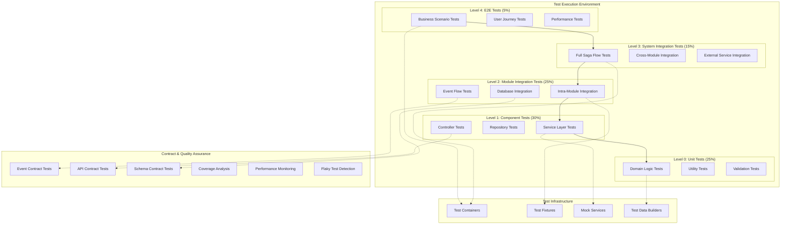

# 통합 테스트 레이어 아키텍처

이 문서는 **알고리포트의 모듈형 모놀리스 환경에서 체계적이고 효율적인 통합 테스트 레이어 구조**를 정의합니다. 단위 테스트부터 E2E 테스트까지 각 레이어의 역할과 상호작용을 명확히 하여 높은 품질의 소프트웨어를 보장합니다.

---

## 🏗️ **통합 테스트 레이어 전체 구조**

### **테스트 아키텍처 다이어그램**



---

## 📊 **Level 0: 단위 테스트 (Unit Tests) - 25%**

### **목적**: 개별 클래스/메서드의 로직 검증

```kotlin
// 도메인 로직 단위 테스트 기본 구조
@ExtendWith(MockitoExtension::class)
@Tag("unit")
class UserServiceUnitTest {
    
    @Mock private lateinit var userRepository: UserRepository
    @Mock private lateinit var passwordEncoder: PasswordEncoder
    @InjectMocks private lateinit var userService: UserService
    
    @Nested
    @DisplayName("사용자 생성 기능")
    inner class UserCreationTests {
        
        @Test
        @DisplayName("유효한 정보로 사용자 생성 시 성공한다")
        fun createUser_WithValidInfo_ShouldSucceed() {
            // Given
            val userInfo = aValidUserInfo()
            val encodedPassword = "encoded_password"
            val savedUser = aUser { id = 1L }
            
            whenever(passwordEncoder.encode(userInfo.password)).thenReturn(encodedPassword)
            whenever(userRepository.save(any<User>())).thenReturn(savedUser)
            
            // When
            val result = userService.createUser(userInfo)
            
            // Then
            assertThat(result.isSuccess).isTrue()
            assertThat(result.data.id).isEqualTo(1L)
            verify(userRepository).save(argThat { user ->
                user.email == userInfo.email && user.password == encodedPassword
            })
        }
        
        @Test
        @DisplayName("중복된 이메일로 사용자 생성 시 실패한다")
        fun createUser_WithDuplicateEmail_ShouldFail() {
            // Given
            val userInfo = aValidUserInfo()
            whenever(userRepository.existsByEmail(userInfo.email)).thenReturn(true)
            
            // When
            val result = userService.createUser(userInfo)
            
            // Then
            assertThat(result.isFailure).isTrue()
            assertThat(result.error).isInstanceOf<UserAlreadyExistsException>()
            verify(userRepository, never()).save(any())
        }
    }
    
    @Nested
    @DisplayName("solved.ac 연동 기능")
    inner class SolvedacLinkTests {
        // solved.ac 관련 단위 테스트들
    }
}
```

### **단위 테스트 전용 도구**

```kotlin
// 테스트 데이터 빌더
class TestDataBuilder {
    companion object {
        fun aValidUserInfo(): CreateUserInfo {
            return CreateUserInfo(
                email = "test${Random.nextInt(1000)}@example.com",
                password = "ValidPassword123!",
                nickname = "테스터${Random.nextInt(1000)}"
            )
        }
        
        fun aUser(customizer: User.() -> Unit = {}): User {
            return User(
                id = Random.nextLong(1, 10000),
                email = "user${Random.nextInt(1000)}@example.com",
                nickname = "사용자${Random.nextInt(1000)}",
                password = "encoded_password",
                isActive = true,
                createdAt = LocalDateTime.now()
            ).apply(customizer)
        }
    }
}

// 커스텀 Assertion 메서드
fun assertThatUser(user: User) = UserAssert(user)

class UserAssert(private val user: User) {
    fun hasValidEmail(): UserAssert {
        assertThat(user.email).matches("^[A-Za-z0-9+_.-]+@(.+)$")
        return this
    }
    
    fun isActive(): UserAssert {
        assertThat(user.isActive).isTrue()
        return this
    }
    
    fun hasNickname(nickname: String): UserAssert {
        assertThat(user.nickname).isEqualTo(nickname)
        return this
    }
}
```

---

## 🔧 **Level 1: 컴포넌트 테스트 (Component Tests) - 30%**

### **목적**: 단일 모듈 내 컴포넌트 간 상호작용 검증

```kotlin
// Service Layer 통합 테스트
@SpringBootTest(classes = [UserModule::class])
@Tag("component")
@TestPropertySource(properties = [
    "spring.datasource.url=jdbc:h2:mem:component-test-db",
    "spring.jpa.hibernate.ddl-auto=create-drop"
])
class UserServiceComponentTest {
    
    @Autowired private lateinit var userService: UserService
    @Autowired private lateinit var userRepository: UserRepository
    @Autowired private lateinit var testEntityManager: TestEntityManager
    
    @MockBean private lateinit var solvedacApiClient: SolvedacApiClient
    @MockBean private lateinit var eventPublisher: EventPublisher
    
    @Test
    @Transactional
    @Rollback
    fun `사용자_생성부터_solved.ac_연동까지_전체_플로우_테스트`() {
        // Given: 유효한 사용자 정보
        val userInfo = CreateUserInfo(
            email = "integration@test.com",
            password = "TestPassword123!",
            nickname = "통합테스터"
        )
        
        // And: solved.ac API 응답 모킹
        val solvedacInfo = SolvedacUserInfo("test_handle", "gold3", 150)
        whenever(solvedacApiClient.getUserInfo("test_handle")).thenReturn(solvedacInfo)
        
        // When: 사용자 생성 및 solved.ac 연동
        val createResult = userService.createUser(userInfo)
        val linkResult = userService.linkSolvedacAccount(createResult.data.id, "test_handle")
        
        // Then: 전체 플로우 성공 확인
        assertThat(createResult.isSuccess).isTrue()
        assertThat(linkResult.isSuccess).isTrue()
        
        // 데이터베이스 상태 확인
        val savedUser = userRepository.findById(createResult.data.id)!!
        assertThat(savedUser.solvedacHandle).isEqualTo("test_handle")
        assertThat(savedUser.solvedacTier).isEqualTo("gold3")
        
        // 이벤트 발행 확인
        verify(eventPublisher).publishEvent(argThat<SolvedacLinkedEvent> { event ->
            event.userId == savedUser.id && event.handle == "test_handle"
        })
    }
    
    @Test
    fun `동시_사용자_생성_요청_처리_테스트`() {
        // 동시성 테스트
        val userCount = 10
        val latch = CountDownLatch(userCount)
        val results = ConcurrentHashMap<Int, Result<User>>()
        val executor = Executors.newFixedThreadPool(5)
        
        try {
            repeat(userCount) { index ->
                executor.submit {
                    try {
                        val userInfo = CreateUserInfo(
                            email = "concurrent_$index@test.com",
                            password = "Password123!",
                            nickname = "동시테스터$index"
                        )
                        val result = userService.createUser(userInfo)
                        results[index] = result
                    } finally {
                        latch.countDown()
                    }
                }
            }
            
            latch.await(10, TimeUnit.SECONDS)
            
            // 모든 요청이 성공했는지 확인
            assertThat(results).hasSize(userCount)
            results.values.forEach { result ->
                assertThat(result.isSuccess).isTrue()
            }
            
            // 데이터베이스에 정확히 저장되었는지 확인
            val savedUsers = userRepository.findAll()
            assertThat(savedUsers).hasSize(userCount)
            
        } finally {
            executor.shutdown()
        }
    }
}
```

### **Repository 통합 테스트**

```kotlin
@DataJpaTest
@Tag("component")
class UserRepositoryComponentTest {
    
    @Autowired private lateinit var userRepository: UserRepository
    @Autowired private lateinit var testEntityManager: TestEntityManager
    
    @Test
    fun `복잡한_쿼리_메서드_동작_검증`() {
        // Given: 다양한 상태의 사용자들
        val activeUsers = (1..5).map { index ->
            aUser { 
                email = "active_$index@test.com"
                isActive = true
                solvedacHandle = "active_handle_$index"
            }
        }
        
        val inactiveUsers = (1..3).map { index ->
            aUser { 
                email = "inactive_$index@test.com"
                isActive = false
                solvedacHandle = null
            }
        }
        
        (activeUsers + inactiveUsers).forEach { user ->
            testEntityManager.persistAndFlush(user)
        }
        
        // When: 복잡한 조건으로 조회
        val linkedActiveUsers = userRepository.findActiveUsersWithSolvedacLink()
        val usersByTier = userRepository.findUsersByTierRange("bronze1", "gold5")
        val recentUsers = userRepository.findUsersCreatedAfter(LocalDateTime.now().minusDays(1))
        
        // Then: 쿼리 결과 검증
        assertThat(linkedActiveUsers).hasSize(5)
        assertThat(linkedActiveUsers).allMatch { it.isActive && it.solvedacHandle != null }
        
        assertThat(usersByTier).isNotEmpty()
        assertThat(recentUsers).hasSize(8)  // 방금 생성한 모든 사용자
    }
    
    @Test
    fun `대량_데이터_처리_성능_테스트`() {
        // Given: 대량의 사용자 데이터
        val userCount = 1000
        val users = (1..userCount).map { index ->
            aUser { 
                email = "bulk_$index@test.com"
                nickname = "대량사용자$index"
            }
        }
        
        val startTime = System.currentTimeMillis()
        
        // When: 배치 저장
        userRepository.saveAll(users)
        testEntityManager.flush()
        
        val saveTime = System.currentTimeMillis() - startTime
        
        // Then: 성능 검증
        assertThat(saveTime).isLessThan(5000)  // 5초 이내
        
        val savedCount = userRepository.count()
        assertThat(savedCount).isEqualTo(userCount.toLong())
        
        // 조회 성능 테스트
        val queryStartTime = System.currentTimeMillis()
        val activeUsers = userRepository.findByIsActiveTrue()
        val queryTime = System.currentTimeMillis() - queryStartTime
        
        assertThat(queryTime).isLessThan(1000)  // 1초 이내
        assertThat(activeUsers).hasSize(userCount)
    }
}
```

---

## 🔗 **Level 2: 모듈 통합 테스트 (Module Integration Tests) - 25%**

### **목적**: 모듈 간 상호작용 및 이벤트 플로우 검증

```kotlin
@SpringBootTest
@Tag("integration")
@TestMethodOrder(OrderAnnotation::class)
@TestPropertySource(properties = [
    "spring.profiles.active=integration-test",
    "kafka.enabled=false"
])
class CrossModuleIntegrationTest {
    
    @Autowired private lateinit var userService: UserService
    @Autowired private lateinit var studyGroupService: StudyGroupService
    @Autowired private lateinit var analysisService: AnalysisService
    @Autowired private lateinit var notificationService: NotificationService
    
    @MockBean private lateinit var kafkaTemplate: KafkaTemplate<String, String>
    @MockBean private lateinit var solvedacApiClient: SolvedacApiClient
    
    private lateinit var testUser: User
    private lateinit var testGroup: StudyGroup
    
    @Test
    @Order(1)
    fun `사용자_등록부터_그룹_참여까지_전체_모듈_협력_테스트`() {
        // Given: 외부 의존성 모킹
        mockSolvedacApiClient()
        
        // When: 1단계 - 사용자 등록
        val userInfo = CreateUserInfo(
            email = "module_integration@test.com",
            password = "TestPassword123!",
            nickname = "모듈통합테스터"
        )
        val userResult = userService.createUser(userInfo)
        testUser = userResult.data
        
        // Then: 사용자 생성 성공
        assertThat(userResult.isSuccess).isTrue()
        
        // When: 2단계 - solved.ac 연동
        val linkResult = userService.linkSolvedacAccount(testUser.id, "integration_tester")
        
        // Then: 연동 성공 및 Analysis 모듈에 데이터 반영
        assertThat(linkResult.isSuccess).isTrue()
        
        await().atMost(Duration.ofSeconds(5)).untilAsserted {
            val analysisProfile = analysisService.getUserAnalysisProfile(testUser.id)
            assertThat(analysisProfile).isNotNull()
            assertThat(analysisProfile.solvedacHandle).isEqualTo("integration_tester")
        }
        
        // When: 3단계 - 스터디 그룹 생성
        val groupRequest = CreateStudyGroupRequest(
            groupName = "통합테스트 그룹",
            description = "모듈 통합 테스트용",
            isPublic = true,
            maxMembers = 10
        )
        val groupResult = studyGroupService.createStudyGroup(testUser.id, groupRequest)
        testGroup = groupResult.data
        
        // Then: 그룹 생성 성공 및 Analysis 모듈에 반영
        assertThat(groupResult.isSuccess).isTrue()
        
        await().atMost(Duration.ofSeconds(5)).untilAsserted {
            val groupAnalysis = analysisService.getGroupAnalysisProfile(testGroup.id)
            assertThat(groupAnalysis).isNotNull()
            assertThat(groupAnalysis.ownerId).isEqualTo(testUser.id)
        }
    }
    
    @Test
    @Order(2)
    fun `그룹_규칙_설정_및_위반_감지_모듈_협력_테스트`() {
        // Given: 그룹 규칙 설정
        val groupRules = StudyGroupRules(
            minimumProblemsPerWeek = 3,
            allowedDifficultyRange = TierRange("bronze1", "gold5"),
            violationPenalty = PenaltyType.WARNING
        )
        
        // When: 규칙 적용
        val ruleResult = studyGroupService.updateGroupRules(testGroup.id, groupRules)
        
        // Then: 규칙 설정 성공
        assertThat(ruleResult.isSuccess).isTrue()
        
        // And: Analysis 모듈에 규칙이 반영됨
        await().atMost(Duration.ofSeconds(5)).untilAsserted {
            val appliedRules = analysisService.getGroupRules(testGroup.id)
            assertThat(appliedRules.minimumProblemsPerWeek).isEqualTo(3)
        }
        
        // When: 규칙 위반 상황 시뮬레이션 (주간 문제 수 부족)
        analysisService.simulateWeeklyActivity(testUser.id, problemsSolved = 1)  // 규칙보다 적음
        
        // Then: Notification 모듈에서 알림 생성
        await().atMost(Duration.ofSeconds(10)).untilAsserted {
            val violations = notificationService.getViolationNotifications(testUser.id)
            assertThat(violations).isNotEmpty()
            assertThat(violations.first().violationType).isEqualTo(ViolationType.INSUFFICIENT_WEEKLY_PROBLEMS)
        }
    }
    
    private fun mockSolvedacApiClient() {
        whenever(solvedacApiClient.getUserInfo("integration_tester"))
            .thenReturn(SolvedacUserInfo("integration_tester", "gold3", 150))
    }
}
```

### **이벤트 플로우 통합 테스트**

```kotlin
@SpringBootTest
@Tag("integration")
@EmbeddedKafka(partitions = 1, topics = ["user-events", "group-events", "analysis-events"])
class EventFlowIntegrationTest {
    
    @Autowired private lateinit var userService: UserService
    @Autowired private lateinit var kafkaTemplate: KafkaTemplate<String, String>
    @Autowired private lateinit var eventCaptor: TestEventCaptor
    
    @Test
    fun `이벤트_기반_모듈_간_통신_전체_플로우_테스트`() {
        // Given: 이벤트 캡처 시작
        eventCaptor.startCapturing("user-events", "analysis-events", "notification-events")
        
        // When: 사용자 등록 (이벤트 발행 트리거)
        val userInfo = CreateUserInfo(
            email = "event_flow@test.com",
            password = "TestPassword123!",
            nickname = "이벤트플로우테스터"
        )
        val user = userService.createUser(userInfo).data
        
        // Then: 이벤트 체인 검증
        await().atMost(Duration.ofSeconds(10)).untilAsserted {
            val capturedEvents = eventCaptor.getCapturedEvents()
            
            // 1. USER_REGISTERED 이벤트 발행 확인
            val userRegisteredEvent = capturedEvents.find { it.type == "USER_REGISTERED" }
            assertThat(userRegisteredEvent).isNotNull()
            assertThat(userRegisteredEvent!!.data["userId"]).isEqualTo(user.id.toString())
            
            // 2. ANALYSIS_PROFILE_CREATED 이벤트 발행 확인 (Analysis 모듈 응답)
            val profileCreatedEvent = capturedEvents.find { it.type == "ANALYSIS_PROFILE_CREATED" }
            assertThat(profileCreatedEvent).isNotNull()
            
            // 3. WELCOME_NOTIFICATION_SENT 이벤트 발행 확인 (Notification 모듈 응답)
            val welcomeNotificationEvent = capturedEvents.find { it.type == "WELCOME_NOTIFICATION_SENT" }
            assertThat(welcomeNotificationEvent).isNotNull()
            
            // 이벤트 순서 검증
            val eventTimestamps = capturedEvents.map { it.timestamp }.sorted()
            assertThat(eventTimestamps).isSorted()
        }
    }
    
    @Test
    fun `이벤트_처리_실패시_재시도_메커니즘_테스트`() {
        // Given: Analysis 모듈이 일시적으로 실패하도록 설정
        analysisService.enableFailureMode(failureCount = 2)  // 처음 2번 실패 후 성공
        
        // When: 사용자 등록
        val user = userService.createUser(aValidUserInfo()).data
        
        // Then: 재시도 후 최종 성공 확인
        await().atMost(Duration.ofSeconds(30)).untilAsserted {
            val analysisProfile = analysisService.getUserAnalysisProfile(user.id)
            assertThat(analysisProfile).isNotNull()
            
            // 재시도 로그 확인
            val retryEvents = eventCaptor.getRetryEvents()
            assertThat(retryEvents).hasSizeGreaterThan(0)
        }
    }
}

@Component
class TestEventCaptor {
    private val capturedEvents = mutableListOf<CapturedEvent>()
    private val retryEvents = mutableListOf<RetryEvent>()
    
    @KafkaListener(topics = ["#{{'user-events', 'analysis-events', 'notification-events'}}"])
    fun captureEvent(@Payload message: String, @Header headers: Map<String, Any>) {
        val event = CapturedEvent(
            type = headers["eventType"] as String,
            data = objectMapper.readValue<Map<String, Any>>(message),
            timestamp = System.currentTimeMillis(),
            topic = headers["kafka_receivedTopic"] as String
        )
        capturedEvents.add(event)
    }
    
    fun startCapturing(vararg topics: String) {
        capturedEvents.clear()
        retryEvents.clear()
    }
    
    fun getCapturedEvents(): List<CapturedEvent> = capturedEvents.toList()
    fun getRetryEvents(): List<RetryEvent> = retryEvents.toList()
}
```

---

## 🌐 **Level 3: 시스템 통합 테스트 (System Integration Tests) - 15%**

### **목적**: 전체 시스템의 주요 비즈니스 플로우 검증

```kotlin
@SpringBootTest(webEnvironment = SpringBootTest.WebEnvironment.RANDOM_PORT)
@Tag("system-integration")
@Testcontainers
class SystemIntegrationTest {
    
    @Container
    static val postgresContainer = PostgreSQLContainer("postgres:14")
        .withDatabaseName("algoreport_test")
        .withUsername("test")
        .withPassword("test")
    
    @Container
    static val kafkaContainer = KafkaContainer(DockerImageName.parse("confluentinc/cp-kafka:latest"))
    
    @Container 
    static val redisContainer = GenericContainer("redis:7-alpine")
        .withExposedPorts(6379)
    
    @Autowired private lateinit var webTestClient: WebTestClient
    @Autowired private lateinit var userService: UserService
    @Autowired private lateinit var studyGroupService: StudyGroupService
    
    @DynamicPropertySource
    companion object {
        @JvmStatic
        fun configureProperties(registry: DynamicPropertyRegistry) {
            registry.add("spring.datasource.url", postgresContainer::getJdbcUrl)
            registry.add("spring.datasource.username", postgresContainer::getUsername)
            registry.add("spring.datasource.password", postgresContainer::getPassword)
            registry.add("spring.kafka.bootstrap-servers", kafkaContainer::getBootstrapServers)
            registry.add("spring.redis.host", redisContainer::getHost)
            registry.add("spring.redis.port") { redisContainer.getMappedPort(6379) }
        }
    }
    
    @Test
    fun `사용자_가입부터_그룹_활동까지_전체_시스템_통합_테스트`() {
        // Given: Google OAuth2 Mock 설정
        setupGoogleOAuth2Mock()
        
        // When: 1단계 - 사용자 회원가입 (REST API)
        val registrationResponse = webTestClient
            .post()
            .uri("/api/v1/auth/register")
            .bodyValue(UserRegistrationRequest(
                authCode = "mock_google_auth_code",
                clientIP = "127.0.0.1"
            ))
            .exchange()
            .expectStatus().isCreated
            .expectBody<UserRegistrationResponse>()
            .returnResult()
            .responseBody!!
        
        val userId = registrationResponse.userId
        val accessToken = registrationResponse.accessToken
        
        // Then: 사용자 생성 및 토큰 발급 확인
        assertThat(userId).isNotBlank()
        assertThat(accessToken).isNotBlank()
        
        // When: 2단계 - solved.ac 계정 연동
        webTestClient
            .post()
            .uri("/api/v1/users/me/link-solvedac")
            .header("Authorization", "Bearer $accessToken")
            .bodyValue(LinkSolvedacRequest("system_test_handle"))
            .exchange()
            .expectStatus().isOk
            .expectBody<LinkSolvedacResponse>()
            .value { response ->
                assertThat(response.handle).isEqualTo("system_test_handle")
                assertThat(response.tier).isNotBlank()
            }
        
        // When: 3단계 - 스터디 그룹 생성
        val groupResponse = webTestClient
            .post()
            .uri("/api/v1/studygroups")
            .header("Authorization", "Bearer $accessToken")
            .bodyValue(CreateStudyGroupRequest(
                groupName = "시스템 통합 테스트 그룹",
                description = "전체 시스템 테스트용",
                isPublic = true,
                maxMembers = 10
            ))
            .exchange()
            .expectStatus().isCreated
            .expectBody<StudyGroupResponse>()
            .returnResult()
            .responseBody!!
        
        val groupId = groupResponse.groupId
        
        // When: 4단계 - 개인 대시보드 조회
        webTestClient
            .get()
            .uri("/api/v1/analysis/users/me/dashboard")
            .header("Authorization", "Bearer $accessToken")
            .exchange()
            .expectStatus().isOk
            .expectBody<UserDashboardResponse>()
            .value { dashboard ->
                assertThat(dashboard.user.handle).isEqualTo("system_test_handle")
                assertThat(dashboard.groups).hasSize(1)
                assertThat(dashboard.groups[0].groupId).isEqualTo(groupId)
            }
        
        // When: 5단계 - 그룹 대시보드 조회
        webTestClient
            .get()
            .uri("/api/v1/analysis/studygroups/$groupId/dashboard")
            .header("Authorization", "Bearer $accessToken")
            .exchange()
            .expectStatus().isOk
            .expectBody<GroupDashboardResponse>()
            .value { dashboard ->
                assertThat(dashboard.group.groupId).isEqualTo(groupId)
                assertThat(dashboard.members).hasSize(1)
                assertThat(dashboard.members[0].userId).isEqualTo(userId)
            }
        
        // Then: 시스템 전체 상태 일관성 확인
        await().atMost(Duration.ofSeconds(30)).untilAsserted {
            verifySystemConsistency(userId, groupId)
        }
    }
    
    @Test
    fun `대용량_사용자_동시_접속_처리_성능_테스트`() {
        // Given: 동시 접속 사용자 시뮬레이션
        val concurrentUsers = 50
        val latch = CountDownLatch(concurrentUsers)
        val results = ConcurrentHashMap<Int, Boolean>()
        val executor = Executors.newFixedThreadPool(10)
        
        val startTime = System.currentTimeMillis()
        
        try {
            repeat(concurrentUsers) { index ->
                executor.submit {
                    try {
                        // 각 사용자별 전체 플로우 실행
                        val success = executeUserJourney(index)
                        results[index] = success
                    } finally {
                        latch.countDown()
                    }
                }
            }
            
            latch.await(60, TimeUnit.SECONDS)
            val totalTime = System.currentTimeMillis() - startTime
            
            // Then: 성능 및 성공률 검증
            val successRate = results.values.count { it } / concurrentUsers.toDouble()
            assertThat(successRate).isGreaterThan(0.9)  // 90% 이상 성공률
            assertThat(totalTime).isLessThan(60000)  // 60초 이내 완료
            
            // 평균 응답 시간 계산
            val avgResponseTime = totalTime / concurrentUsers.toDouble()
            assertThat(avgResponseTime).isLessThan(2000)  // 사용자당 평균 2초 이내
            
        } finally {
            executor.shutdown()
        }
    }
    
    private fun executeUserJourney(userIndex: Int): Boolean {
        return try {
            val authResponse = webTestClient
                .post()
                .uri("/api/v1/auth/register")
                .bodyValue(UserRegistrationRequest(
                    authCode = "concurrent_user_$userIndex",
                    clientIP = "127.0.0.1"
                ))
                .exchange()
                .expectStatus().isCreated
                .expectBody<UserRegistrationResponse>()
                .returnResult()
                .responseBody!!
            
            webTestClient
                .post()
                .uri("/api/v1/users/me/link-solvedac")
                .header("Authorization", "Bearer ${authResponse.accessToken}")
                .bodyValue(LinkSolvedacRequest("handle_$userIndex"))
                .exchange()
                .expectStatus().isOk
            
            webTestClient
                .get()
                .uri("/api/v1/analysis/users/me/dashboard")
                .header("Authorization", "Bearer ${authResponse.accessToken}")
                .exchange()
                .expectStatus().isOk
            
            true
        } catch (e: Exception) {
            logger.warn("User journey failed for user $userIndex", e)
            false
        }
    }
    
    private fun verifySystemConsistency(userId: String, groupId: String) {
        // 모든 모듈의 데이터 일관성 검증
        val user = userService.getUserById(userId)
        val group = studyGroupService.getGroupById(groupId)
        val analysisProfile = analysisService.getUserAnalysisProfile(userId)
        val groupAnalysis = analysisService.getGroupAnalysisProfile(groupId)
        
        assertThat(user.solvedacHandle).isNotNull()
        assertThat(group.ownerId).isEqualTo(userId)
        assertThat(group.memberCount).isEqualTo(1)
        assertThat(analysisProfile.solvedacHandle).isEqualTo(user.solvedacHandle)
        assertThat(groupAnalysis.ownerId).isEqualTo(userId)
        assertThat(groupAnalysis.memberIds).contains(userId)
    }
}
```

---

## 🎭 **Level 4: E2E 테스트 (End-to-End Tests) - 5%**

### **목적**: 실제 사용자 관점에서의 전체 비즈니스 시나리오 검증

```kotlin
@SpringBootTest(webEnvironment = SpringBootTest.WebEnvironment.DEFINED_PORT)
@Tag("e2e")
@Testcontainers
class EndToEndTest {
    
    @Container
    static val seleniumContainer = BrowserWebDriverContainer<Nothing>()
        .withCapabilities(ChromeOptions().apply { 
            addArguments("--headless", "--no-sandbox", "--disable-dev-shm-usage")
        })
    
    private lateinit var driver: RemoteWebDriver
    
    @BeforeEach
    fun setUp() {
        driver = seleniumContainer.webDriver
        driver.manage().timeouts().implicitlyWait(Duration.ofSeconds(10))
    }
    
    @Test
    fun `신규_사용자의_완전한_온보딩_여정_테스트`() {
        // Given: 랜딩 페이지 접속
        driver.get("http://localhost:8080")
        
        // When: 1단계 - Google 로그인
        val loginButton = driver.findElement(By.id("google-login-button"))
        loginButton.click()
        
        // Google OAuth2 Mock 페이지 처리
        val mockEmailInput = wait.until(ExpectedConditions.presenceOfElementLocated(By.id("mock-email")))
        mockEmailInput.sendKeys("e2e_test@example.com")
        
        val mockLoginButton = driver.findElement(By.id("mock-login-submit"))
        mockLoginButton.click()
        
        // Then: 대시보드 페이지로 리디렉션 확인
        wait.until(ExpectedConditions.urlContains("/dashboard"))
        assertThat(driver.title).contains("알고리포트 - 대시보드")
        
        // When: 2단계 - solved.ac 계정 연동
        val linkSolvedacButton = driver.findElement(By.id("link-solvedac-button"))
        linkSolvedacButton.click()
        
        val handleInput = wait.until(ExpectedConditions.presenceOfElementLocated(By.id("solvedac-handle")))
        handleInput.sendKeys("e2e_test_handle")
        
        val linkButton = driver.findElement(By.id("link-submit-button"))
        linkButton.click()
        
        // Then: 연동 성공 메시지 확인
        val successMessage = wait.until(ExpectedConditions.presenceOfElementLocated(By.className("success-message")))
        assertThat(successMessage.text).contains("solved.ac 계정이 성공적으로 연동되었습니다")
        
        // When: 3단계 - 스터디 그룹 생성
        val createGroupButton = driver.findElement(By.id("create-group-button"))
        createGroupButton.click()
        
        val groupNameInput = wait.until(ExpectedConditions.presenceOfElementLocated(By.id("group-name")))
        groupNameInput.sendKeys("E2E 테스트 그룹")
        
        val groupDescInput = driver.findElement(By.id("group-description"))
        groupDescInput.sendKeys("E2E 테스트를 위한 그룹입니다")
        
        val createButton = driver.findElement(By.id("create-group-submit"))
        createButton.click()
        
        // Then: 그룹 생성 성공 및 그룹 페이지로 이동
        wait.until(ExpectedConditions.urlContains("/groups/"))
        val groupTitle = driver.findElement(By.className("group-title"))
        assertThat(groupTitle.text).isEqualTo("E2E 테스트 그룹")
        
        // When: 4단계 - 개인 분석 페이지 확인
        val analysisTab = driver.findElement(By.id("analysis-tab"))
        analysisTab.click()
        
        // Then: 분석 데이터 표시 확인
        wait.until(ExpectedConditions.presenceOfElementLocated(By.className("user-statistics")))
        val solvedacInfo = driver.findElement(By.className("solvedac-info"))
        assertThat(solvedacInfo.text).contains("e2e_test_handle")
        
        // When: 5단계 - 그룹 분석 페이지 확인
        val groupAnalysisTab = driver.findElement(By.id("group-analysis-tab"))
        groupAnalysisTab.click()
        
        // Then: 그룹 분석 데이터 표시 확인
        wait.until(ExpectedConditions.presenceOfElementLocated(By.className("group-statistics")))
        val memberList = driver.findElement(By.className("member-list"))
        assertThat(memberList.text).contains("e2e_test@example.com")
        
        // 전체 페이지 스크린샷 캡처 (디버깅용)
        val screenshot = (driver as TakesScreenshot).getScreenshotAs(OutputType.FILE)
        Files.copy(screenshot.toPath(), Paths.get("build/reports/e2e-test-success.png"))
    }
    
    @Test
    fun `모바일_반응형_웹_테스트`() {
        // Given: 모바일 화면 크기로 설정
        driver.manage().window().size = Dimension(375, 667)  // iPhone SE 크기
        
        // When: 랜딩 페이지 접속
        driver.get("http://localhost:8080")
        
        // Then: 모바일 레이아웃 확인
        val mobileNavigation = driver.findElement(By.className("mobile-navigation"))
        assertThat(mobileNavigation.isDisplayed).isTrue()
        
        val hamburgerMenu = driver.findElement(By.id("hamburger-menu"))
        assertThat(hamburgerMenu.isDisplayed).isTrue()
        
        // When: 햄버거 메뉴 클릭
        hamburgerMenu.click()
        
        // Then: 모바일 메뉴 확장 확인
        val mobileMenu = wait.until(ExpectedConditions.presenceOfElementLocated(By.className("mobile-menu-expanded")))
        assertThat(mobileMenu.isDisplayed).isTrue()
        
        // 모바일 스크린샷 캡처
        val screenshot = (driver as TakesScreenshot).getScreenshotAs(OutputType.FILE)
        Files.copy(screenshot.toPath(), Paths.get("build/reports/e2e-mobile-test.png"))
    }
    
    private val wait = WebDriverWait(driver, Duration.ofSeconds(10))
}
```

---

## 🏗️ **테스트 인프라스트럭처**

### **테스트 컨테이너 설정**

```kotlin
@TestConfiguration
class TestInfrastructureConfiguration {
    
    @Bean
    @Primary
    fun testDatabaseContainer(): PostgreSQLContainer<*> {
        return PostgreSQLContainer("postgres:14")
            .withDatabaseName("algoreport_test")
            .withUsername("test_user")
            .withPassword("test_password")
            .withInitScript("test-schema.sql")
            .apply { start() }
    }
    
    @Bean
    @Primary
    fun testKafkaContainer(): KafkaContainer {
        return KafkaContainer(DockerImageName.parse("confluentinc/cp-kafka:latest"))
            .withEnv("KAFKA_AUTO_CREATE_TOPICS_ENABLE", "true")
            .apply { start() }
    }
    
    @Bean
    @Primary
    fun testRedisContainer(): GenericContainer<*> {
        return GenericContainer("redis:7-alpine")
            .withExposedPorts(6379)
            .withCommand("redis-server", "--requirepass", "test_password")
            .apply { start() }
    }
}

// 테스트용 데이터 팩토리
@Component
class TestDataFactory {
    
    fun createTestUsers(count: Int): List<User> {
        return (1..count).map { index ->
            User(
                id = index.toLong(),
                email = "test_user_$index@example.com",
                nickname = "테스터$index",
                password = "encoded_password",
                isActive = true,
                createdAt = LocalDateTime.now()
            )
        }
    }
    
    fun createTestGroups(ownerIds: List<Long>): List<StudyGroup> {
        return ownerIds.mapIndexed { index, ownerId ->
            StudyGroup(
                id = index.toLong() + 1,
                groupName = "테스트 그룹 ${index + 1}",
                description = "테스트용 스터디 그룹",
                ownerId = ownerId,
                isPublic = true,
                maxMembers = 10,
                memberCount = 1,
                createdAt = LocalDateTime.now()
            )
        }
    }
    
    fun createTestSubmissions(userId: Long, count: Int): List<Submission> {
        return (1..count).map { index ->
            Submission(
                id = index.toLong(),
                userId = userId,
                problemId = 1000 + index,
                result = "AC",
                language = "java",
                submittedAt = LocalDateTime.now().minusDays(index.toLong())
            )
        }
    }
}
```

### **테스트 실행 최적화**

```kotlin
// 병렬 테스트 실행 설정
// junit-platform.properties
junit.jupiter.execution.parallel.enabled=true
junit.jupiter.execution.parallel.mode.default=concurrent
junit.jupiter.execution.parallel.mode.classes.default=concurrent

// 테스트 그룹별 리소스 격리
@Execution(ExecutionMode.CONCURRENT)
@ResourceLock(value = "database", mode = ResourceAccessMode.READ_WRITE)
class DatabaseIntegrationTest {
    // 데이터베이스를 사용하는 테스트들
}

@Execution(ExecutionMode.CONCURRENT)
@ResourceLock(value = "kafka", mode = ResourceAccessMode.READ_WRITE)
class EventFlowIntegrationTest {
    // Kafka를 사용하는 테스트들
}

// 테스트 실행 시간 모니터링
@ExtendWith(TestExecutionTimeExtension::class)
class TestExecutionTimeExtension : BeforeEachCallback, AfterEachCallback {
    
    override fun beforeEach(context: ExtensionContext) {
        context.getStore(NAMESPACE).put("startTime", System.currentTimeMillis())
    }
    
    override fun afterEach(context: ExtensionContext) {
        val startTime = context.getStore(NAMESPACE).get("startTime", Long::class.java)
        val duration = System.currentTimeMillis() - startTime
        
        val testMethod = context.displayName
        val testClass = context.testClass.get().simpleName
        
        logger.info("Test execution time: $testClass.$testMethod = ${duration}ms")
        
        // 느린 테스트 감지
        if (duration > getExpectedDuration(context)) {
            logger.warn("Slow test detected: $testClass.$testMethod took ${duration}ms")
        }
    }
    
    private fun getExpectedDuration(context: ExtensionContext): Long {
        return when {
            context.tags.contains("unit") -> 1000L
            context.tags.contains("component") -> 5000L
            context.tags.contains("integration") -> 15000L
            context.tags.contains("system-integration") -> 30000L
            context.tags.contains("e2e") -> 60000L
            else -> 10000L
        }
    }
    
    companion object {
        private val NAMESPACE = ExtensionContext.Namespace.create(TestExecutionTimeExtension::class.java)
        private val logger = LoggerFactory.getLogger(TestExecutionTimeExtension::class.java)
    }
}
```

---

이러한 통합 테스트 레이어 구조를 통해 모듈형 모놀리스에서도 체계적이고 효율적인 테스트 전략을 구현할 수 있습니다. 각 레이어가 명확한 역할을 가지고 상호 보완하면서 전체 시스템의 품질을 보장합니다.

📝 **문서 버전**: v1.0  
📅 **최종 수정일**: 2025-07-23  
👤 **작성자**: 채기훈