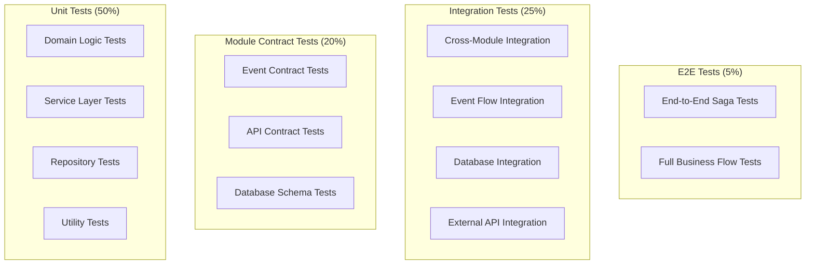

# 모듈형 모놀리스 TDD 전략 가이드

이 문서는 **알고리포트의 모듈형 모놀리스 아키텍처에서 효과적인 TDD를 수행하기 위한 종합 가이드**입니다. Saga 패턴과 이벤트 기반 아키텍처의 특성을 고려한 실전 TDD 방법론을 제시합니다.

---

## 🏗️ **모듈형 모놀리스 TDD 아키텍처**

### **테스트 피라미드 재정의**



---

## 🧪 **1. 단위 테스트 (Unit Tests) - 50%**

### **1.1 도메인 로직 테스트**

각 모듈의 핵심 비즈니스 로직을 격리하여 테스트합니다.

```kotlin
// User Module - 도메인 로직 테스트 예시
class UserServiceTest {
    
    @Mock private lateinit var userRepository: UserRepository
    @Mock private lateinit var solvedacApiClient: SolvedacApiClient
    @InjectMocks private lateinit var userService: UserService
    
    @Test
    fun `solved.ac 핸들 연동 시 유효한 핸들이면 성공`() {
        // Given
        val userId = "user-123"
        val handle = "algosolver"
        val validUserInfo = SolvedacUserInfo(handle, "gold3", 150)
        
        whenever(userRepository.findById(userId)).thenReturn(createTestUser(userId))
        whenever(solvedacApiClient.getUserInfo(handle)).thenReturn(validUserInfo)
        
        // When
        val result = userService.linkSolvedacAccount(userId, handle)
        
        // Then
        assertThat(result.isSuccess).isTrue()
        assertThat(result.handle).isEqualTo(handle)
        verify(userRepository).save(any<User>())
    }
    
    @Test
    fun `solved.ac 핸들 연동 시 이미 사용중인 핸들이면 실패`() {
        // Given
        val userId = "user-123"
        val handle = "existing-handle"
        
        whenever(userRepository.existsBySolvedacHandle(handle)).thenReturn(true)
        
        // When & Then
        assertThrows<HandleAlreadyUsedException> {
            userService.linkSolvedacAccount(userId, handle)
        }
    }
}
```

### **1.2 TDD 사이클 적용**

```kotlin
class StudyGroupServiceTest {
    
    @Test
    fun `스터디 그룹 생성 시 소유자는 자동으로 첫 번째 멤버가 된다`() {
        // Red: 실패하는 테스트 작성
        val ownerId = "owner-123"
        val groupInfo = CreateStudyGroupRequest("알고리즘 스터디", "매일 1문제씩", true)
        
        // 아직 구현되지 않은 메서드 호출
        val result = studyGroupService.createStudyGroup(ownerId, groupInfo)
        
        // 예상되는 결과 정의
        assertThat(result.ownerId).isEqualTo(ownerId)
        assertThat(result.members).contains(ownerId)
        assertThat(result.memberCount).isEqualTo(1)
    }
    
    // Green: 최소한의 구현으로 테스트 통과
    // Refactor: 코드 정리 및 최적화
}
```

---

## 🔗 **2. 모듈 계약 테스트 (Module Contract Tests) - 20%**

### **2.1 이벤트 계약 테스트**

모듈 간 이벤트 발행/구독의 계약을 검증합니다.

```kotlin
@TestMethodOrder(OrderAnnotation::class)
class UserModuleEventContractTest {
    
    @Test @Order(1)
    fun `USER_REGISTERED 이벤트는 올바른 스키마로 발행되어야 한다`() {
        // Given: 사용자 등록 요청
        val userInfo = GoogleUserInfo("test@example.com", "테스터", "profile.jpg")
        
        // When: 사용자 등록 실행
        val user = userService.registerUser(userInfo)
        
        // Then: Outbox에 올바른 형태의 이벤트가 저장되어야 함
        val outboxEvents = outboxRepository.findByAggregateId(user.id.toString())
        val userRegisteredEvent = outboxEvents.find { it.eventType == "USER_REGISTERED" }
        
        assertThat(userRegisteredEvent).isNotNull()
        
        // 이벤트 스키마 검증
        val eventData = objectMapper.readValue<UserRegisteredEventData>(userRegisteredEvent!!.eventData)
        assertThat(eventData.userId).isEqualTo(user.id.toString())
        assertThat(eventData.email).isEqualTo("test@example.com")
        assertThat(eventData.nickname).isNotBlank()
    }
    
    @Test @Order(2) 
    fun `USER_REGISTERED 이벤트를 Analysis Module이 올바르게 처리할 수 있어야 한다`() {
        // Given: USER_REGISTERED 이벤트
        val event = createUserRegisteredEvent()
        
        // When: Analysis Module의 이벤트 핸들러 실행
        analysisEventHandler.handleUserRegistered(
            objectMapper.writeValueAsString(event.data),
            mapOf("sagaId" to event.sagaId, "sagaType" to event.sagaType)
        )
        
        // Then: Analysis Profile이 생성되어야 함
        val profile = analysisProfileRepository.findByUserId(event.data.userId)
        assertThat(profile).isNotNull()
        
        // 그리고 후속 이벤트가 발행되어야 함
        val responseEvents = outboxRepository.findRecentEvents(limit = 10)
        assertThat(responseEvents).anyMatch { it.eventType == "ANALYSIS_PROFILE_CREATED" }
    }
}
```

### **2.2 API 계약 테스트**

```kotlin
@WebMvcTest(StudyGroupController::class)
class StudyGroupControllerContractTest {
    
    @MockBean private lateinit var studyGroupService: StudyGroupService
    @Autowired private lateinit var mockMvc: MockMvc
    
    @Test
    fun `POST studygroups API는 정의된 스키마로 응답해야 한다`() {
        // Given
        val request = CreateStudyGroupRequest("테스트 그룹", "설명", true)
        val expectedResponse = StudyGroupResponse("group-123", "테스트 그룹", "owner-123")
        
        whenever(studyGroupService.createStudyGroup(any(), any())).thenReturn(expectedResponse)
        
        // When & Then
        mockMvc.perform(
            post("/api/v1/studygroups")
                .contentType(MediaType.APPLICATION_JSON)
                .content(objectMapper.writeValueAsString(request))
                .header("Authorization", "Bearer valid-jwt-token")
        )
        .andExpect(status().isCreated)
        .andExpect(jsonPath("$.groupId").value("group-123"))
        .andExpect(jsonPath("$.groupName").value("테스트 그룹"))
        .andExpect(jsonPath("$.ownerId").value("owner-123"))
        .andDo(document("create-study-group")) // Spring REST Docs
    }
}
```

### **2.3 데이터베이스 스키마 계약 테스트**

```kotlin
@DataJpaTest
class DatabaseSchemaContractTest {
    
    @Autowired private lateinit var testEntityManager: TestEntityManager
    
    @Test
    fun `User 엔티티는 정의된 제약조건을 만족해야 한다`() {
        // Given
        val user = User(
            email = "test@example.com",
            nickname = "테스터123",
            provider = AuthProvider.GOOGLE
        )
        
        // When
        val savedUser = testEntityManager.persistAndFlush(user)
        
        // Then
        assertThat(savedUser.id).isNotNull()
        assertThat(savedUser.createdAt).isNotNull()
        assertThat(savedUser.isActive).isTrue() // 기본값 확인
    }
    
    @Test
    fun `이메일 중복 시 제약조건 위반 예외가 발생해야 한다`() {
        // Given
        val user1 = User(email = "duplicate@example.com", nickname = "사용자1")
        val user2 = User(email = "duplicate@example.com", nickname = "사용자2")
        
        testEntityManager.persistAndFlush(user1)
        
        // When & Then
        assertThrows<ConstraintViolationException> {
            testEntityManager.persistAndFlush(user2)
        }
    }
}
```

---

## 🔄 **3. 통합 테스트 (Integration Tests) - 25%**

### **3.1 모듈 간 통합 테스트**

```kotlin
@SpringBootTest
@Transactional
@TestPropertySource(properties = [
    "kafka.enabled=false",  // 실제 Kafka 대신 Mock 사용
    "spring.jpa.hibernate.ddl-auto=create-drop"
])
class CrossModuleIntegrationTest {
    
    @Autowired private lateinit var userService: UserService
    @Autowired private lateinit var studyGroupService: StudyGroupService
    @Autowired private lateinit var analysisService: AnalysisService
    
    @MockBean private lateinit var kafkaTemplate: KafkaTemplate<String, String>
    
    @Test
    fun `사용자 등록부터 그룹 참여까지 전체 플로우 테스트`() {
        // Given: 사용자 등록
        val userInfo = GoogleUserInfo("integration@test.com", "통합테스터", "profile.jpg")
        val user = userService.registerUser(userInfo)
        
        // And: solved.ac 계정 연동
        val handle = "integration-tester"
        userService.linkSolvedacAccount(user.id.toString(), handle)
        
        // And: 스터디 그룹 생성
        val groupInfo = CreateStudyGroupRequest("통합테스트 그룹", "설명", true)
        val group = studyGroupService.createStudyGroup(user.id.toString(), groupInfo)
        
        // When: 다른 사용자가 그룹 참여
        val otherUser = userService.registerUser(
            GoogleUserInfo("other@test.com", "다른테스터", "other.jpg")
        )
        val joinResult = studyGroupService.joinGroup(group.groupId, otherUser.id.toString())
        
        // Then: 모든 모듈의 상태가 올바르게 업데이트되어야 함
        assertThat(joinResult.isSuccess).isTrue()
        
        val updatedGroup = studyGroupService.getGroupById(group.groupId)
        assertThat(updatedGroup.memberCount).isEqualTo(2)
        
        // Analysis Module에도 데이터가 반영되어야 함
        val groupAnalysis = analysisService.getGroupAnalysis(group.groupId)
        assertThat(groupAnalysis.memberProfiles).hasSize(2)
    }
}
```

### **3.2 이벤트 플로우 통합 테스트**

```kotlin
@SpringBootTest
@TestMethodOrder(OrderAnnotation::class)
class EventFlowIntegrationTest {
    
    @Autowired private lateinit var outboxEventPublisher: OutboxEventPublisher
    @Autowired private lateinit var userEventHandler: UserEventHandler
    @Autowired private lateinit var analysisEventHandler: AnalysisEventHandler
    
    private lateinit var testSagaId: UUID
    
    @Test @Order(1)
    fun `이벤트 발행 및 처리 체인 테스트`() {
        // Given: 사용자 등록 이벤트 생성
        testSagaId = UUID.randomUUID()
        val event = createUserRegisteredEvent(sagaId = testSagaId)
        
        // When: Outbox에 이벤트 저장
        outboxRepository.save(event)
        
        // And: 이벤트 발행 스케줄러 실행
        outboxEventPublisher.publishOutboxEvents()
        
        // Then: 이벤트가 처리되었는지 확인
        await().atMost(Duration.ofSeconds(10)).untilAsserted {
            val processedEvent = outboxRepository.findById(event.eventId)
            assertThat(processedEvent.get().processed).isTrue()
        }
    }
    
    @Test @Order(2)
    fun `이벤트 처리 후 후속 이벤트 발행 확인`() {
        // Given: 이전 테스트에서 발행된 이벤트
        
        // When: Analysis Module이 이벤트를 처리
        // (실제로는 Kafka Consumer가 처리하지만, 테스트에서는 직접 호출)
        
        // Then: ANALYSIS_PROFILE_CREATED 이벤트가 발행되어야 함
        await().atMost(Duration.ofSeconds(5)).untilAsserted {
            val responseEvents = outboxRepository.findBySagaId(testSagaId)
            assertThat(responseEvents).anyMatch { 
                it.eventType == "ANALYSIS_PROFILE_CREATED" 
            }
        }
    }
}
```

---

## 🎭 **4. Saga 패턴 특화 TDD**

### **4.1 Saga 테스트 전용 어노테이션**

```kotlin
@Target(AnnotationTarget.CLASS)
@Retention(AnnotationRetention.RUNTIME)
@SpringBootTest
@Transactional
@TestPropertySource(properties = [
    "kafka.enabled=false",
    "saga.timeout.enabled=false",  // 테스트 중 타임아웃 비활성화
    "outbox.publisher.enabled=false"  // 자동 발행 비활성화
])
annotation class SagaTest

@Target(AnnotationTarget.FUNCTION)
@Retention(AnnotationRetention.RUNTIME)
@Test
@Timeout(value = 30, unit = TimeUnit.SECONDS)  // Saga 테스트 타임아웃
annotation class SagaScenario
```

### **4.2 Saga 테스트 DSL**

```kotlin
@SagaTest
class UserRegistrationSagaTest {
    
    @SagaScenario
    fun `사용자 등록 Saga 성공 시나리오`() {
        sagaTest {
            // Given: 초기 조건 설정
            given {
                googleOAuth2Returns(validUserInfo())
                analysisServiceIsHealthy()
                notificationServiceIsHealthy()
            }
            
            // When: Saga 시작
            whenSagaStarts {
                userRegistrationSaga.start(validRegistrationContext())
            }
            
            // Then: 각 단계별 검증
            thenSagaShould {
                completeSuccessfully()
                haveCompletedSteps("USER_CREATED", "ANALYSIS_PROFILE_CREATED", "WELCOME_NOTIFICATION_SENT")
                haveTriggeredEvents("USER_REGISTERED", "ANALYSIS_PROFILE_CREATED", "WELCOME_NOTIFICATION_SENT")
            }
            
            // And: 최종 상태 검증
            andSystemShould {
                haveUserInDatabase()
                haveAnalysisProfileForUser()
                haveWelcomeNotificationSent()
            }
        }
    }
    
    @SagaScenario
    fun `분석 프로필 생성 실패 시 보상 트랜잭션 테스트`() {
        sagaTest {
            given {
                googleOAuth2Returns(validUserInfo())
                analysisServiceThrows(RuntimeException("DB Error"))  // 의도적 실패
                notificationServiceIsHealthy()
            }
            
            whenSagaStarts {
                userRegistrationSaga.start(validRegistrationContext())
            }
            
            thenSagaShould {
                failAtStep("ANALYSIS_PROFILE_CREATED")
                executeCompensationFor("USER_CREATED")
                endWithStatus(SagaStatus.COMPENSATED)
            }
            
            andSystemShould {
                notHaveUserInDatabase()  // 보상으로 삭제됨
                notHaveAnalysisProfile()
                haveCompensationEventsLogged()
            }
        }
    }
}
```

### **4.3 Saga 테스트 헬퍼**

```kotlin
class SagaTestDSL {
    private lateinit var sagaId: UUID
    private lateinit var sagaResult: SagaResult
    
    fun given(setup: SagaTestSetup.() -> Unit) {
        val testSetup = SagaTestSetup()
        testSetup.setup()
        // Mock 설정 적용
    }
    
    fun whenSagaStarts(action: () -> SagaResult) {
        sagaResult = action()
        sagaId = sagaResult.sagaId
    }
    
    fun thenSagaShould(assertions: SagaAssertions.() -> Unit) {
        val sagaAssertions = SagaAssertions(sagaId, sagaResult)
        sagaAssertions.assertions()
    }
    
    fun andSystemShould(assertions: SystemStateAssertions.() -> Unit) {
        val systemAssertions = SystemStateAssertions(sagaId)
        systemAssertions.assertions()
    }
}

class SagaAssertions(private val sagaId: UUID, private val result: SagaResult) {
    
    fun completeSuccessfully() {
        assertThat(result.status).isEqualTo(SagaStatus.COMPLETED)
    }
    
    fun failAtStep(stepName: String) {
        assertThat(result.status).isEqualTo(SagaStatus.FAILED)
        assertThat(result.failedStep).isEqualTo(stepName)
    }
    
    fun haveCompletedSteps(vararg steps: String) {
        assertThat(result.completedSteps).containsAll(steps.toList())
    }
    
    fun haveTriggeredEvents(vararg eventTypes: String) {
        val outboxEvents = outboxRepository.findBySagaId(sagaId)
        val triggeredEvents = outboxEvents.map { it.eventType }
        assertThat(triggeredEvents).containsAll(eventTypes.toList())
    }
}
```

---

## 🎪 **5. 테스트 환경 격리 전략**

### **5.1 테스트 프로파일 관리**

```yaml
# application-test.yml
spring:
  profiles:
    active: test
  
  datasource:
    url: jdbc:h2:mem:testdb-${random.uuid}  # 각 테스트마다 다른 DB
    driver-class-name: org.h2.Driver
  
  jpa:
    hibernate:
      ddl-auto: create-drop
    show-sql: false
  
  kafka:
    enabled: false  # 테스트 중 실제 Kafka 비활성화

# 테스트별 격리 설정
test:
  isolation:
    database: per-class  # 클래스당 별도 DB
    kafka: mock          # Mock Kafka 사용
    external-apis: stub  # 외부 API Stub 처리
```

### **5.2 테스트 데이터 빌더**

```kotlin
class TestDataBuilder {
    
    companion object {
        fun aUser(modifier: User.() -> Unit = {}): User {
            return User(
                email = "test-${UUID.randomUUID()}@example.com",
                nickname = "테스터${Random.nextInt(1000)}",
                provider = AuthProvider.GOOGLE,
                isActive = true
            ).apply(modifier)
        }
        
        fun aStudyGroup(owner: User, modifier: StudyGroup.() -> Unit = {}): StudyGroup {
            return StudyGroup(
                groupName = "테스트그룹${Random.nextInt(1000)}",
                description = "테스트용 스터디 그룹",
                ownerId = owner.id.toString(),
                isPublic = true,
                maxMembers = 10
            ).apply(modifier)
        }
        
        fun aSagaContext(sagaType: String, modifier: Map<String, Any>.() -> Map<String, Any> = { this }): SagaContext {
            val baseData = mutableMapOf<String, Any>(
                "testMode" to true,
                "timestamp" to LocalDateTime.now().toString()
            )
            return SagaContext(
                sagaType = sagaType,
                correlationData = baseData.modifier()
            )
        }
    }
}

// 사용 예시
class StudyGroupServiceTest {
    
    @Test
    fun `그룹 생성 테스트`() {
        // Given
        val owner = aUser { nickname = "그룹장" }
        val groupRequest = CreateStudyGroupRequest("새 그룹", "설명", true)
        
        // When
        val result = studyGroupService.createStudyGroup(owner.id.toString(), groupRequest)
        
        // Then
        assertThat(result.ownerId).isEqualTo(owner.id.toString())
    }
}
```

---

## 🚀 **6. 지속적 통합(CI) TDD 파이프라인**

### **6.1 Gradle 테스트 태스크 구성**

```kotlin
// build.gradle.kts
tasks {
    test {
        useJUnitPlatform {
            includeTags("unit", "contract")
            excludeTags("integration", "e2e")
        }
        systemProperty("spring.profiles.active", "test")
        maxParallelForks = Runtime.getRuntime().availableProcessors()
    }
    
    val integrationTest by registering(Test::class) {
        useJUnitPlatform {
            includeTags("integration")
            excludeTags("e2e")
        }
        shouldRunAfter(test)
        systemProperty("spring.profiles.active", "integration-test")
    }
    
    val e2eTest by registering(Test::class) {
        useJUnitPlatform {
            includeTags("e2e")
        }
        shouldRunAfter(integrationTest)
        systemProperty("spring.profiles.active", "e2e-test")
    }
    
    val sagaTest by registering(Test::class) {
        useJUnitPlatform {
            includeTags("saga")
        }
        systemProperty("spring.profiles.active", "saga-test")
        timeout.set(Duration.ofMinutes(10))  // Saga 테스트는 시간이 오래 걸림
    }
}
```

### **6.2 테스트 태그 전략**

```kotlin
// 테스트 태그 정의
@Target(AnnotationTarget.CLASS, AnnotationTarget.FUNCTION)
@Retention(AnnotationRetention.RUNTIME)
@Tag("unit")
annotation class UnitTest

@Target(AnnotationTarget.CLASS, AnnotationTarget.FUNCTION) 
@Retention(AnnotationRetention.RUNTIME)
@Tag("integration")
annotation class IntegrationTest

@Target(AnnotationTarget.CLASS, AnnotationTarget.FUNCTION)
@Retention(AnnotationRetention.RUNTIME)
@Tag("contract")
annotation class ContractTest

@Target(AnnotationTarget.CLASS, AnnotationTarget.FUNCTION)
@Retention(AnnotationRetention.RUNTIME)
@Tag("saga")
annotation class SagaIntegrationTest

@Target(AnnotationTarget.CLASS, AnnotationTarget.FUNCTION)
@Retention(AnnotationRetention.RUNTIME)
@Tag("e2e")
annotation class EndToEndTest

// 사용 예시
@UnitTest
class UserServiceTest {
    // 단위 테스트들
}

@ContractTest
class UserModuleEventContractTest {
    // 계약 테스트들
}

@SagaIntegrationTest
class UserRegistrationSagaTest {
    // Saga 통합 테스트들
}
```

---

## 📊 **7. TDD 메트릭 및 품질 관리**

### **7.1 테스트 커버리지 목표**

```kotlin
// build.gradle.kts - JaCoCo 설정
jacoco {
    toolVersion = "0.8.8"
}

tasks.jacocoTestReport {
    dependsOn(tasks.test)
    reports {
        xml.required.set(true)
        html.required.set(true)
    }
    
    executionData.setFrom(fileTree(layout.buildDirectory.dir("jacoco")).include("**/*.exec"))
}

tasks.jacocoTestCoverageVerification {
    dependsOn(tasks.jacocoTestReport)
    
    violationRules {
        rule {
            limit {
                minimum = "0.80".toBigDecimal()  // 전체 80% 이상
            }
        }
        
        rule {
            element = "CLASS"
            includes = listOf("com.algoreport.module.*.service.*")
            limit {
                minimum = "0.90".toBigDecimal()  // 서비스 레이어 90% 이상
            }
        }
        
        rule {
            element = "CLASS"
            includes = listOf("com.algoreport.saga.*")
            limit {
                minimum = "0.85".toBigDecimal()  // Saga 85% 이상
            }
        }
    }
}
```

### **7.2 테스트 품질 메트릭**

```kotlin
// 테스트 실행 시간 모니터링
@TestExecutionListeners(value = [TestMetricsListener::class])
class TestMetricsListener : TestExecutionListener {
    
    override fun beforeTestExecution(testContext: TestContext) {
        val startTime = System.currentTimeMillis()
        testContext.setAttribute("startTime", startTime)
    }
    
    override fun afterTestExecution(testContext: TestContext) {
        val startTime = testContext.getAttribute("startTime") as Long
        val duration = System.currentTimeMillis() - startTime
        
        // 느린 테스트 경고
        if (duration > 5000) {  // 5초 이상
            logger.warn("Slow test detected: ${testContext.testMethod.name} took ${duration}ms")
        }
        
        // 메트릭 수집
        testMetricsCollector.recordTestDuration(
            testClass = testContext.testClass.simpleName,
            testMethod = testContext.testMethod.name,
            duration = duration
        )
    }
}
```

---

## 🎯 **8. TDD 실천 가이드라인**

### **8.1 Red-Green-Refactor 사이클**

```kotlin
// 1. Red: 실패하는 테스트 작성
@Test
fun `스터디 그룹 참여 시 정원이 가득 찬 경우 실패해야 한다`() {
    // Given
    val fullGroup = aStudyGroup(owner) { 
        maxMembers = 1
        memberCount = 1 
    }
    val newUser = aUser()
    
    // When & Then - 아직 구현되지 않은 기능
    assertThrows<GroupCapacityExceededException> {
        studyGroupService.joinGroup(fullGroup.id, newUser.id.toString())
    }
}

// 2. Green: 최소한의 구현으로 테스트 통과
fun joinGroup(groupId: String, userId: String): JoinGroupResult {
    val group = groupRepository.findById(groupId) ?: throw GroupNotFoundException()
    
    // 최소한의 구현
    if (group.memberCount >= group.maxMembers) {
        throw GroupCapacityExceededException("Group is full")
    }
    
    // 나머지 로직...
    return JoinGroupResult.success()
}

// 3. Refactor: 코드 정리 및 최적화
// - 메서드 추출
// - 가독성 향상
// - 성능 최적화
```

### **8.2 모듈별 TDD 체크리스트**

```yaml
User Module TDD 체크리스트:
  ✅ Google OAuth2 로그인 플로우
  ✅ solved.ac 계정 연동 (성공/실패 케이스)
  ✅ 사용자 프로필 업데이트
  ✅ 계정 비활성화/삭제
  ✅ USER_REGISTERED 이벤트 발행

StudyGroup Module TDD 체크리스트:
  ✅ 그룹 생성/수정/삭제
  ✅ 멤버 참여/탈퇴 (정원 체크 포함)
  ✅ 권한 관리 (소유자/멤버)
  ✅ 그룹 규칙 설정/적용
  ✅ MEMBER_JOINED, GROUP_CREATED 이벤트 발행

Analysis Module TDD 체크리스트:
  ✅ 제출 데이터 수집/저장
  ✅ 태그별 숙련도 계산
  ✅ 추천 알고리즘 실행
  ✅ 대시보드 데이터 생성
  ✅ ANALYSIS_UPDATED 이벤트 발행

Saga TDD 체크리스트:
  ✅ Happy Path 시나리오
  ✅ 각 단계별 실패 시나리오
  ✅ 보상 트랜잭션 실행
  ✅ 타임아웃 처리
  ✅ 동시성 제어
```

---

## 📚 **9. 참고 도구 및 라이브러리**

### **9.1 테스트 도구 스택**

```kotlin
dependencies {
    // 기본 테스트 프레임워크
    testImplementation("org.springframework.boot:spring-boot-starter-test")
    testImplementation("org.junit.jupiter:junit-jupiter")
    testImplementation("org.mockito.kotlin:mockito-kotlin:4.1.0")
    
    // 통합 테스트
    testImplementation("org.springframework.boot:spring-boot-testcontainers")
    testImplementation("org.testcontainers:postgresql:1.19.0")
    testImplementation("org.testcontainers:kafka:1.19.0")
    
    // Saga 테스트
    testImplementation("org.awaitility:awaitility-kotlin:4.2.0")
    testImplementation("com.github.tomakehurst:wiremock-jre8:2.35.0")
    
    // 테스트 데이터 생성
    testImplementation("io.github.serpro69:kotlin-faker:1.15.0")
    testImplementation("com.appmattus.fixture:fixture:1.2.0")
    
    // Contract Testing
    testImplementation("org.springframework.cloud:spring-cloud-contract-wiremock")
    testImplementation("au.com.dius.pact.consumer:junit5:4.6.2")
}
```

### **9.2 TDD 개발 환경 설정**

```kotlin
// IntelliJ IDEA Live Templates for TDD
// Abbreviation: tdd-test
@Test
fun `$DESCRIPTION$`() {
    // Given
    $GIVEN$
    
    // When
    $WHEN$
    
    // Then
    $THEN$
}

// Abbreviation: tdd-saga
@SagaScenario
fun `$SAGA_NAME$ $SCENARIO_DESCRIPTION$`() {
    sagaTest {
        given {
            $SETUP$
        }
        
        whenSagaStarts {
            $SAGA_EXECUTION$
        }
        
        thenSagaShould {
            $SAGA_ASSERTIONS$
        }
        
        andSystemShould {
            $SYSTEM_ASSERTIONS$
        }
    }
}
```

---

이 가이드를 통해 모듈형 모놀리스 환경에서도 체계적이고 효과적인 TDD를 수행할 수 있습니다. 특히 Saga 패턴의 복잡성을 고려한 테스트 전략으로 안정적인 분산 트랜잭션 시스템을 구축할 수 있습니다.

📝 **문서 버전**: v1.0  
📅 **최종 수정일**: 2025-07-23  
👤 **작성자**: 채기훈