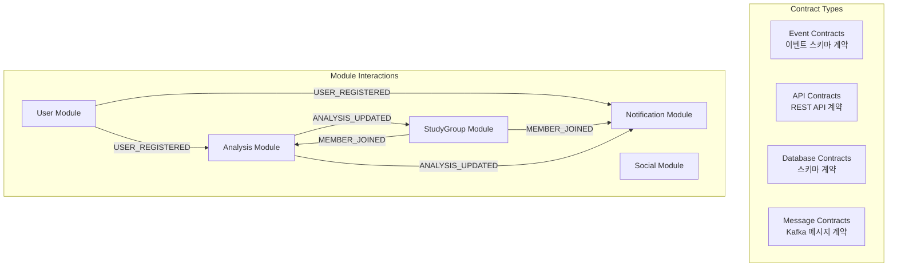

# 모듈 간 계약 테스트 패턴

이 문서는 **알고리포트의 모듈형 모놀리스 아키텍처에서 모듈 간 계약(Contract)을 보장하는 테스트 전략**을 정의합니다. 이벤트 기반 통신과 API 호출의 호환성을 사전에 검증하여 통합 시점의 오류를 방지합니다.

---

## 🎯 **계약 테스트의 목적과 범위**

### **계약 테스트란?**
모듈 간 인터페이스(API, 이벤트, 데이터베이스 스키마)의 **생산자(Producer)와 소비자(Consumer) 간 합의된 계약을 검증**하는 테스트

### **알고리포트에서의 계약 대상**


---

## 📋 **1. 이벤트 계약 테스트 패턴**

### **1.1 이벤트 스키마 계약 정의**

```kotlin
// 이벤트 계약을 코드로 정의
@EventContract(
    producer = "User Module",
    consumers = ["Analysis Module", "Notification Module"],
    version = "1.0"
)
data class UserRegisteredEventContract(
    @JsonProperty("userId") 
    @NotBlank 
    val userId: String,
    
    @JsonProperty("email") 
    @Email 
    val email: String,
    
    @JsonProperty("nickname") 
    @NotBlank 
    @Size(min = 2, max = 20)
    val nickname: String,
    
    @JsonProperty("profileImageUrl") 
    @URL 
    val profileImageUrl: String,
    
    @JsonProperty("provider") 
    @Pattern(regexp = "GOOGLE|KAKAO|NAVER")
    val provider: String,
    
    @JsonProperty("registeredAt") 
    @NotNull 
    val registeredAt: String,  // ISO 8601 format
    
    @JsonProperty("isActive") 
    val isActive: Boolean = true
) : EventContract

// 계약 검증용 어노테이션
@Target(AnnotationTarget.CLASS)
@Retention(AnnotationRetention.RUNTIME)
annotation class EventContract(
    val producer: String,
    val consumers: Array<String>,
    val version: String
)
```

### **1.2 Producer 테스트 (이벤트 발행자)**

```kotlin
@ContractTest
class UserModuleEventProducerTest {
    
    @Autowired private lateinit var userService: UserService
    @Autowired private lateinit var outboxRepository: OutboxEventRepository
    @Autowired private lateinit var objectMapper: ObjectMapper
    
    @Test
    fun `USER_REGISTERED 이벤트가 정의된 계약을_만족한다`() {
        // Given: 사용자 등록 요청
        val userInfo = GoogleUserInfo(
            email = "contract_test@example.com",
            name = "계약테스터",
            picture = "https://example.com/profile.jpg"
        )
        
        // When: 사용자 등록 실행
        val user = userService.registerUser(userInfo)
        
        // Then: 발행된 이벤트가 계약을 만족하는지 검증
        val outboxEvents = outboxRepository.findByAggregateId(user.id.toString())
        val userRegisteredEvent = outboxEvents.find { it.eventType == "USER_REGISTERED" }
        
        assertThat(userRegisteredEvent).isNotNull()
        
        // 이벤트 데이터를 계약 스키마로 역직렬화 (검증)
        val contractData = assertDoesNotThrow {
            objectMapper.readValue<UserRegisteredEventContract>(userRegisteredEvent!!.eventData)
        }
        
        // 계약 필드 검증
        assertThat(contractData.userId).isEqualTo(user.id.toString())
        assertThat(contractData.email).isEqualTo("contract_test@example.com")
        assertThat(contractData.nickname).isNotBlank()
        assertThat(contractData.provider).isEqualTo("GOOGLE")
        assertThat(contractData.isActive).isTrue()
        
        // 날짜 형식 검증 (ISO 8601)
        assertDoesNotThrow {
            LocalDateTime.parse(contractData.registeredAt)
        }
    }
    
    @Test
    fun `USER_REGISTERED 이벤트_스키마_버전_호환성_테스트`() {
        // 이벤트 스키마가 변경되어도 하위 호환성을 유지하는지 테스트
        
        // Given: 기존 버전의 이벤트 데이터
        val oldVersionEventData = """
        {
            "userId": "user-123",
            "email": "old@example.com", 
            "nickname": "구버전사용자",
            "provider": "GOOGLE",
            "registeredAt": "2025-07-23T10:00:00"
        }
        """.trimIndent()
        
        // When & Then: 새 버전의 계약으로 파싱 가능한지 확인
        val newVersionContract = assertDoesNotThrow {
            objectMapper.readValue<UserRegisteredEventContract>(oldVersionEventData)
        }
        
        // 기본값이 올바르게 적용되는지 확인
        assertThat(newVersionContract.isActive).isTrue()  // 기본값
        assertThat(newVersionContract.profileImageUrl).isBlank()  // nullable 필드
    }
}
```

### **1.3 Consumer 테스트 (이벤트 소비자)**

```kotlin
@ContractTest
class AnalysisModuleEventConsumerTest {
    
    @Autowired private lateinit var analysisEventHandler: AnalysisEventHandler
    @Autowired private lateinit var analysisProfileRepository: AnalysisProfileRepository
    
    @Test
    fun `Analysis Module이 USER_REGISTERED 계약을 올바르게 처리할_수_있다`() {
        // Given: 계약에 맞는 USER_REGISTERED 이벤트
        val contractEvent = UserRegisteredEventContract(
            userId = "user-contract-123",
            email = "analysis_test@example.com",
            nickname = "분석테스터",
            profileImageUrl = "https://example.com/profile.jpg",
            provider = "GOOGLE",
            registeredAt = LocalDateTime.now().toString(),
            isActive = true
        )
        
        val eventMessage = objectMapper.writeValueAsString(contractEvent)
        val headers = mapOf(
            "eventType" to "USER_REGISTERED",
            "sagaId" to UUID.randomUUID().toString(),
            "sagaType" to "USER_REGISTRATION_SAGA"
        )
        
        // When: 이벤트 핸들러 실행
        assertDoesNotThrow {
            analysisEventHandler.handleUserRegistered(eventMessage, headers)
        }
        
        // Then: 올바르게 처리되었는지 확인
        val analysisProfile = analysisProfileRepository.findByUserId("user-contract-123")
        assertThat(analysisProfile).isNotNull()
        assertThat(analysisProfile!!.userId).isEqualTo("user-contract-123")
    }
    
    @Test
    fun `Analysis Module이 잘못된_계약_이벤트를_거부한다`() {
        // Given: 계약을 위반하는 이벤트 (필수 필드 누락)
        val invalidEventData = """
        {
            "userId": "",
            "email": "invalid-email",
            "nickname": "a",
            "provider": "UNKNOWN_PROVIDER"
        }
        """.trimIndent()
        
        // When & Then: 이벤트 처리 시 예외 발생해야 함
        assertThrows<EventContractViolationException> {
            analysisEventHandler.handleUserRegistered(invalidEventData, emptyMap())
        }
    }
}
```

### **1.4 계약 호환성 매트릭스 테스트**

```kotlin
@ContractTest
class EventContractCompatibilityTest {
    
    @ParameterizedTest
    @ValueSource(strings = [
        "User Module v1.0 -> Analysis Module v1.0",
        "User Module v1.1 -> Analysis Module v1.0",  // 하위 호환성
        "User Module v1.0 -> Analysis Module v1.1"   // 상위 호환성
    ])
    fun `이벤트_계약_호환성_매트릭스_테스트`(compatibility: String) {
        val (producerVersion, consumerVersion) = parseCompatibility(compatibility)
        
        // Given: 특정 버전의 Producer가 발행한 이벤트
        val event = createEventByVersion(producerVersion)
        
        // When: 특정 버전의 Consumer가 처리
        val result = processEventByVersion(event, consumerVersion)
        
        // Then: 호환성 매트릭스에 따른 결과 검증
        when {
            isBackwardCompatible(producerVersion, consumerVersion) -> {
                assertThat(result.isSuccess).isTrue()
            }
            isForwardCompatible(producerVersion, consumerVersion) -> {
                assertThat(result.isSuccess).isTrue()
                assertThat(result.hasWarnings).isTrue()  // 경고는 있을 수 있음
            }
            else -> {
                assertThat(result.isSuccess).isFalse()
                assertThat(result.error).contains("Contract version incompatible")
            }
        }
    }
}
```

---

## 🌐 **2. API 계약 테스트 패턴**

### **2.1 REST API 계약 정의**

```kotlin
// OpenAPI 스펙 기반 계약 정의
@ApiContract(
    provider = "StudyGroup Module",
    consumer = "Frontend Client",
    version = "1.0"
)
@RestController
@RequestMapping("/api/v1/studygroups")
class StudyGroupController {
    
    @PostMapping
    @Operation(
        summary = "스터디 그룹 생성",
        requestBody = @RequestBody(
            content = [Content(
                mediaType = "application/json",
                schema = @Schema(implementation = CreateStudyGroupRequest::class)
            )]
        ),
        responses = [
            @ApiResponse(
                responseCode = "201",
                content = [Content(
                    mediaType = "application/json", 
                    schema = @Schema(implementation = StudyGroupResponse::class)
                )]
            ),
            @ApiResponse(responseCode = "400", description = "잘못된 요청"),
            @ApiResponse(responseCode = "403", description = "권한 없음")
        ]
    )
    fun createStudyGroup(
        @Valid @RequestBody request: CreateStudyGroupRequest,
        @AuthenticationPrincipal user: UserPrincipal
    ): ResponseEntity<StudyGroupResponse>
}

// 요청/응답 계약 스키마
@Schema(description = "스터디 그룹 생성 요청")
data class CreateStudyGroupRequest(
    @field:NotBlank
    @field:Size(min = 2, max = 50)
    @Schema(description = "그룹명", example = "알고리즘 마스터즈")
    val groupName: String,
    
    @field:Size(max = 500)
    @Schema(description = "그룹 설명", example = "매일 1문제씩 풀어요")
    val description: String,
    
    @Schema(description = "공개 여부", example = "true")
    val isPublic: Boolean,
    
    @field:Min(2)
    @field:Max(100)
    @Schema(description = "최대 인원", example = "10")
    val maxMembers: Int
)

@Schema(description = "스터디 그룹 응답")
data class StudyGroupResponse(
    @Schema(description = "그룹 ID", example = "group-uuid-123")
    val groupId: String,
    
    @Schema(description = "그룹명", example = "알고리즘 마스터즈")
    val groupName: String,
    
    @Schema(description = "그룹장 ID", example = "user-uuid-456")
    val ownerId: String,
    
    @Schema(description = "현재 멤버 수", example = "1")
    val memberCount: Int,
    
    @Schema(description = "생성일시", example = "2025-07-23T10:30:00Z")
    val createdAt: String
)
```

### **2.2 Provider 테스트 (API 제공자)**

```kotlin
@WebMvcTest(StudyGroupController::class)
@ContractTest
class StudyGroupControllerProviderTest {
    
    @Autowired private lateinit var mockMvc: MockMvc
    @MockBean private lateinit var studyGroupService: StudyGroupService
    
    @Test
    fun `POST_studygroups_API가_정의된_계약을_만족한다`() {
        // Given: 계약에 맞는 요청
        val request = CreateStudyGroupRequest(
            groupName = "테스트 그룹",
            description = "계약 테스트용 그룹",
            isPublic = true,
            maxMembers = 10
        )
        
        val expectedResponse = StudyGroupResponse(
            groupId = "group-123",
            groupName = "테스트 그룹", 
            ownerId = "user-456",
            memberCount = 1,
            createdAt = "2025-07-23T10:30:00Z"
        )
        
        whenever(studyGroupService.createStudyGroup(any(), any()))
            .thenReturn(expectedResponse)
        
        // When & Then: API 호출 및 계약 검증
        val result = mockMvc.perform(
            post("/api/v1/studygroups")
                .contentType(MediaType.APPLICATION_JSON)
                .content(objectMapper.writeValueAsString(request))
                .header("Authorization", "Bearer valid-jwt")
        )
        .andExpectAll(
            status().isCreated,
            content().contentType(MediaType.APPLICATION_JSON),
            jsonPath("$.groupId").value("group-123"),
            jsonPath("$.groupName").value("테스트 그룹"),
            jsonPath("$.ownerId").value("user-456"),
            jsonPath("$.memberCount").value(1),
            jsonPath("$.createdAt").value("2025-07-23T10:30:00Z")
        )
        .andDo(document("create-study-group"))  // API 문서 생성
        
        // 응답 스키마 검증
        val responseBody = result.andReturn().response.contentAsString
        val actualResponse = objectMapper.readValue<StudyGroupResponse>(responseBody)
        
        // 계약 스키마 검증 (Bean Validation)
        val violations = validator.validate(actualResponse)
        assertThat(violations).isEmpty()
    }
    
    @Test
    fun `잘못된_요청시_정의된_에러_응답을_반환한다`() {
        // Given: 계약을 위반하는 요청
        val invalidRequest = CreateStudyGroupRequest(
            groupName = "a",  // 너무 짧음 (min=2)
            description = "a".repeat(501),  // 너무 김 (max=500)
            isPublic = true,
            maxMembers = 1  // 너무 적음 (min=2)
        )
        
        // When & Then: 400 Bad Request 응답
        mockMvc.perform(
            post("/api/v1/studygroups")
                .contentType(MediaType.APPLICATION_JSON)
                .content(objectMapper.writeValueAsString(invalidRequest))
                .header("Authorization", "Bearer valid-jwt")
        )
        .andExpectAll(
            status().isBadRequest,
            jsonPath("$.code").value("E40000"),  // 정의된 에러 코드
            jsonPath("$.message").exists(),
            jsonPath("$.details").isArray()
        )
    }
}
```

### **2.3 Consumer 테스트 (API 소비자)**

```kotlin
@SpringBootTest
@AutoConfigureWireMock
@ContractTest
class StudyGroupApiConsumerTest {
    
    @Autowired private lateinit var studyGroupApiClient: StudyGroupApiClient
    
    @Test
    fun `StudyGroup API Client가 Provider 계약을_만족한다`() {
        // Given: Provider의 응답을 WireMock으로 모킹
        stubFor(
            post(urlEqualTo("/api/v1/studygroups"))
                .withHeader("Content-Type", equalTo("application/json"))
                .withHeader("Authorization", matching("Bearer .+"))
                .willReturn(
                    aResponse()
                        .withStatus(201)
                        .withHeader("Content-Type", "application/json")
                        .withBody("""
                            {
                                "groupId": "group-contract-123",
                                "groupName": "계약 테스트 그룹",
                                "ownerId": "user-contract-456", 
                                "memberCount": 1,
                                "createdAt": "2025-07-23T10:30:00Z"
                            }
                        """.trimIndent())
                )
        )
        
        // When: API Client 호출
        val request = CreateStudyGroupRequest(
            groupName = "계약 테스트 그룹",
            description = "Consumer 테스트",
            isPublic = true,
            maxMembers = 10
        )
        
        val response = studyGroupApiClient.createStudyGroup(request, "Bearer mock-jwt")
        
        // Then: 계약 스키마에 맞는 응답인지 검증
        assertThat(response.isSuccess).isTrue()
        assertThat(response.data.groupId).isEqualTo("group-contract-123")
        assertThat(response.data.groupName).isEqualTo("계약 테스트 그룹")
        assertThat(response.data.memberCount).isEqualTo(1)
        
        // 날짜 형식 검증
        assertDoesNotThrow {
            LocalDateTime.parse(response.data.createdAt)
        }
        
        // WireMock 호출 검증
        verify(
            postRequestedFor(urlEqualTo("/api/v1/studygroups"))
                .withHeader("Content-Type", equalTo("application/json"))
                .withRequestBody(containing("계약 테스트 그룹"))
        )
    }
    
    @Test
    fun `Provider_에러_응답을_올바르게_처리한다`() {
        // Given: Provider 에러 응답 모킹
        stubFor(
            post(urlEqualTo("/api/v1/studygroups"))
                .willReturn(
                    aResponse()
                        .withStatus(400)
                        .withHeader("Content-Type", "application/json")
                        .withBody("""
                            {
                                "code": "E40000",
                                "message": "잘못된 요청입니다",
                                "details": ["groupName: 그룹명은 2자 이상이어야 합니다"]
                            }
                        """.trimIndent())
                )
        )
        
        // When: 잘못된 요청 전송
        val invalidRequest = CreateStudyGroupRequest(
            groupName = "a",
            description = "",
            isPublic = true,
            maxMembers = 5
        )
        
        val response = studyGroupApiClient.createStudyGroup(invalidRequest, "Bearer mock-jwt")
        
        // Then: 에러 응답 처리 검증
        assertThat(response.isSuccess).isFalse()
        assertThat(response.error.code).isEqualTo("E40000")
        assertThat(response.error.message).contains("잘못된 요청")
        assertThat(response.error.details).isNotEmpty()
    }
}
```

---

## 🗄️ **3. 데이터베이스 계약 테스트 패턴**

### **3.1 스키마 계약 정의**

```kotlin
// 데이터베이스 스키마 계약을 코드로 정의
@DatabaseContract(
    module = "User Module",
    dependentModules = ["Analysis Module", "StudyGroup Module"],
    version = "1.0"
)
@Entity
@Table(name = "users")
data class UserSchemaContract(
    @Id
    @Column(name = "user_id", columnDefinition = "UUID")
    val id: UUID,
    
    @Column(name = "email", nullable = false, unique = true, length = 255)
    val email: String,
    
    @Column(name = "nickname", nullable = false, length = 50)
    val nickname: String,
    
    @Column(name = "provider", nullable = false, length = 20)
    @Enumerated(EnumType.STRING)
    val provider: AuthProvider,
    
    @Column(name = "solvedac_handle", nullable = true, unique = true, length = 50)
    val solvedacHandle: String? = null,
    
    @Column(name = "is_active", nullable = false, columnDefinition = "BOOLEAN DEFAULT TRUE")
    val isActive: Boolean = true,
    
    @Column(name = "created_at", nullable = false, columnDefinition = "TIMESTAMP DEFAULT CURRENT_TIMESTAMP")
    val createdAt: LocalDateTime = LocalDateTime.now(),
    
    @Column(name = "updated_at", nullable = false, columnDefinition = "TIMESTAMP DEFAULT CURRENT_TIMESTAMP")
    val updatedAt: LocalDateTime = LocalDateTime.now()
)

@Target(AnnotationTarget.CLASS)
@Retention(AnnotationRetention.RUNTIME)
annotation class DatabaseContract(
    val module: String,
    val dependentModules: Array<String>,
    val version: String
)
```

### **3.2 스키마 호환성 테스트**

```kotlin
@DataJpaTest
@ContractTest
class UserSchemaContractTest {
    
    @Autowired private lateinit var testEntityManager: TestEntityManager
    @Autowired private lateinit var jdbcTemplate: JdbcTemplate
    
    @Test
    fun `User 스키마가_정의된_계약을_만족한다`() {
        // Given: 계약에 맞는 사용자 데이터
        val user = UserSchemaContract(
            id = UUID.randomUUID(),
            email = "schema_test@example.com",
            nickname = "스키마테스터",
            provider = AuthProvider.GOOGLE,
            solvedacHandle = "schema_tester",
            isActive = true
        )
        
        // When: 데이터베이스에 저장
        val savedUser = assertDoesNotThrow {
            testEntityManager.persistAndFlush(user)
        }
        
        // Then: 제약조건 확인
        assertThat(savedUser.id).isNotNull()
        assertThat(savedUser.email).isEqualTo("schema_test@example.com")
        assertThat(savedUser.createdAt).isNotNull()
        assertThat(savedUser.updatedAt).isNotNull()
        
        // 데이터베이스 제약조건 검증
        val tableConstraints = getTableConstraints("users")
        assertThat(tableConstraints).containsKeys("uk_users_email", "uk_users_solvedac_handle")
    }
    
    @Test
    fun `이메일_중복시_제약조건_위반_예외가_발생한다`() {
        // Given: 동일한 이메일의 사용자 2명
        val user1 = UserSchemaContract(
            id = UUID.randomUUID(),
            email = "duplicate@example.com",
            nickname = "사용자1",
            provider = AuthProvider.GOOGLE
        )
        val user2 = UserSchemaContract(
            id = UUID.randomUUID(),
            email = "duplicate@example.com",  // 동일한 이메일
            nickname = "사용자2",
            provider = AuthProvider.GOOGLE
        )
        
        // When & Then: 첫 번째는 성공, 두 번째는 실패
        testEntityManager.persistAndFlush(user1)
        
        assertThrows<DataIntegrityViolationException> {
            testEntityManager.persistAndFlush(user2)
        }
    }
    
    @Test
    fun `스키마_마이그레이션_호환성_테스트`() {
        // 스키마 변경 시 기존 데이터 호환성 테스트
        
        // Given: 기존 버전의 데이터 (solved.ac 핸들 없음)
        jdbcTemplate.execute("""
            INSERT INTO users (user_id, email, nickname, provider, is_active, created_at, updated_at)
            VALUES ('${UUID.randomUUID()}', 'legacy@example.com', '레거시사용자', 'GOOGLE', true, CURRENT_TIMESTAMP, CURRENT_TIMESTAMP)
        """)
        
        // When: 새 버전의 엔티티로 조회
        val legacyUser = testEntityManager
            .getEntityManager()
            .createQuery("SELECT u FROM UserSchemaContract u WHERE u.email = 'legacy@example.com'", UserSchemaContract::class.java)
            .singleResult
        
        // Then: 새 필드가 기본값으로 처리되는지 확인
        assertThat(legacyUser.solvedacHandle).isNull()
        assertThat(legacyUser.isActive).isTrue()
    }
    
    private fun getTableConstraints(tableName: String): Map<String, String> {
        return jdbcTemplate.queryForList("""
            SELECT CONSTRAINT_NAME, CONSTRAINT_TYPE 
            FROM INFORMATION_SCHEMA.CONSTRAINTS 
            WHERE TABLE_NAME = ?
        """, tableName).associate {
            it["CONSTRAINT_NAME"] as String to it["CONSTRAINT_TYPE"] as String
        }
    }
}
```

---

## 📨 **4. 메시지 계약 테스트 패턴**

### **4.1 Kafka 메시지 계약**

```kotlin
@MessageContract(
    topic = "study-group-events",
    producer = "StudyGroup Module",
    consumers = ["Analysis Module", "Notification Module"],
    version = "1.0"
)
data class MemberJoinedMessageContract(
    @JsonProperty("eventId")
    @NotBlank
    val eventId: String,
    
    @JsonProperty("eventType") 
    @Pattern(regexp = "MEMBER_JOINED")
    val eventType: String,
    
    @JsonProperty("timestamp")
    @NotNull
    val timestamp: Long,
    
    @JsonProperty("groupId")
    @NotBlank  
    val groupId: String,
    
    @JsonProperty("userId")
    @NotBlank
    val userId: String,
    
    @JsonProperty("joinedAt")
    @NotNull
    val joinedAt: String,  // ISO 8601
    
    @JsonProperty("memberRole")
    @Pattern(regexp = "OWNER|ADMIN|MEMBER")
    val memberRole: String = "MEMBER"
) : MessageContract

@Target(AnnotationTarget.CLASS)
@Retention(AnnotationRetention.RUNTIME)
annotation class MessageContract(
    val topic: String,
    val producer: String,
    val consumers: Array<String>,
    val version: String
)
```

### **4.2 메시지 Producer 테스트**

```kotlin
@SpringKafkaTest
@ContractTest
class StudyGroupMessageProducerTest {
    
    @Autowired private lateinit var kafkaTemplate: KafkaTemplate<String, String>
    @Autowired private lateinit var studyGroupService: StudyGroupService
    
    @Test
    fun `MEMBER_JOINED 메시지가_정의된_계약을_만족한다`() {
        // Given: 그룹 참여 상황
        val groupId = "group-123"
        val userId = "user-456"
        
        // When: 그룹 참여 처리
        studyGroupService.joinGroup(groupId, userId)
        
        // Then: Kafka 메시지 확인
        val kafkaMessages = captureKafkaMessages("study-group-events")
        val memberJoinedMessage = kafkaMessages.find { 
            it.value.contains("MEMBER_JOINED") 
        }
        
        assertThat(memberJoinedMessage).isNotNull()
        
        // 메시지 계약 검증
        val contractData = assertDoesNotThrow {
            objectMapper.readValue<MemberJoinedMessageContract>(memberJoinedMessage!!.value)
        }
        
        assertThat(contractData.eventType).isEqualTo("MEMBER_JOINED")
        assertThat(contractData.groupId).isEqualTo(groupId)
        assertThat(contractData.userId).isEqualTo(userId)
        assertThat(contractData.memberRole).isEqualTo("MEMBER")
        
        // 타임스탬프 유효성 검증
        val eventTime = Instant.ofEpochMilli(contractData.timestamp)
        assertThat(eventTime).isCloseTo(Instant.now(), within(Duration.ofMinutes(1)))
        
        // 날짜 형식 검증
        assertDoesNotThrow {
            LocalDateTime.parse(contractData.joinedAt)
        }
    }
}
```

### **4.3 메시지 Consumer 테스트**

```kotlin
@SpringKafkaTest
@ContractTest
class AnalysisMessageConsumerTest {
    
    @Autowired private lateinit var kafkaTestUtils: KafkaTestUtils
    @Autowired private lateinit var analysisKafkaConsumer: AnalysisKafkaConsumer
    
    @Test
    fun `Analysis Consumer가_MEMBER_JOINED_계약을_올바르게_처리한다`() {
        // Given: 계약에 맞는 MEMBER_JOINED 메시지
        val contractMessage = MemberJoinedMessageContract(
            eventId = UUID.randomUUID().toString(),
            eventType = "MEMBER_JOINED",
            timestamp = System.currentTimeMillis(),
            groupId = "group-contract-789",
            userId = "user-contract-012",
            joinedAt = LocalDateTime.now().toString(),
            memberRole = "MEMBER"
        )
        
        val messageJson = objectMapper.writeValueAsString(contractMessage)
        
        // When: Consumer가 메시지 처리
        assertDoesNotThrow {
            analysisKafkaConsumer.handleMemberJoined(
                messageJson,
                mapOf("eventType" to "MEMBER_JOINED")
            )
        }
        
        // Then: 올바르게 처리되었는지 확인
        val groupAnalysis = groupAnalysisRepository.findByGroupId("group-contract-789")
        assertThat(groupAnalysis?.memberIds).contains("user-contract-012")
    }
    
    @Test
    fun `Consumer가_잘못된_메시지_계약을_거부한다`() {
        // Given: 계약을 위반하는 메시지
        val invalidMessage = """
        {
            "eventType": "INVALID_EVENT",
            "groupId": "",
            "userId": null,
            "timestamp": "invalid-timestamp"
        }
        """.trimIndent()
        
        // When & Then: 메시지 처리 시 예외 발생
        assertThrows<MessageContractViolationException> {
            analysisKafkaConsumer.handleMemberJoined(invalidMessage, emptyMap())
        }
    }
}
```

---

## 🔄 **5. 계약 테스트 자동화 파이프라인**

### **5.1 계약 테스트 실행 전략**

```kotlin
// build.gradle.kts
tasks {
    val contractTest by registering(Test::class) {
        useJUnitPlatform {
            includeTags("contract")
        }
        systemProperty("spring.profiles.active", "contract-test")
        
        // 계약 테스트는 다른 모듈의 인터페이스에 의존하므로 격리 실행
        mustRunAfter(test)
        shouldRunAfter("integrationTest")
    }
    
    val contractValidation by registering {
        dependsOn(contractTest)
        doLast {
            // 계약 호환성 리포트 생성
            generateContractCompatibilityReport()
        }
    }
}

fun generateContractCompatibilityReport() {
    val contractResults = file("build/contract-test-results")
    val reportFile = file("build/reports/contract-compatibility.html")
    
    // 계약 테스트 결과를 분석하여 호환성 리포트 생성
    ContractReportGenerator.generate(contractResults, reportFile)
}
```

### **5.2 계약 버전 관리**

```kotlin
// 계약 버전 관리 시스템
@Component
class ContractVersionManager {
    
    private val contractRegistry = mutableMapOf<String, ContractInfo>()
    
    fun registerContract(contractInfo: ContractInfo) {
        val key = "${contractInfo.module}-${contractInfo.type}-${contractInfo.name}"
        contractRegistry[key] = contractInfo
    }
    
    fun validateCompatibility(
        producerContract: ContractInfo,
        consumerContract: ContractInfo
    ): CompatibilityResult {
        return when {
            producerContract.version == consumerContract.version -> 
                CompatibilityResult.FULLY_COMPATIBLE
                
            isBackwardCompatible(producerContract.version, consumerContract.version) ->
                CompatibilityResult.BACKWARD_COMPATIBLE
                
            isForwardCompatible(producerContract.version, consumerContract.version) ->
                CompatibilityResult.FORWARD_COMPATIBLE
                
            else -> CompatibilityResult.INCOMPATIBLE
        }
    }
    
    private fun isBackwardCompatible(producerVersion: String, consumerVersion: String): Boolean {
        // Semantic Versioning 규칙 적용
        val (prodMajor, prodMinor, _) = parseVersion(producerVersion)
        val (consMajor, consMinor, _) = parseVersion(consumerVersion)
        
        return prodMajor == consMajor && prodMinor >= consMinor
    }
}

data class ContractInfo(
    val module: String,
    val type: ContractType,
    val name: String,
    val version: String,
    val schema: String
)

enum class ContractType {
    EVENT, API, DATABASE, MESSAGE
}

enum class CompatibilityResult {
    FULLY_COMPATIBLE,
    BACKWARD_COMPATIBLE, 
    FORWARD_COMPATIBLE,
    INCOMPATIBLE
}
```

### **5.3 계약 위반 감지 및 알림**

```kotlin
@Component
class ContractViolationDetector {
    
    @EventListener
    fun handleContractViolation(violation: ContractViolationEvent) {
        logger.error("Contract violation detected: ${violation.details}")
        
        // 심각도에 따른 대응
        when (violation.severity) {
            Severity.CRITICAL -> {
                // 빌드 중단
                throw ContractViolationException("Critical contract violation: ${violation.message}")
            }
            Severity.WARNING -> {
                // 경고 로그 및 알림
                alertingService.sendWarning("Contract compatibility warning", violation.message)
            }
            Severity.INFO -> {
                // 정보성 로그
                logger.info("Contract compatibility info: ${violation.message}")
            }
        }
    }
}

data class ContractViolationEvent(
    val contractType: ContractType,
    val producerModule: String,
    val consumerModule: String,
    val violationType: ViolationType,
    val severity: Severity,
    val message: String,
    val details: Map<String, Any>
)

enum class ViolationType {
    SCHEMA_INCOMPATIBLE,
    VERSION_INCOMPATIBLE,
    FIELD_MISSING,
    TYPE_MISMATCH,
    CONSTRAINT_VIOLATION
}
```

---

## 📊 **6. 계약 테스트 메트릭 및 리포팅**

### **6.1 계약 테스트 대시보드**

```kotlin
@RestController
@RequestMapping("/admin/contracts")
class ContractTestDashboardController {
    
    @GetMapping("/compatibility-matrix")
    fun getCompatibilityMatrix(): ContractCompatibilityMatrix {
        return ContractCompatibilityMatrix(
            modules = listOf("User", "StudyGroup", "Analysis", "Notification"),
            contractTypes = ContractType.values().toList(),
            compatibilityData = generateCompatibilityData()
        )
    }
    
    @GetMapping("/violations")
    fun getContractViolations(
        @RequestParam(defaultValue = "7") days: Int
    ): List<ContractViolationSummary> {
        return contractViolationRepository.findRecentViolations(days)
            .map { violation ->
                ContractViolationSummary(
                    date = violation.detectedAt.toLocalDate(),
                    contractType = violation.contractType,
                    violationType = violation.violationType,
                    count = violation.count,
                    severity = violation.maxSeverity
                )
            }
    }
    
    @GetMapping("/coverage")
    fun getContractCoverage(): ContractCoverageReport {
        val totalContracts = contractRegistry.size
        val testedContracts = contractTestResultRepository.countDistinctContracts()
        val coveragePercentage = (testedContracts.toDouble() / totalContracts) * 100
        
        return ContractCoverageReport(
            totalContracts = totalContracts,
            testedContracts = testedContracts,
            coveragePercentage = coveragePercentage,
            uncoveredContracts = findUncoveredContracts()
        )
    }
}
```

### **6.2 계약 테스트 품질 메트릭**

```yaml
계약 테스트 품질 기준:
  계약_커버리지: ≥ 90%
  호환성_테스트_통과율: ≥ 95%
  계약_위반_감지_시간: ≤ 1분
  
  모듈별_계약_테스트_비율:
    Event_Contracts: 100%  # 모든 이벤트 계약 테스트 필수
    API_Contracts: ≥ 95%   # 공개 API 계약 테스트 필수
    Database_Contracts: ≥ 80%  # 중요 스키마 계약 테스트
    Message_Contracts: ≥ 90%   # Kafka 메시지 계약 테스트
```

---

이러한 계약 테스트 패턴을 통해 모듈형 모놀리스에서도 각 모듈이 독립적으로 개발되면서 통합 시점의 호환성을 보장할 수 있습니다. 특히 이벤트 기반 아키텍처에서는 계약 테스트가 시스템 안정성의 핵심 요소가 됩니다.

📝 **문서 버전**: v1.0  
📅 **최종 수정일**: 2025-07-23  
👤 **작성자**: 채기훈